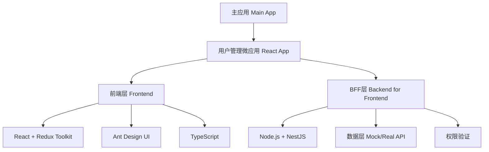

# React 用户管理系统架构设计方案

## 1. 项目概述

### 1.1 项目目标
将 `sub-apps/react-app-1` 改造成一个完整的企业级用户管理系统，包含前端、BFF层和完整的业务逻辑，符合 qiankun 微前端架构规范。

### 1.2 技术架构


## 2. 系统架构设计

### 2.1 整体架构

#### 前端架构
- **UI层**: React + Ant Design + TypeScript
- **状态管理**: Redux Toolkit + RTK Query
- **路由管理**: React Router v6
- **表单处理**: React Hook Form + Yup
- **样式方案**: Styled Components + CSS Modules

#### BFF层架构
- **服务端**: Node.js + NestJS + TypeScript
- **数据层**: Mock 数据 + JSON 文件存储
- **API设计**: RESTful API + GraphQL (可选)
- **中间件**: 认证、权限、日志、错误处理
- **数据验证**: Joi 或 Yup

### 2.2 目录结构设计

```
sub-apps/react-app-1/
├── frontend/                    # 前端代码
│   ├── src/
│   │   ├── components/         # 通用组件
│   │   │   ├── common/        # 基础组件
│   │   │   ├── forms/         # 表单组件
│   │   │   └── tables/        # 表格组件
│   │   ├── pages/             # 页面组件
│   │   │   ├── users/         # 用户管理
│   │   │   ├── roles/         # 角色管理
│   │   │   ├── permissions/   # 权限管理
│   │   │   └── logs/          # 操作日志
│   │   ├── hooks/             # 自定义Hooks
│   │   ├── services/          # API服务
│   │   ├── store/             # Redux状态管理
│   │   ├── utils/             # 工具函数
│   │   ├── types/             # TypeScript类型
│   │   └── constants/         # 常量定义
│   ├── package.json
│   └── vite.config.ts
├── backend/                     # BFF层代码
│   ├── src/
│   │   ├── controllers/       # 控制器
│   │   ├── services/          # 业务逻辑
│   │   ├── models/            # 数据模型
│   │   ├── middleware/        # 中间件
│   │   ├── routes/            # 路由定义
│   │   ├── utils/             # 工具函数
│   │   ├── data/              # Mock数据
│   │   └── types/             # TypeScript类型
│   ├── package.json
│   └── tsconfig.json
└── shared/                      # 共享代码
    ├── types/                  # 共享类型定义
    └── constants/              # 共享常量
```

## 3. 核心功能模块设计

### 3.1 用户管理模块

#### 功能特性
- **用户列表**: 分页、搜索、筛选、排序
- **用户详情**: 查看用户完整信息
- **用户操作**: 新增、编辑、删除、批量操作
- **状态管理**: 启用、禁用、锁定用户
- **密码管理**: 重置密码、强制修改密码

#### 数据模型
```typescript
interface User {
  id: string;
  username: string;
  email: string;
  phone?: string;
  avatar?: string;
  nickname?: string;
  status: 'active' | 'inactive' | 'suspended' | 'pending';
  roles: Role[];
  permissions: Permission[];
  profile: UserProfile;
  lastLoginAt?: string;
  createdAt: string;
  updatedAt: string;
}
```

### 3.2 权限管理模块

#### 角色权限系统
- **RBAC模型**: 用户-角色-权限三层模型
- **权限粒度**: 页面级、功能级、数据级权限控制
- **动态权限**: 支持运行时权限变更
- **权限继承**: 支持角色权限继承机制

#### 权限数据结构
```typescript
interface Permission {
  id: string;
  name: string;
  code: string;
  resource: string;
  action: string;
  description?: string;
}

interface Role {
  id: string;
  name: string;
  code: string;
  description?: string;
  permissions: Permission[];
  level: number;
}
```

### 3.3 操作日志模块

#### 日志功能
- **操作记录**: 记录所有用户操作行为
- **审计追踪**: 支持操作时间、操作人、操作内容追踪
- **日志查询**: 支持多维度日志查询和导出
- **敏感操作**: 重点监控敏感操作（删除、权限变更等）

### 3.4 数据导入导出模块

#### 导入功能
- **Excel导入**: 支持用户批量导入
- **模板下载**: 提供标准导入模板
- **数据验证**: 导入数据格式验证和去重
- **错误处理**: 导入失败数据处理和反馈

#### 导出功能
- **多格式导出**: 支持Excel、CSV、PDF格式
- **自定义字段**: 支持选择导出字段
- **数据筛选**: 支持按条件导出数据

## 4. 技术实现方案

### 4.1 前端技术栈

#### 状态管理
```typescript
// Redux Toolkit 配置
export const store = configureStore({
  reducer: {
    app: appSlice,
    user: userSlice,
    role: roleSlice,
    permission: permissionSlice,
    log: logSlice,
    // RTK Query APIs
    userApi: userApi.reducer,
    roleApi: roleApi.reducer,
    permissionApi: permissionApi.reducer,
  },
  middleware: (getDefaultMiddleware) =>
    getDefaultMiddleware()
      .concat(userApi.middleware)
      .concat(roleApi.middleware)
      .concat(permissionApi.middleware),
});
```

#### API服务设计
```typescript
// RTK Query API定义
export const userApi = createApi({
  reducerPath: 'userApi',
  baseQuery: fetchBaseQuery({
    baseUrl: '/api/users',
    prepareHeaders: (headers, { getState }) => {
      const token = (getState() as RootState).auth.token;
      if (token) {
        headers.set('authorization', `Bearer ${token}`);
      }
      return headers;
    },
  }),
  tagTypes: ['User', 'UserList'],
  endpoints: (builder) => ({
    getUsers: builder.query<UsersResponse, UsersRequest>({
      query: (params) => ({
        url: '',
        params,
      }),
      providesTags: ['UserList'],
    }),
    getUserById: builder.query<User, string>({
      query: (id) => `/${id}`,
      providesTags: (result, error, id) => [{ type: 'User', id }],
    }),
    createUser: builder.mutation<User, CreateUserRequest>({
      query: (userData) => ({
        url: '',
        method: 'POST',
        body: userData,
      }),
      invalidatesTags: ['UserList'],
    }),
    updateUser: builder.mutation<User, UpdateUserRequest>({
      query: ({ id, ...userData }) => ({
        url: `/${id}`,
        method: 'PUT',
        body: userData,
      }),
      invalidatesTags: (result, error, { id }) => [
        { type: 'User', id },
        'UserList',
      ],
    }),
    deleteUser: builder.mutation<void, string>({
      query: (id) => ({
        url: `/${id}`,
        method: 'DELETE',
      }),
      invalidatesTags: ['UserList'],
    }),
  }),
});
```

### 4.2 BFF层技术实现

#### Express服务器配置
```typescript
// app.ts
import express from 'express';
import cors from 'cors';
import helmet from 'helmet';
import rateLimit from 'express-rate-limit';
import { authMiddleware } from './middleware/auth';
import { errorHandler } from './middleware/error';
import { userRoutes } from './routes/users';

const app = express();

// 安全中间件
app.use(helmet());
app.use(cors());
app.use(express.json());

// 限流中间件
const limiter = rateLimit({
  windowMs: 15 * 60 * 1000, // 15分钟
  max: 100, // 限制每个IP 15分钟内最多100个请求
});
app.use('/api', limiter);

// 认证中间件
app.use('/api', authMiddleware);

// 路由
app.use('/api/users', userRoutes);

// 错误处理
app.use(errorHandler);

export default app;
```

#### 数据服务层
```typescript
// services/userService.ts
import { User, CreateUserRequest, UpdateUserRequest } from '../types';
import { UserRepository } from '../repositories/userRepository';
import { ValidationError } from '../utils/errors';
import { hashPassword, validateEmail } from '../utils/helpers';

export class UserService {
  constructor(private userRepository: UserRepository) {}

  async getUsers(params: GetUsersParams): Promise<PaginatedResponse<User>> {
    const { page = 1, pageSize = 20, keyword, status, role } = params;
    
    let users = await this.userRepository.findAll();
    
    // 搜索过滤
    if (keyword) {
      users = users.filter(user => 
        user.username.includes(keyword) || 
        user.email.includes(keyword) ||
        user.nickname?.includes(keyword)
      );
    }
    
    // 状态过滤
    if (status && status !== 'all') {
      users = users.filter(user => user.status === status);
    }
    
    // 角色过滤
    if (role) {
      users = users.filter(user => 
        user.roles.some(r => r.code === role)
      );
    }
    
    // 分页
    const total = users.length;
    const startIndex = (page - 1) * pageSize;
    const endIndex = startIndex + pageSize;
    const paginatedUsers = users.slice(startIndex, endIndex);
    
    return {
      data: paginatedUsers,
      pagination: {
        page,
        pageSize,
        total,
        totalPages: Math.ceil(total / pageSize),
      },
    };
  }

  async createUser(userData: CreateUserRequest): Promise<User> {
    // 数据验证
    if (!validateEmail(userData.email)) {
      throw new ValidationError('Invalid email format');
    }
    
    // 检查用户名和邮箱唯一性
    const existingUser = await this.userRepository.findByUsernameOrEmail(
      userData.username,
      userData.email
    );
    
    if (existingUser) {
      throw new ValidationError('Username or email already exists');
    }
    
    // 创建用户
    const hashedPassword = await hashPassword(userData.password);
    const newUser = await this.userRepository.create({
      ...userData,
      password: hashedPassword,
      id: generateId(),
      createdAt: new Date().toISOString(),
      updatedAt: new Date().toISOString(),
    });
    
    return newUser;
  }
}
```

### 4.3 qiankun 集成配置

#### Vite配置优化
```typescript
// vite.config.ts
import { defineConfig } from 'vite';
import react from '@vitejs/plugin-react';
import legacy from '@vitejs/plugin-legacy';
import { vitePluginLegacyQiankun } from 'vite-plugin-legacy-qiankun';
import { resolve } from 'path';

export default defineConfig({
  plugins: [
    react(),
    legacy({
      targets: ['defaults', 'not IE 11'],
    }),
    vitePluginLegacyQiankun({
      name: 'react-user-management',
      devSandbox: true,
    }),
  ],
  
  server: {
    port: 3001,
    host: '0.0.0.0',
    cors: true,
    proxy: {
      '/api': {
        target: 'http://localhost:3002', // BFF服务端口
        changeOrigin: true,
      },
    },
  },
  
  resolve: {
    alias: {
      '@': resolve(__dirname, 'frontend/src'),
      '@shared': resolve(__dirname, '../../shared'),
      '@backend': resolve(__dirname, 'backend/src'),
    },
  },
  
  build: {
    outDir: 'dist',
    sourcemap: true,
  },
});
```

## 5. 开发实施计划

### 5.1 第一阶段：基础架构搭建（3-4天）

#### 任务清单
1. **项目结构重构**
   - 创建 frontend/backend 分离结构
   - 配置 TypeScript 和构建工具
   - 设置 qiankun 集成配置

2. **BFF层基础搭建**
   - Express 服务器配置
   - 中间件集成（认证、CORS、限流等）
   - Mock 数据结构设计

3. **前端基础配置**
   - Redux Toolkit 状态管理配置
   - RTK Query API 配置
   - 路由和布局组件

### 5.2 第二阶段：核心功能开发（5-6天）

#### 用户管理功能
1. **用户列表页面**
   - 数据表格组件
   - 搜索和筛选功能
   - 分页和排序

2. **用户表单功能**
   - 新增用户表单
   - 编辑用户表单
   - 表单验证和提交

3. **BFF API实现**
   - 用户CRUD API
   - 数据验证和错误处理
   - Mock数据服务

### 5.3 第三阶段：权限和角色管理（3-4天）

#### 权限系统
1. **角色管理页面**
   - 角色列表和编辑
   - 权限分配界面

2. **权限控制实现**
   - 前端权限守卫
   - API权限验证
   - 动态菜单渲染

### 5.4 第四阶段：高级功能和优化（3-4天）

#### 高级功能
1. **操作日志系统**
   - 日志记录中间件
   - 日志查询界面

2. **导入导出功能**
   - Excel导入导出
   - 数据模板和验证

3. **性能优化**
   - 代码分割和懒加载
   - 缓存策略优化
   - 错误边界和异常处理

## 6. 技术风险和解决方案

### 6.1 qiankun集成风险
- **问题**: ES模块兼容性问题
- **解决方案**: 使用 `vite-plugin-legacy-qiankun` 插件，确保生产环境兼容性

### 6.2 状态管理复杂性
- **问题**: 跨组件状态同步
- **解决方案**: 使用 RTK Query 缓存机制，配合 Redux DevTools 调试

### 6.3 BFF层性能
- **问题**: 大量数据处理性能
- **解决方案**: 实现数据分页、缓存策略和索引优化

## 7. 质量保证

### 7.1 代码质量
- **ESLint + Prettier**: 代码风格统一
- **TypeScript**: 类型安全保证
- **Husky + lint-staged**: Git提交钩子

### 7.2 测试策略
- **单元测试**: Jest + React Testing Library
- **API测试**: Supertest
- **E2E测试**: Playwright (可选)

### 7.3 文档和规范
- **API文档**: Swagger/OpenAPI
- **组件文档**: Storybook
- **开发规范**: 代码注释和README

## 8. 部署和运维

### 8.1 开发环境
```bash
# 启动前端开发服务器
cd frontend && npm run dev

# 启动BFF开发服务器
cd backend && npm run dev

# 启动完整系统
npm run dev:all
```

### 8.2 生产构建
```bash
# 构建前端
cd frontend && npm run build

# 构建后端
cd backend && npm run build

# 部署到qiankun主应用
npm run deploy
```

## 9. 总结

这个设计方案将 `react-app-1` 改造为一个完整的企业级用户管理系统，具备以下特点：

1. **完整的全栈架构**: 前端 + BFF + Mock数据
2. **现代化技术栈**: React 18 + Redux Toolkit + Node.js + TypeScript
3. **企业级功能**: 用户管理、权限控制、操作日志、导入导出
4. **qiankun兼容**: 完美集成微前端架构
5. **可扩展设计**: 模块化架构，易于扩展新功能

该方案预计开发周期 12-15 天，能够满足企业级用户管理系统的所有核心需求。