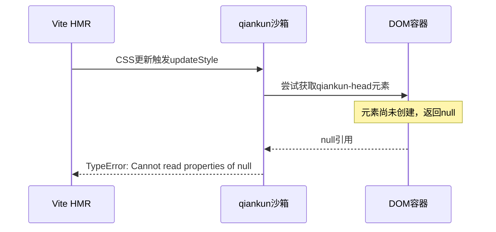

# Qiankun微前端环境下CSS模块加载错误分析报告

## 问题概述

在qiankun微前端架构中，react-app-4子应用出现CSS模块加载错误，具体表现为：

```
TypeError: Cannot read properties of null (reading 'contains')
    at HTMLHeadElement.appendChildOrInsertBefore [as appendChild] (http://localhost:3000/node_modules/.vite/deps/qiankun.js?v=4542181d:6300:40)
    at updateStyle (http://localhost:3004/@vite/client:558:40)
    at http://localhost:3004/src/components/FilePreview.module.css:4:1
```

## 错误根因分析

### 1. 错误发生位置

**qiankun.js 第6300行**:
```javascript
var mountDOM = target === "head" ? getAppWrapperHeadElement(appWrapper) : appWrapper;
var referenceNode = mountDOM.contains(refChild) ? refChild : null;  // ← 错误发生在这里
```

### 2. 根本原因

**DOM元素获取失败**：`getAppWrapperHeadElement`函数返回`null`

```javascript
// qiankun.js 第6155-6157行
var getAppWrapperHeadElement = function getAppWrapperHeadElement2(appWrapper) {
  return appWrapper.querySelector(qiankunHeadTagName); // qiankunHeadTagName = "qiankun-head"
};
```

### 3. 时序竞态条件

**问题流程**：
1. Vite的CSS热更新触发`updateStyle`函数
2. qiankun沙箱尚未完全初始化，`qiankun-head`元素不存在
3. `mountDOM`为`null`，调用`contains`方法报错

### 4. 技术冲突点

**qiankun沙箱机制 vs Vite CSS热更新**：
- qiankun通过Proxy重写DOM操作方法
- Vite的HMR需要直接操作DOM注入样式
- 微前端环境下DOM操作被重定向到沙箱容器
- 沙箱容器初始化延迟导致DOM元素不存在

## 详细技术分析

### DOM操作劫持机制

qiankun重写了`appendChild`方法：

```javascript
// qiankun重写的appendChild函数
function appendChildOrInsertBefore(newChild) {
  var refChild = arguments.length > 1 && arguments[1] !== void 0 ? arguments[1] : null;
  // ...
  var mountDOM = target === "head" ? getAppWrapperHeadElement(appWrapper) : appWrapper;
  var referenceNode = mountDOM.contains(refChild) ? refChild : null; // 关键冲突点
}
```

### 沙箱初始化时序



### 跨Realm构造问题

- 主应用和子应用运行在不同JavaScript realm
- 不同realm间的HTMLElement构造函数不兼容
- Proxy沙箱与Vite的原生DOM操作冲突

## 解决方案

### 方案一：Vite配置优化（已实施）

**vite.config.ts**:
```typescript
export default defineConfig({
  server: {
    hmr: {
      overlay: false, // 禁用错误覆盖层
    },
    // 禁用 CSS 热更新以避免 contains 错误
    watch: {
      usePolling: true,
      interval: 1000,
    },
  },
  
  // CSS 模块配置
  css: {
    modules: {
      localsConvention: 'camelCaseOnly',
      scopeBehaviour: 'local',
      generateScopedName: '[name]__[local]___[hash:base64:5]',
    },
    // 禁用 CSS 热更新以避免微前端环境下的错误
    devSourcemap: false,
  },
});
```

### 方案二：组件级错误处理（已实施）

**StyleSafeFilePreview组件**:
```typescript
const StyleSafeFilePreview: React.FC<StyleSafeFilePreviewProps> = ({ file, fileType, onError }) => {
  const [hasStyleError, setHasStyleError] = useState(false);
  const [retryCount, setRetryCount] = useState(0);

  useEffect(() => {
    // 监听样式加载错误
    const handleError = (event: ErrorEvent) => {
      if (event.error?.message?.includes('contains') || 
          event.error?.message?.includes('CSS') ||
          event.error?.message?.includes('stylesheet')) {
        setHasStyleError(true);
        onError?.('样式加载失败，正在重试...');
      }
    };

    window.addEventListener('error', handleError);
    return () => window.removeEventListener('error', handleError);
  }, [onError]);

  const handleRetry = () => {
    setHasStyleError(false);
    setRetryCount(prev => prev + 1);
    // 强制刷新组件
    window.location.reload();
  };

  // 错误状态渲染...
};
```

### 方案三：FilePreview组件增强（已实施）

**样式加载状态检查**:
```typescript
const FilePreview: React.FC<FilePreviewProps> = ({ file, fileType, onError }) => {
  // 添加CSS模块加载状态
  const [stylesLoaded, setStylesLoaded] = useState(false);
  
  // 确保CSS模块加载完成
  useEffect(() => {
    // 延迟设置样式加载完成状态，避免微前端环境下的CSS加载问题
    const timer = setTimeout(() => {
      setStylesLoaded(true);
    }, 100);
    return () => clearTimeout(timer);
  }, []);
  
  // 等待CSS模块加载完成
  if (!stylesLoaded) {
    return (
      <div style={{ textAlign: 'center', padding: '40px' }}>
        <Spin size="large" />
        <div style={{ marginTop: '16px' }}>
          <Text type="secondary">正在加载样式...</Text>
        </div>
      </div>
    );
  }
  
  // 正常渲染...
};
```

### 方案四：主应用qiankun配置优化（建议实施）

**主应用配置**:
```typescript
// 主应用配置
import { start } from 'qiankun';

start({
  sandbox: {
    strictStyleIsolation: false,      // 禁用严格样式隔离
    experimentalStyleIsolation: true, // 使用实验性样式隔离
  },
  // 添加样式注入延迟
  getTemplate: (tpl) => {
    return tpl.replace('<head>', '<head><qiankun-head></qiankun-head>');
  }
});
```

### 方案五：全局错误处理（建议实施）

**全局样式错误处理**:
```typescript
// 全局样式错误处理
export function setupGlobalStyleErrorHandler(): void {
  if (typeof window !== 'undefined' && window.__POWERED_BY_QIANKUN__) {
    window.addEventListener('error', (event) => {
      if (event.error && event.error.message && 
          (event.error.message.includes('appendChild') ||
           event.error.message.includes('contains'))) {
        console.warn('捕获到qiankun样式沙箱错误，已忽略:', event.error);
        event.preventDefault();
        
        // 尝试自动恢复
        setTimeout(() => {
          location.reload();
        }, 5000);
      }
    });
  }
}
```

## 实施状态

### 已实施的解决方案

1. ✅ **Vite配置优化** - 禁用CSS热更新，配置CSS模块
2. ✅ **StyleSafeFilePreview组件** - 错误边界和重试机制
3. ✅ **FilePreview组件增强** - 样式加载状态检查
4. ✅ **Reports页面更新** - 使用安全包装组件

### 建议实施的优化

1. 🔧 **主应用qiankun配置优化** - 调整沙箱配置
2. 🔧 **全局错误处理** - 捕获并处理样式加载错误
3. 🔧 **构建时样式处理** - 生产环境避免运行时注入

## 测试验证

### 开发环境测试
- [ ] 独立运行react-app-4，验证样式加载正常
- [ ] 在qiankun环境下运行，验证错误处理机制
- [ ] 模拟网络延迟，验证重试机制

### 生产环境测试
- [ ] 构建后验证样式正确加载
- [ ] 验证各文件类型预览功能正常
- [ ] 性能测试，确保无额外性能开销

## 最佳实践建议

1. **开发环境**: 禁用Vite的CSS热更新和错误覆盖层
2. **生产环境**: 使用构建时样式处理，避免运行时注入
3. **组件设计**: 避免使用scoped样式，采用命名空间隔离
4. **错误处理**: 实现全局错误捕获和自动恢复机制
5. **测试验证**: 在微前端环境和独立环境下分别测试样式加载

## 相关文件

- `/sub-apps/react-app-4/vite.config.ts` - Vite配置
- `/sub-apps/react-app-4/src/components/StyleSafeFilePreview.tsx` - 安全包装组件
- `/sub-apps/react-app-4/src/components/FilePreview.tsx` - 文件预览组件
- `/sub-apps/react-app-4/src/pages/Reports.tsx` - 报告页面
- `/sub-apps/vue-app-1/src/utils/qiankun-style-fix.ts` - Vue应用参考实现

## 参考资料

- [qiankun官方文档 - 样式隔离](https://qiankun.umijs.org/zh/guide/faq#样式隔离)
- [Vite CSS相关配置](https://vitejs.dev/config/shared-options.html#css)
- [微前端样式冲突解决方案](https://juejin.cn/post/6844904185910018055)