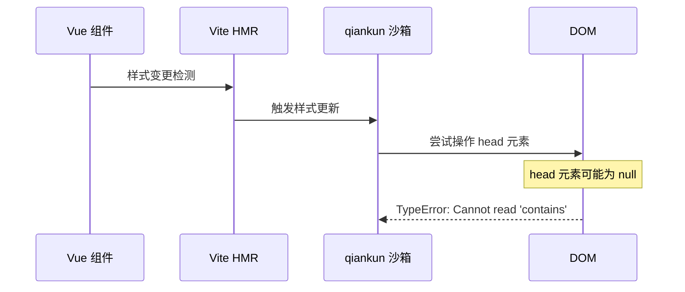
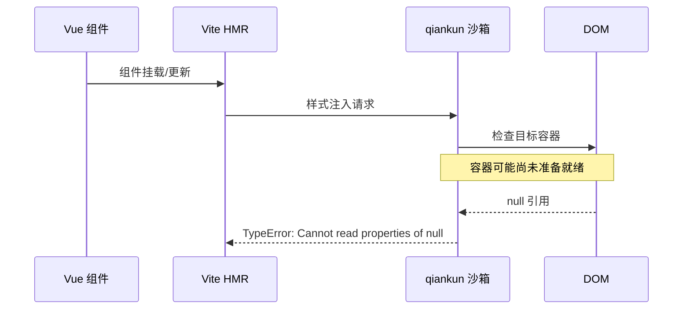

# qiankun 微前端 Vue 样式冲突问题解决指南

## 1. 问题概述和技术背景

### 1.1 问题描述

在 qiankun 微前端环境中，Vue 应用经常遇到样式相关的运行时错误，典型表现为：

```javascript
TypeError: Cannot read properties of null (reading 'contains')
    at HTMLHeadElement.appendChildOrInsertBefore [as appendChild] (qiankun.js:6300:40)
    at updateStyle (client.ts:425:4)
    at MessageCenter.vue?vue&type=style&index=0&scoped=edd5abf7&lang.css:4:1
```

### 1.2 技术背景

**qiankun 微前端架构**
- qiankun 基于 single-spa 实现，提供了完整的微前端解决方案
- 通过 HTML Entry 方式加载子应用，自动处理 JS 和 CSS 资源
- 实现了 JavaScript 沙箱和样式隔离机制

**Vue 样式处理机制**
- Vue 单文件组件支持 scoped 样式，通过 PostCSS 插件实现样式隔离
- 开发环境下支持热模块替换（HMR），样式可以实时更新
- 构建时可以选择 CSS 代码分割，将样式提取到独立文件

## 2. 根本原因深度分析

### 2.1 qiankun 样式沙箱机制

qiankun 通过以下机制实现样式隔离：

1. **DOM 操作劫持**: 重写 `appendChild`、`insertBefore`、`removeChild` 等 DOM 操作方法
2. **样式作用域限制**: 为子应用的样式添加特定的作用域前缀
3. **动态样式管理**: 监控和管理动态注入的样式元素

```javascript
// qiankun 样式沙箱核心逻辑（简化版）
function appendChildOrInsertBefore(element, target) {
  // 检查目标容器是否存在
  if (!target || !target.contains) {
    throw new TypeError("Cannot read properties of null (reading 'contains')");
  }
  
  // 执行实际的 DOM 操作
  return originalAppendChild.call(target, element);
}
```

### 2.2 Vue 样式处理与冲突点

**Vue Scoped 样式处理流程**:

1. **编译阶段**: Vue 编译器为 scoped 样式生成唯一的 data 属性
2. **运行时注入**: 样式通过 `<style>` 标签动态注入到 `<head>` 中
3. **热更新机制**: 开发环境下样式变更会触发重新注入

**冲突产生机制**:



### 2.3 时序问题分析

**问题触发时序**:

1. **组件初始化**: Vue 组件开始挂载
2. **样式注入**: scoped 样式准备注入到 DOM
3. **沙箱拦截**: qiankun 拦截 DOM 操作
4. **null 引用**: 此时 DOM 容器可能尚未准备就绪
5. **错误抛出**: 访问 null 对象的 `contains` 方法

**关键时间窗口**:
- 微前端应用启动后的前 100-200ms
- 组件热更新时的瞬间
- 路由切换导致的组件重新挂载时

### 冲突机制分析

#### 1. 时序冲突


#### 2. DOM 操作竞态条件
- qiankun 沙箱初始化需要时间
- Vue 组件可能在沙箱完全就绪前就开始样式注入
- 开发环境的热更新加剧了这种竞态条件

#### 3. 样式作用域冲突
```css
/* Vue scoped 样式 */
.message-center[data-v-edd5abf7] { padding: 16px; }

/* qiankun 期望的格式 */
.qiankun-app-vue-message-center .message-center { padding: 16px; }
```

## 错误表现和诊断方法

### 典型错误表现

#### 1. 运行时错误
```
TypeError: Cannot read properties of null (reading 'contains')
TypeError: Cannot read properties of null (reading 'appendChild')
TypeError: Cannot read properties of undefined (reading 'insertBefore')
```

#### 2. 样式失效
- 组件样式不生效
- 样式闪烁或延迟加载
- 热更新后样式丢失

#### 3. 控制台警告
```
[qiankun] Skip styles isolation because of STYLE element with invalid target
[qiankun] Failed to apply style isolation for micro app
```

### 诊断方法

#### 1. 浏览器开发者工具检查
```javascript
// 检查 qiankun 环境
console.log('qiankun 环境:', window.__POWERED_BY_QIANKUN__);

// 检查样式容器状态
console.log('Head 元素:', document.head);
console.log('样式元素数量:', document.querySelectorAll('style').length);

// 检查沙箱状态
console.log('沙箱 contains 方法:', document.head.contains);
```

#### 2. 网络面板分析
- 检查样式文件加载状态
- 观察 HMR 更新频率
- 确认 CORS 配置正确性

#### 3. 错误堆栈分析
```javascript
// 错误堆栈示例
Error: Cannot read properties of null (reading 'contains')
    at appendChildOrInsertBefore (qiankun.js:6300:40)
    at HTMLHeadElement.appendChild (qiankun.js:6295:20)
    at updateStyle (client.ts:425:4)  // Vite HMR 触发点
    at eval (MessageCenter.vue:4:1)   // Vue 组件样式注入点
```

## 完整的解决方案

### 方案一：移除 Scoped 样式，使用命名空间隔离（推荐）

#### 实施步骤

**1. 修改 Vue 组件样式**
```vue
<!-- 修改前 -->
<template>
  <div class="message-center">
    <h2>消息中心</h2>
  </div>
</template>

<style scoped>
.message-center {
  padding: 16px;
  background: #fff;
}
</style>

<!-- 修改后 -->
<template>
  <div class="vue-message-center">
    <div class="message-center">
      <h2>消息中心</h2>
    </div>
  </div>
</template>

<style>
.vue-message-center .message-center {
  padding: 16px;
  background: #fff;
}

.vue-message-center .message-center h2 {
  margin: 0 0 16px 0;
  color: #333;
}
</style>
```

**2. 批量修改工具脚本**
```bash
#!/bin/bash
# 批量移除 scoped 属性的脚本
find src/views -name "*.vue" -exec sed -i 's/<style scoped>/<style>/g' {} \;
find src/components -name "*.vue" -exec sed -i 's/<style scoped>/<style>/g' {} \;
```

**3. 样式命名规范**
```css
/* 命名空间规范 */
.vue-message-center {
  /* 根容器样式 */
}

.vue-message-center .component-name {
  /* 组件级样式 */
}

.vue-message-center .component-name__element {
  /* BEM 元素样式 */
}

.vue-message-center .component-name--modifier {
  /* BEM 修饰符样式 */
}
```

### 方案二：优化样式注入时序

#### 实施步骤

**1. 创建样式修复工具类**
```typescript
// src/utils/qiankun-style-fix.ts
export async function safeStyleInject(
  callback: () => void, 
  options: {
    delay?: number;
    maxRetries?: number;
    retryDelay?: number;
  } = {}
): Promise<boolean> {
  const { delay = 0, maxRetries = 3, retryDelay = 100 } = options;
  
  if (window.__POWERED_BY_QIANKUN__) {
    // 等待 DOM 和沙箱就绪
    const [domReady, sandboxReady] = await Promise.all([
      waitForDOMReady(),
      waitForQiankunSandbox()
    ]);

    if (!domReady || !sandboxReady) {
      console.warn('DOM 或沙箱未就绪，样式注入可能失败');
    }

    // 添加延迟确保环境稳定
    if (delay > 0) {
      await new Promise(resolve => setTimeout(resolve, delay));
    }

    // 重试机制
    for (let i = 0; i < maxRetries; i++) {
      try {
        callback();
        return true;
      } catch (error) {
        console.warn(`样式注入失败 (尝试 ${i + 1}/${maxRetries}):`, error);
        if (i < maxRetries - 1) {
          await new Promise(resolve => setTimeout(resolve, retryDelay));
        }
      }
    }
    return false;
  } else {
    // 独立运行模式直接执行
    try {
      callback();
      return true;
    } catch (error) {
      console.error('样式注入失败:', error);
      return false;
    }
  }
}
```

**2. 在组件中使用安全样式注入**
```vue
<script setup lang="ts">
import { onMounted } from 'vue';
import { safeStyleInject, safeDOMOperation, ensureStyleContainer } from '@/utils/qiankun-style-fix';

onMounted(async () => {
  // 在微前端环境下添加额外的延迟确保样式沙箱初始化完成
  if (window.__POWERED_BY_QIANKUN__) {
    await new Promise(resolve => setTimeout(resolve, 100));
  }

  // 安全的样式注入
  const componentStyles = `
    .vue-message-center .message-center {
      padding: 16px;
      background: #fff;
    }
  `;
  
  await safeStyleInject(() => {
    const container = ensureStyleContainer('head');
    if (container) {
      const styleElement = document.createElement('style');
      styleElement.textContent = componentStyles;
      styleElement.setAttribute('data-vue-message-center', 'true');
      
      safeDOMOperation(() => {
        container.appendChild(styleElement);
      });
    }
  });
});
</script>
```

### 方案三：Vite 配置优化

#### 实施步骤

**1. 优化 Vite 配置**
```typescript
// vite.config.ts
import { defineConfig } from 'vite';
import vue from '@vitejs/plugin-vue';
import { legacyQiankun } from 'vite-plugin-legacy-qiankun';

export default defineConfig({
  plugins: [
    vue({
      template: {
        compilerOptions: {
          // 禁用 scoped 样式的自动注入
          scopeId: false
        }
      }
    }),
    legacyQiankun({
      name: 'vue-message-center',
      devSandbox: true,
    }),
  ],
  
  css: {
    // 禁用 CSS 代码分割，避免动态样式加载问题
    cssCodeSplit: false,
    // 样式预处理器配置
    preprocessorOptions: {
      scss: {
        // 全局样式变量
        additionalData: `@import "@/styles/variables.scss";`
      }
    }
  },
  
  build: {
    cssCodeSplit: false,
    rollupOptions: {
      output: {
        // 确保样式文件独立输出
        assetFileNames: (assetInfo) => {
          if (assetInfo.name?.endsWith('.css')) {
            return 'assets/[name].[hash].css';
          }
          return 'assets/[name].[hash].[ext]';
        }
      }
    }
  },
  
  server: {
    hmr: {
      // 优化 HMR 配置，减少样式更新频率
      overlay: false
    }
  }
});
```

**2. 创建全局样式文件**
```css
/* src/styles/qiankun-compatibility.css */
/* qiankun 微前端兼容性样式 */

/* 确保弹层组件正确显示 */
.ant-modal-root,
.ant-drawer-root,
.ant-notification,
.ant-message {
  z-index: 9999 !important;
}

/* 修复响应式布局问题 */
.vue-message-center {
  box-sizing: border-box;
  width: 100%;
  height: 100%;
  overflow: hidden;
}

/* 修复 Ant Design 组件样式 */
.vue-message-center .ant-card {
  border-radius: 6px;
  box-shadow: 0 1px 2px -2px rgba(0,0,0,.16), 0 3px 6px 0 rgba(0,0,0,.12);
}

.vue-message-center .ant-list-item {
  border-bottom: 1px solid #f0f0f0;
  padding: 12px 16px;
}

.vue-message-center .ant-list-item:hover {
  background-color: #fafafa;
  cursor: pointer;
}
```

### 方案四：全局错误处理机制

#### 实施步骤

**1. 设置全局样式错误处理**
```typescript
// src/main.ts
import { setupGlobalStyleErrorHandler } from '@/utils/qiankun-style-fix';

// 在应用启动时设置全局错误处理
setupGlobalStyleErrorHandler();

// 样式错误监控
window.__STYLE_ERROR_MONITOR__ = {
  recordError(error: any) {
    console.warn('样式错误记录:', error);
    
    // 可以集成到监控系统
    if (typeof window.reportError === 'function') {
      window.reportError(error);
    }
    
    // 尝试自动恢复
    if (error.type === 'dom_operation_failed') {
      setTimeout(() => {
        // 重新初始化样式
        location.reload();
      }, 5000);
    }
  }
};
```

**2. 错误恢复机制**
```typescript
// src/utils/style-recovery.ts
export class StyleRecoveryManager {
  private static instance: StyleRecoveryManager;
  private recoveryAttempts = new Map<string, number>();
  private maxRecoveryAttempts = 3;

  static getInstance(): StyleRecoveryManager {
    if (!StyleRecoveryManager.instance) {
      StyleRecoveryManager.instance = new StyleRecoveryManager();
    }
    return StyleRecoveryManager.instance;
  }

  async recoverStyle(styleId: string, styleContent: string): Promise<boolean> {
    const attempts = this.recoveryAttempts.get(styleId) || 0;
    
    if (attempts >= this.maxRecoveryAttempts) {
      console.error(`样式恢复失败，已达到最大重试次数: ${styleId}`);
      return false;
    }

    this.recoveryAttempts.set(styleId, attempts + 1);

    try {
      // 等待环境稳定
      await new Promise(resolve => setTimeout(resolve, 200 * (attempts + 1)));
      
      // 移除旧样式
      const oldStyle = document.querySelector(`style[data-style-id="${styleId}"]`);
      if (oldStyle) {
        oldStyle.remove();
      }

      // 重新注入样式
      const styleElement = document.createElement('style');
      styleElement.textContent = styleContent;
      styleElement.setAttribute('data-style-id', styleId);
      styleElement.setAttribute('data-recovery-attempt', attempts.toString());
      
      document.head.appendChild(styleElement);
      
      console.log(`样式恢复成功: ${styleId} (尝试 ${attempts + 1})`);
      this.recoveryAttempts.delete(styleId);
      return true;
    } catch (error) {
      console.warn(`样式恢复失败: ${styleId} (尝试 ${attempts + 1})`, error);
      return false;
    }
  }
}
```

## 开发规范和最佳实践

### 样式开发规范

#### 1. 命名空间规范
```css
/* ✅ 推荐：使用应用级命名空间 */
.vue-message-center .component-name {
  /* 样式规则 */
}

/* ❌ 避免：直接使用全局样式 */
.component-name {
  /* 可能与其他应用冲突 */
}

/* ❌ 避免：使用 scoped 样式 */
.component-name[data-v-hash] {
  /* 在微前端环境下可能出现问题 */
}
```

#### 2. 样式优先级管理
```css
/* 优先级层次 */
.vue-message-center { /* 100 */ }
.vue-message-center .component { /* 200 */ }
.vue-message-center .component.modifier { /* 300 */ }
.vue-message-center .component .element { /* 300 */ }

/* 避免使用 !important */
.vue-message-center .component {
  color: #333 !important; /* ❌ 避免 */
  color: #333; /* ✅ 推荐 */
}
```

#### 3. 响应式设计规范
```css
.vue-message-center {
  /* 移动端优先 */
  .message-center {
    padding: 8px;
    
    @media (min-width: 768px) {
      padding: 16px;
    }
    
    @media (min-width: 1200px) {
      padding: 24px;
    }
  }
}
```

### 组件开发最佳实践

#### 1. 组件结构规范
```vue
<template>
  <!-- 根容器必须包含应用命名空间 -->
  <div class="vue-message-center">
    <div class="message-center">
      <div class="message-center__header">
        <h2 class="message-center__title">消息中心</h2>
      </div>
      <div class="message-center__content">
        <!-- 内容 -->
      </div>
    </div>
  </div>
</template>

<script setup lang="ts">
import { onMounted, onUnmounted } from 'vue';
import { safeStyleInject } from '@/utils/qiankun-style-fix';

// 组件样式
const componentStyles = `
  .vue-message-center .message-center {
    padding: 16px;
  }
  
  .vue-message-center .message-center__header {
    margin-bottom: 16px;
  }
  
  .vue-message-center .message-center__title {
    margin: 0;
    font-size: 18px;
    font-weight: 600;
  }
`;

let styleElement: HTMLStyleElement | null = null;

onMounted(async () => {
  // 安全注入样式
  await safeStyleInject(() => {
    styleElement = document.createElement('style');
    styleElement.textContent = componentStyles;
    styleElement.setAttribute('data-component', 'message-center');
    document.head.appendChild(styleElement);
  });
});

onUnmounted(() => {
  // 清理样式
  if (styleElement && styleElement.parentNode) {
    styleElement.parentNode.removeChild(styleElement);
  }
});
</script>

<style>
/* 静态样式，避免动态注入 */
.vue-message-center {
  box-sizing: border-box;
  width: 100%;
  height: 100%;
}
</style>
```

#### 2. 生命周期管理
```typescript
// 组件生命周期最佳实践
export default defineComponent({
  name: 'MessageCenter',
  
  async beforeMount() {
    // 在微前端环境下等待沙箱就绪
    if (window.__POWERED_BY_QIANKUN__) {
      await waitForQiankunSandbox();
    }
  },
  
  mounted() {
    // 延迟执行样式相关操作
    this.$nextTick(async () => {
      await this.initializeStyles();
    });
  },
  
  beforeUnmount() {
    // 清理样式和事件监听器
    this.cleanupStyles();
    this.cleanupEventListeners();
  },
  
  methods: {
    async initializeStyles() {
      // 安全的样式初始化
      await safeStyleInject(() => {
        // 样式注入逻辑
      });
    },
    
    cleanupStyles() {
      // 样式清理逻辑
      const styles = document.querySelectorAll('style[data-component="message-center"]');
      styles.forEach(style => style.remove());
    },
    
    cleanupEventListeners() {
      // 事件监听器清理
    }
  }
});
```

## 新增 Vue 组件的安全开发指南

### 组件创建模板

#### 1. 标准组件模板
```vue
<!-- src/components/SafeComponent.vue -->
<template>
  <div class="vue-message-center">
    <div class="safe-component">
      <div class="safe-component__header">
        <slot name="header">
          <h3 class="safe-component__title">{{ title }}</h3>
        </slot>
      </div>
      <div class="safe-component__content">
        <slot></slot>
      </div>
      <div class="safe-component__footer" v-if="$slots.footer">
        <slot name="footer"></slot>
      </div>
    </div>
  </div>
</template>

<script setup lang="ts">
import { ref, onMounted, onUnmounted, nextTick } from 'vue';
import { safeStyleInject, safeDOMOperation } from '@/utils/qiankun-style-fix';

interface Props {
  title?: string;
  loading?: boolean;
}

const props = withDefaults(defineProps<Props>(), {
  title: '',
  loading: false
});

// 组件状态
const isStylesLoaded = ref(false);
const componentId = `safe-component-${Date.now()}`;

// 组件样式
const componentStyles = `
  .vue-message-center .safe-component {
    border: 1px solid #d9d9d9;
    border-radius: 6px;
    background: #fff;
    overflow: hidden;
  }
  
  .vue-message-center .safe-component__header {
    padding: 16px;
    background: #fafafa;
    border-bottom: 1px solid #f0f0f0;
  }
  
  .vue-message-center .safe-component__title {
    margin: 0;
    font-size: 16px;
    font-weight: 600;
    color: #262626;
  }
  
  .vue-message-center .safe-component__content {
    padding: 16px;
  }
  
  .vue-message-center .safe-component__footer {
    padding: 16px;
    background: #fafafa;
    border-top: 1px solid #f0f0f0;
    text-align: right;
  }
  
  .vue-message-center .safe-component.loading {
    opacity: 0.6;
    pointer-events: none;
  }
`;

// 样式注入
async function injectStyles() {
  const success = await safeStyleInject(() => {
    const styleElement = document.createElement('style');
    styleElement.textContent = componentStyles;
    styleElement.setAttribute('data-component-id', componentId);
    
    safeDOMOperation(() => {
      document.head.appendChild(styleElement);
    });
  }, {
    delay: 50,
    maxRetries: 3,
    retryDelay: 100
  });
  
  isStylesLoaded.value = success;
  
  if (!success) {
    console.warn(`组件样式注入失败: ${componentId}`);
  }
}

// 样式清理
function cleanupStyles() {
  const styleElements = document.querySelectorAll(`style[data-component-id="${componentId}"]`);
  styleElements.forEach(element => {
    safeDOMOperation(() => {
      element.remove();
    });
  });
}

// 生命周期
onMounted(async () => {
  await nextTick();
  await injectStyles();
});

onUnmounted(() => {
  cleanupStyles();
});

// 暴露给父组件的方法
defineExpose({
  refreshStyles: injectStyles,
  isStylesLoaded: () => isStylesLoaded.value
});
</script>

<style>
/* 基础样式，不依赖动态注入 */
.vue-message-center .safe-component {
  position: relative;
  min-height: 100px;
}

.vue-message-center .safe-component.loading::before {
  content: '';
  position: absolute;
  top: 0;
  left: 0;
  right: 0;
  bottom: 0;
  background: rgba(255, 255, 255, 0.8);
  z-index: 1;
}
</style>
```

#### 2. 组件使用示例
```vue
<!-- 父组件中使用 -->
<template>
  <div class="vue-message-center">
    <SafeComponent 
      ref="safeComponentRef"
      title="安全组件示例"
      :loading="loading"
    >
      <template #header>
        <h3>自定义标题</h3>
      </template>
      
      <p>这是组件内容</p>
      
      <template #footer>
        <a-button @click="handleRefresh">刷新样式</a-button>
      </template>
    </SafeComponent>
  </div>
</template>

<script setup lang="ts">
import { ref } from 'vue';
import SafeComponent from '@/components/SafeComponent.vue';

const safeComponentRef = ref();
const loading = ref(false);

async function handleRefresh() {
  if (safeComponentRef.value) {
    loading.value = true;
    await safeComponentRef.value.refreshStyles();
    loading.value = false;
  }
}
</script>
```

### 开发检查清单

#### 创建新组件前
- [ ] 确认组件命名符合 BEM 规范
- [ ] 设计组件的样式命名空间
- [ ] 规划组件的 props 和 events 接口
- [ ] 考虑组件的响应式设计需求

#### 开发过程中
- [ ] 使用 `.vue-message-center` 作为根命名空间
- [ ] 避免使用 `scoped` 样式
- [ ] 使用 `safeStyleInject` 进行样式注入
- [ ] 实现样式清理逻辑
- [ ] 添加加载状态和错误处理

#### 测试验证
- [ ] 独立运行模式测试
- [ ] 微前端环境测试
- [ ] 热更新功能测试
- [ ] 样式隔离效果验证
- [ ] 移动端响应式测试

### 常见问题预防

#### 1. 样式命名冲突
```css
/* ❌ 错误：全局样式可能冲突 */
.button {
  background: #1890ff;
}

/* ✅ 正确：使用命名空间 */
.vue-message-center .message-button {
  background: #1890ff;
}
```

#### 2. 动态样式注入时机
```typescript
// ❌ 错误：立即注入可能失败
onMounted(() => {
  document.head.appendChild(styleElement);
});

// ✅ 正确：安全注入
onMounted(async () => {
  await nextTick();
  await safeStyleInject(() => {
    document.head.appendChild(styleElement);
  });
});
```

#### 3. 样式清理遗漏
```typescript
// ❌ 错误：未清理样式
onUnmounted(() => {
  // 组件销毁但样式残留
});

// ✅ 正确：完整清理
onUnmounted(() => {
  cleanupStyles();
  cleanupEventListeners();
  cleanupTimers();
});
```

## 故障排查流程

### 快速诊断步骤

#### 1. 环境检查
```javascript
// 在浏览器控制台执行
console.log('=== qiankun 环境诊断 ===');
console.log('qiankun 环境:', window.__POWERED_BY_QIANKUN__);
console.log('公共路径:', window.__INJECTED_PUBLIC_PATH_BY_QIANKUN__);
console.log('DOM 状态:', document.readyState);
console.log('Head 元素:', document.head);
console.log('样式元素数量:', document.querySelectorAll('style').length);
```

#### 2. 样式状态检查
```javascript
// 检查样式注入状态
function checkStylesStatus() {
  const styles = document.querySelectorAll('style');
  const vueStyles = Array.from(styles).filter(style => 
    style.getAttribute('data-vue-message-center')
  );
  
  console.log('总样式数量:', styles.length);
  console.log('Vue 应用样式数量:', vueStyles.length);
  console.log('样式详情:', vueStyles.map(style => ({
    id: style.getAttribute('data-component-id'),
    content: style.textContent?.substring(0, 100) + '...'
  })));
}

checkStylesStatus();
```

#### 3. 错误重现
```javascript
// 模拟样式注入错误
function simulateStyleError() {
  try {
    const styleElement = document.createElement('style');
    styleElement.textContent = '.test { color: red; }';
    document.head.appendChild(styleElement);
    console.log('✅ 样式注入成功');
  } catch (error) {
    console.error('❌ 样式注入失败:', error);
  }
}

simulateStyleError();
```

### 详细排查指南

#### 1. 错误类型分析

**TypeError: Cannot read properties of null (reading 'contains')**
- **原因**：qiankun 沙箱未完全初始化
- **解决**：使用 `waitForQiankunSandbox()` 等待沙箱就绪
- **预防**：在样式操作前添加环境检查

**样式不生效或闪烁**
- **原因**：样式注入时机过早或过晚
- **解决**：使用 `nextTick()` 和适当延迟
- **预防**：实现样式加载状态管理

**热更新后样式丢失**
- **原因**：HMR 更新时样式被错误移除
- **解决**：优化 Vite HMR 配置
- **预防**：实现样式恢复机制

#### 2. 分步骤排查

**步骤 1：基础环境检查**
```bash
# 检查服务状态
curl -I http://localhost:3006

# 检查 CORS 配置
curl -H "Origin: http://localhost:3000" \
     -H "Access-Control-Request-Method: GET" \
     -X OPTIONS \
     http://localhost:3006
```

**步骤 2：配置文件检查**
```typescript
// 检查 vite.config.ts
import { defineConfig } from 'vite';

export default defineConfig({
  // 确认插件配置
  plugins: [
    vue(), // ✅ Vue 插件
    legacyQiankun({ // ✅ qiankun 插件
      name: 'vue-message-center',
      devSandbox: true
    })
  ],
  
  // 确认 CSS 配置
  css: {
    cssCodeSplit: false // ✅ 禁用 CSS 分割
  }
});
```

**步骤 3：组件代码检查**
```vue
<template>
  <!-- ✅ 确认根容器有命名空间 -->
  <div class="vue-message-center">
    <div class="component-content">
      <!-- 内容 -->
    </div>
  </div>
</template>

<style>
/* ✅ 确认使用命名空间样式 */
.vue-message-center .component-content {
  padding: 16px;
}
</style>
```

**步骤 4：运行时检查**
```javascript
// 检查样式注入函数
import { safeStyleInject } from '@/utils/qiankun-style-fix';

// 测试样式注入
safeStyleInject(() => {
  console.log('样式注入测试成功');
}).then(success => {
  console.log('注入结果:', success);
});
```

### 应急处理方案

#### 1. 临时禁用样式隔离
```typescript
// 主应用配置
import { start } from 'qiankun';

start({
  sandbox: {
    strictStyleIsolation: false,
    experimentalStyleIsolation: false // 临时禁用
  }
});
```

#### 2. 强制样式重新加载
```javascript
// 紧急样式恢复函数
function emergencyStyleRecovery() {
  // 移除所有 Vue 应用样式
  document.querySelectorAll('style[data-vue-message-center]')
    .forEach(style => style.remove());
  
  // 重新加载页面
  setTimeout(() => {
    location.reload();
  }, 1000);
}

// 在控制台执行
emergencyStyleRecovery();
```

#### 3. 降级到内联样式
```vue
<template>
  <div 
    class="vue-message-center"
    :style="emergencyStyles"
  >
    <!-- 内容 -->
  </div>
</template>

<script setup lang="ts">
import { computed } from 'vue';

const emergencyStyles = computed(() => ({
  padding: '16px',
  background: '#fff',
  border: '1px solid #d9d9d9',
  borderRadius: '6px'
}));
</script>
```

## 相关工具和代码示例

### 开发工具

#### 1. 样式调试工具
```javascript
// 浏览器控制台工具
window.qiankunStyleDebugger = {
  // 检查样式状态
  checkStyles() {
    const styles = document.querySelectorAll('style');
    return Array.from(styles).map(style => ({
      id: style.id || 'unnamed',
      dataAttributes: Array.from(style.attributes)
        .filter(attr => attr.name.startsWith('data-'))
        .map(attr => `${attr.name}="${attr.value}"`),
      contentPreview: style.textContent?.substring(0, 200) + '...',
      parent: style.parentElement?.tagName
    }));
  },
  
  // 清理所有 Vue 样式
  cleanVueStyles() {
    document.querySelectorAll('style[data-vue-message-center]')
      .forEach(style => style.remove());
    console.log('已清理所有 Vue 样式');
  },
  
  // 重新注入样式
  reinjectStyles() {
    this.cleanVueStyles();
    // 触发组件重新渲染
    window.dispatchEvent(new Event('vue-style-reinject'));
  }
};
```

#### 2. 性能监控工具
```typescript
// src/utils/style-performance.ts
export class StylePerformanceMonitor {
  private static metrics = new Map<string, number>();
  
  static startTiming(operation: string): void {
    this.metrics.set(operation, performance.now());
  }
  
  static endTiming(operation: string): number {
    const startTime = this.metrics.get(operation);
    if (!startTime) return 0;
    
    const duration = performance.now() - startTime;
    this.metrics.delete(operation);
    
    console.log(`样式操作耗时 [${operation}]: ${duration.toFixed(2)}ms`);
    return duration;
  }
  
  static async measureStyleInjection<T>(
    operation: string,
    callback: () => Promise<T>
  ): Promise<T> {
    this.startTiming(operation);
    try {
      const result = await callback();
      this.endTiming(operation);
      return result;
    } catch (error) {
      this.endTiming(operation);
      throw error;
    }
  }
}

// 使用示例
await StylePerformanceMonitor.measureStyleInjection(
  'component-style-injection',
  () => safeStyleInject(() => {
    document.head.appendChild(styleElement);
  })
);
```

### 自动化测试

#### 1. 样式注入测试
```typescript
// tests/style-injection.test.ts
import { describe, it, expect, beforeEach, afterEach } from 'vitest';
import { safeStyleInject, ensureStyleContainer } from '@/utils/qiankun-style-fix';

describe('样式注入测试', () => {
  beforeEach(() => {
    // 模拟 qiankun 环境
    (window as any).__POWERED_BY_QIANKUN__ = true;
  });
  
  afterEach(() => {
    // 清理测试环境
    document.querySelectorAll('style[data-test]').forEach(el => el.remove());
    delete (window as any).__POWERED_BY_QIANKUN__;
  });
  
  it('应该安全注入样式', async () => {
    const testStyle = '.test { color: red; }';
    
    const success = await safeStyleInject(() => {
      const styleElement = document.createElement('style');
      styleElement.textContent = testStyle;
      styleElement.setAttribute('data-test', 'true');
      document.head.appendChild(styleElement);
    });
    
    expect(success).toBe(true);
    expect(document.querySelector('style[data-test]')).toBeTruthy();
  });
  
  it('应该处理样式注入失败', async () => {
    // 模拟 DOM 操作失败
    const originalAppendChild = document.head.appendChild;
    document.head.appendChild = () => {
      throw new Error('DOM operation failed');
    };
    
    const success = await safeStyleInject(() => {
      const styleElement = document.createElement('style');
      document.head.appendChild(styleElement);
    });
    
    expect(success).toBe(false);
    
    // 恢复原始方法
    document.head.appendChild = originalAppendChild;
  });
});
```

#### 2. 端到端测试
```typescript
// e2e/style-isolation.spec.ts
import { test, expect } from '@playwright/test';

test.describe('qiankun 样式隔离测试', () => {
  test('Vue 应用样式应该正确隔离', async ({ page }) => {
    // 访问主应用
    await page.goto('http://localhost:3000');
    
    // 导航到 Vue 子应用
    await page.click('text=消息中心');
    
    // 等待子应用加载
    await page.waitForSelector('.vue-message-center');
    
    // 检查样式隔离
    const vueStyles = await page.evaluate(() => {
      return Array.from(document.querySelectorAll('style'))
        .filter(style => style.textContent?.includes('.vue-message-center'))
        .length;
    });
    
    expect(vueStyles).toBeGreaterThan(0);
    
    // 检查样式不冲突
    const hasConflicts = await page.evaluate(() => {
      const mainAppElement = document.querySelector('.main-app');
      const vueAppElement = document.querySelector('.vue-message-center');
      
      if (!mainAppElement || !vueAppElement) return false;
      
      const mainStyles = window.getComputedStyle(mainAppElement);
      const vueStyles = window.getComputedStyle(vueAppElement);
      
      // 检查关键样式是否被意外覆盖
      return mainStyles.color === vueStyles.color && 
             mainStyles.fontSize === vueStyles.fontSize;
    });
    
    expect(hasConflicts).toBe(false);
  });
  
  test('热更新不应该破坏样式', async ({ page }) => {
    await page.goto('http://localhost:3000/message-center');
    
    // 获取初始样式
    const initialStyles = await page.evaluate(() => {
      const element = document.querySelector('.vue-message-center .message-center');
      return element ? window.getComputedStyle(element).padding : null;
    });
    
    // 模拟文件修改触发热更新
    // 这里需要配合开发环境的文件监听
    
    // 等待热更新完成
    await page.waitForTimeout(2000);
    
    // 检查样式是否保持
    const updatedStyles = await page.evaluate(() => {
      const element = document.querySelector('.vue-message-center .message-center');
      return element ? window.getComputedStyle(element).padding : null;
    });
    
    expect(updatedStyles).toBe(initialStyles);
  });
});
```

### 构建优化

#### 1. Webpack 配置优化（如果使用 Webpack）
```javascript
// webpack.config.js
const path = require('path');

module.exports = {
  // ... 其他配置
  
  optimization: {
    splitChunks: {
      cacheGroups: {
        styles: {
          name: 'styles',
          test: /\.css$/,
          chunks: 'all',
          enforce: true,
        },
      },
    },
  },
  
  module: {
    rules: [
      {
        test: /\.vue$/,
        loader: 'vue-loader',
        options: {
          compilerOptions: {
            // 禁用 scoped 样式
            scopeId: false
          }
        }
      },
      {
        test: /\.css$/,
        use: [
          'vue-style-loader',
          {
            loader: 'css-loader',
            options: {
              // 启用 CSS 模块
              modules: {
                localIdentName: '[local]--[hash:base64:5]'
              }
            }
          }
        ]
      }
    ]
  }
};
```

#### 2. PostCSS 配置
```javascript
// postcss.config.js
module.exports = {
  plugins: [
    require('autoprefixer'),
    require('postcss-nested'),
    require('postcss-custom-properties'),
    // 添加前缀以避免样式冲突
    require('postcss-prefixwrap')('.vue-message-center')
  ]
};
```

## 参考资料和延伸阅读

### 官方文档
- [qiankun 官方文档](https://qiankun.umijs.org/zh)
- [qiankun 样式隔离指南](https://qiankun.umijs.org/zh/guide/tutorial#%E6%A0%B7%E5%BC%8F%E9%9A%94%E7%A6%BB)
- [Vue 3 官方文档](https://vuejs.org/)
- [Vue SFC 样式特性](https://vuejs.org/api/sfc-css-features.html)
- [Vite 官方文档](https://vitejs.dev/)
- [Vite CSS 处理](https://vitejs.dev/guide/features.html#css)

### 技术博客和最佳实践
- [微前端样式隔离方案对比](https://zhuanlan.zhihu.com/p/382852723)
- [qiankun 样式沙箱原理解析](https://juejin.cn/post/6920110573418086413)
- [Vue 3 + qiankun 最佳实践](https://github.com/umijs/qiankun/issues/1257)

### 相关工具和插件
- [vite-plugin-legacy-qiankun](https://github.com/tengmaoqing/vite-plugin-legacy-qiankun)
- [webpack-qiankun-plugin](https://github.com/Tencent/webpack-qiankun-plugin)
- [postcss-prefixwrap](https://github.com/dbtedman/postcss-prefixwrap)

### 社区资源
- [qiankun GitHub Issues](https://github.com/umijs/qiankun/issues)
- [微前端社区](https://github.com/micro-frontends)
- [Awesome Micro Frontends](https://github.com/rajasegar/awesome-micro-frontends)

### 相关标准和规范
- [CSS Scoping Module Level 1](https://www.w3.org/TR/css-scoping-1/)
- [Shadow DOM v1 规范](https://dom.spec.whatwg.org/#shadow-trees)
- [Web Components 标准](https://www.webcomponents.org/specs)

---

**文档版本**: 2.0  
**创建日期**: 2025-09-28  
**最后更新**: 2025-09-28  
**维护人员**: Roger
**适用版本**: qiankun ^2.8.0, Vue ^3.3.0, Vite ^4.4.0