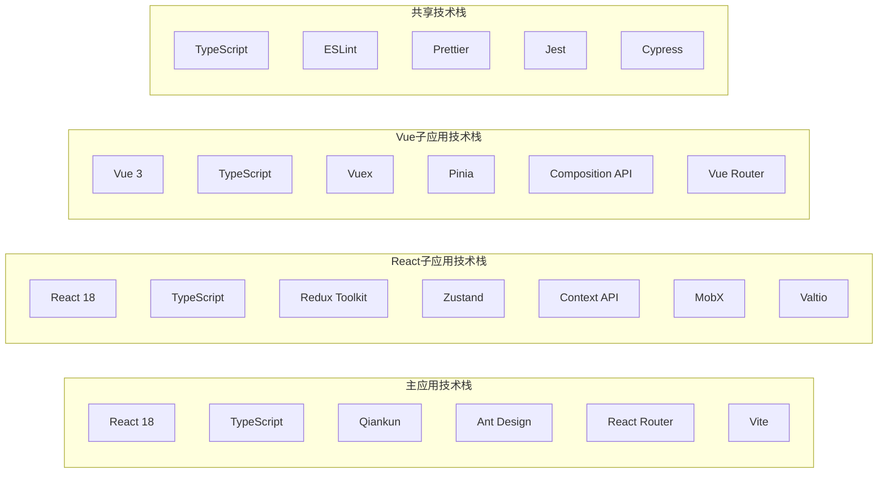
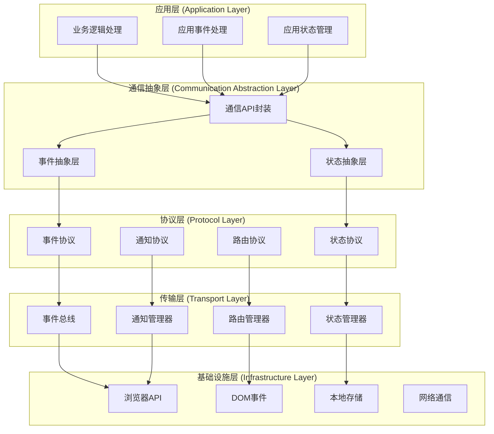
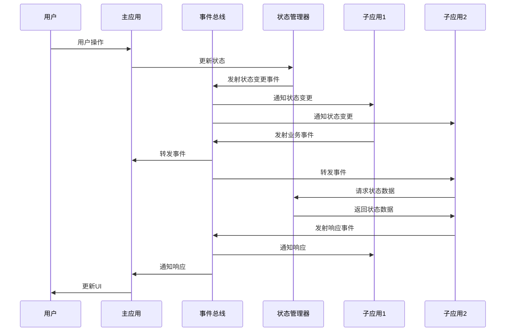

# Qiankun微前端整体架构通信文档

## 1. 架构总览

本文档从整体架构的角度，全面阐述qiankun微前端项目中应用间通信的设计理念、实现方案和最佳实践。

### 1.1 整体架构图

```mermaid
graph TB
    subgraph "用户界面层 (Presentation Layer)"
        UI[用户界面]
        UE[用户体验]
    end
    
    subgraph "主应用层 (Main Application Layer)"
        MA[主应用容器<br/>React 18 + Qiankun<br/>端口: 3000]
        
        subgraph "核心服务"
            QR[Qiankun注册器]
            RM[路由管理器]
            AM[认证管理器]
            PM[权限管理器]
            TM[主题管理器]
            EM[错误管理器]
        end
    end
    
    subgraph "通信基础设施层 (Communication Infrastructure)"
        EB[全局事件总线<br/>EventBus]
        GSM[全局状态管理<br/>GlobalStateManager]
        API[通信API层]
        
        subgraph "通信协议"
            EP[事件协议]
            SP[状态协议]
            RP[路由协议]
            NP[通知协议]
        end
    end
    
    subgraph "微应用层 (Micro Applications Layer)"
        subgraph "React应用集群"
            RA1[用户管理<br/>Redux Toolkit<br/>端口: 3001]
            RA2[商品管理<br/>Zustand<br/>端口: 3002]
            RA3[订单管理<br/>Context API<br/>端口: 3003]
            RA4[数据看板<br/>MobX<br/>端口: 3004]
            RA5[设置中心<br/>Valtio<br/>端口: 3005]
        end
        
        subgraph "Vue应用集群"
            VA1[消息中心<br/>Vuex<br/>端口: 3006]
            VA2[文件管理<br/>Pinia<br/>端口: 3007]
            VA3[系统监控<br/>Composition API<br/>端口: 3008]
        end
    end
    
    subgraph "共享资源层 (Shared Resources Layer)"
        ST[TypeScript类型定义]
        SU[工具函数库]
        SC[样式系统]
        SL[日志系统]
        SM[监控系统]
    end
    
    subgraph "基础设施层 (Infrastructure Layer)"
        NET[网络层]
        CACHE[缓存层]
        STORAGE[存储层]
        SECURITY[安全层]
    end
    
    UI --> MA
    MA --> QR
    MA --> RM
    MA --> AM
    MA --> PM
    MA --> TM
    MA --> EM
    
    MA --> EB
    MA --> GSM
    MA --> API
    
    EB --> EP
    EB --> SP
    EB --> RP
    EB --> NP
    
    GSM --> EP
    GSM --> SP
    
    API <--> RA1
    API <--> RA2
    API <--> RA3
    API <--> RA4
    API <--> RA5
    API <--> VA1
    API <--> VA2
    API <--> VA3
    
    EB <--> RA1
    EB <--> RA2
    EB <--> RA3
    EB <--> RA4
    EB <--> RA5
    EB <--> VA1
    EB <--> VA2
    EB <--> VA3
    
    GSM <--> RA1
    GSM <--> RA2
    GSM <--> RA3
    GSM <--> RA4
    GSM <--> RA5
    GSM <--> VA1
    GSM <--> VA2
    GSM <--> VA3
    
    ST -.-> RA1
    ST -.-> RA2
    ST -.-> RA3
    ST -.-> RA4
    ST -.-> RA5
    ST -.-> VA1
    ST -.-> VA2
    ST -.-> VA3
    
    SU -.-> MA
    SU -.-> RA1
    SU -.-> RA2
    SU -.-> RA3
    SU -.-> RA4
    SU -.-> RA5
    SU -.-> VA1
    SU -.-> VA2
    SU -.-> VA3
    
    NET --> MA
    CACHE --> GSM
    STORAGE --> GSM
    SECURITY --> AM
```



### 1.2 架构设计原则

| 原则 | 描述 | 实现方式 |
|------|------|----------|
| **松耦合** | 应用间通过标准接口通信，避免直接依赖 | 事件总线 + 全局状态管理 |
| **高内聚** | 每个应用内部功能高度相关，职责单一 | 按业务领域拆分应用 |
| **可扩展** | 支持动态添加新应用和功能 | 插件化架构 + 配置驱动 |
| **容错性** | 单个应用故障不影响整体系统 | 错误边界 + 降级策略 |
| **一致性** | 统一的用户体验和交互模式 | 共享组件库 + 设计规范 |
| **性能优化** | 高效的资源加载和运行性能 | 懒加载 + 缓存策略 |

### 1.3 技术栈分布



## 2. 通信架构深度解析

### 2.1 通信层次模型



### 2.2 通信模式分类

#### 2.2.1 同步通信模式

```typescript
// 直接状态访问
interface SyncCommunication {
  // 获取全局状态
  getGlobalState(): GlobalState;
  
  // 获取特定应用状态
  getAppState(appName: string): any;
  
  // 检查权限
  hasPermission(permission: string): boolean;
  
  // 获取当前用户
  getCurrentUser(): User | null;
}

// 实现示例
class SyncCommunicationImpl implements SyncCommunication {
  getGlobalState(): GlobalState {
    return globalStateManager.getState();
  }
  
  getAppState(appName: string): any {
    const state = this.getGlobalState();
    return state.app.microApps.find(app => app.name === appName);
  }
  
  hasPermission(permission: string): boolean {
    const state = this.getGlobalState();
    return state.user.permissions.includes(permission);
  }
  
  getCurrentUser(): User | null {
    const state = this.getGlobalState();
    return state.user.currentUser;
  }
}
```

#### 2.2.2 异步通信模式

```typescript
// 事件驱动通信
interface AsyncCommunication {
  // 发送事件
  emit<T extends BaseEvent>(event: T): void;
  
  // 监听事件
  on<T extends BaseEvent>(eventType: string, handler: EventHandler<T>): EventSubscription;
  
  // 请求-响应模式
  request<T>(eventType: string, data: any, timeout?: number): Promise<T>;
  
  // 广播消息
  broadcast(message: any, target?: string[]): void;
}

// 实现示例
class AsyncCommunicationImpl implements AsyncCommunication {
  emit<T extends BaseEvent>(event: T): void {
    globalEventBus.emit(event);
  }
  
  on<T extends BaseEvent>(eventType: string, handler: EventHandler<T>): EventSubscription {
    return globalEventBus.on(eventType, handler);
  }
  
  async request<T>(eventType: string, data: any, timeout: number = 5000): Promise<T> {
    const requestId = `req-${Date.now()}-${Math.random()}`;
    const responseEventType = `${eventType}_RESPONSE`;
    
    return new Promise((resolve, reject) => {
      const timeoutId = setTimeout(() => {
        reject(new Error(`Request timeout: ${eventType}`));
      }, timeout);
      
      const subscription = this.on(responseEventType, (event) => {
        if (event.data.requestId === requestId) {
          clearTimeout(timeoutId);
          subscription.unsubscribe();
          resolve(event.data.response);
        }
      });
      
      this.emit({
        type: eventType,
        source: 'communication-layer',
        timestamp: new Date().toISOString(),
        id: requestId,
        data: { ...data, requestId }
      });
    });
  }
  
  broadcast(message: any, target?: string[]): void {
    this.emit({
      type: 'BROADCAST_MESSAGE',
      source: 'communication-layer',
      timestamp: new Date().toISOString(),
      id: `broadcast-${Date.now()}`,
      data: { message, target }
    });
  }
}
```

#### 2.2.3 发布订阅模式

```typescript
// 主题订阅系统
class TopicSubscriptionSystem {
  private topics = new Map<string, Set<EventHandler>>();
  private wildcardSubscribers = new Set<EventHandler>();
  
  // 订阅主题
  subscribe(topic: string, handler: EventHandler): EventSubscription {
    if (topic === '*') {
      this.wildcardSubscribers.add(handler);
    } else {
      if (!this.topics.has(topic)) {
        this.topics.set(topic, new Set());
      }
      this.topics.get(topic)!.add(handler);
    }
    
    return {
      unsubscribe: () => this.unsubscribe(topic, handler)
    };
  }
  
  // 取消订阅
  unsubscribe(topic: string, handler: EventHandler): void {
    if (topic === '*') {
      this.wildcardSubscribers.delete(handler);
    } else {
      const subscribers = this.topics.get(topic);
      if (subscribers) {
        subscribers.delete(handler);
        if (subscribers.size === 0) {
          this.topics.delete(topic);
        }
      }
    }
  }
  
  // 发布消息
  publish(topic: string, data: any): void {
    const event = {
      type: topic,
      source: 'topic-system',
      timestamp: new Date().toISOString(),
      id: `topic-${Date.now()}`,
      data
    };
    
    // 通知主题订阅者
    const subscribers = this.topics.get(topic);
    if (subscribers) {
      subscribers.forEach(handler => {
        try {
          handler(event);
        } catch (error) {
          console.error(`Topic handler error for ${topic}:`, error);
        }
      });
    }
    
    // 通知通配符订阅者
    this.wildcardSubscribers.forEach(handler => {
      try {
        handler(event);
      } catch (error) {
        console.error(`Wildcard handler error for ${topic}:`, error);
      }
    });
  }
  
  // 获取主题统计
  getTopicStats(): Record<string, number> {
    const stats: Record<string, number> = {};
    
    this.topics.forEach((subscribers, topic) => {
      stats[topic] = subscribers.size;
    });
    
    stats['*'] = this.wildcardSubscribers.size;
    
    return stats;
  }
}
```

### 2.3 数据流架构



## 3. 核心组件详细设计

### 3.1 全局事件总线

#### 3.1.1 事件总线架构

```typescript
// 事件总线核心架构
class AdvancedEventBus extends EventBus {
  private eventQueue: BaseEvent[] = [];
  private processing = false;
  private middleware: EventMiddleware[] = [];
  private interceptors: EventInterceptor[] = [];
  private metrics: EventMetrics = new EventMetrics();
  
  // 添加中间件
  use(middleware: EventMiddleware): void {
    this.middleware.push(middleware);
  }
  
  // 添加拦截器
  addInterceptor(interceptor: EventInterceptor): void {
    this.interceptors.push(interceptor);
  }
  
  // 增强的事件发射
  emit<T extends BaseEvent>(event: T): void {
    // 事件预处理
    const processedEvent = this.preprocessEvent(event);
    
    // 应用拦截器
    const interceptedEvent = this.applyInterceptors(processedEvent);
    
    // 添加到队列
    this.eventQueue.push(interceptedEvent);
    
    // 处理队列
    this.processEventQueue();
  }
  
  // 预处理事件
  private preprocessEvent<T extends BaseEvent>(event: T): T {
    // 添加元数据
    const enhancedEvent = {
      ...event,
      metadata: {
        ...event.metadata,
        queueTime: Date.now(),
        version: '1.0.0'
      }
    };
    
    // 验证事件
    this.validateEvent(enhancedEvent);
    
    return enhancedEvent;
  }
  
  // 应用拦截器
  private applyInterceptors<T extends BaseEvent>(event: T): T {
    return this.interceptors.reduce((evt, interceptor) => {
      return interceptor.intercept(evt);
    }, event);
  }
  
  // 处理事件队列
  private async processEventQueue(): Promise<void> {
    if (this.processing || this.eventQueue.length === 0) {
      return;
    }
    
    this.processing = true;
    
    while (this.eventQueue.length > 0) {
      const event = this.eventQueue.shift()!;
      await this.processEvent(event);
    }
    
    this.processing = false;
  }
  
  // 处理单个事件
  private async processEvent<T extends BaseEvent>(event: T): Promise<void> {
    const startTime = performance.now();
    
    try {
      // 应用中间件
      await this.applyMiddleware(event);
      
      // 执行原始发射逻辑
      super.emit(event);
      
      // 记录成功指标
      this.metrics.recordSuccess(event.type, performance.now() - startTime);
    } catch (error) {
      // 记录错误指标
      this.metrics.recordError(event.type, error as Error);
      
      // 错误处理
      this.handleEventError(event, error as Error);
    }
  }
  
  // 应用中间件
  private async applyMiddleware<T extends BaseEvent>(event: T): Promise<void> {
    for (const middleware of this.middleware) {
      await middleware.process(event);
    }
  }
  
  // 验证事件
  private validateEvent<T extends BaseEvent>(event: T): void {
    if (!event.type || !event.source || !event.timestamp || !event.id) {
      throw new Error('Invalid event structure');
    }
    
    // 检查事件大小
    const eventSize = JSON.stringify(event).length;
    if (eventSize > 1024 * 1024) { // 1MB限制
      throw new Error('Event size too large');
    }
  }
  
  // 错误处理
  private handleEventError<T extends BaseEvent>(event: T, error: Error): void {
    console.error(`Event processing error for ${event.type}:`, error);
    
    // 发射错误事件
    super.emit({
      type: 'EVENT_PROCESSING_ERROR',
      source: 'event-bus',
      timestamp: new Date().toISOString(),
      id: `error-${Date.now()}`,
      data: {
        originalEvent: event,
        error: {
          message: error.message,
          stack: error.stack
        }
      }
    });
  }
  
  // 获取事件指标
  getMetrics(): any {
    return this.metrics.getStats();
  }
}

// 事件中间件接口
interface EventMiddleware {
  process<T extends BaseEvent>(event: T): Promise<void>;
}

// 事件拦截器接口
interface EventInterceptor {
  intercept<T extends BaseEvent>(event: T): T;
}

// 事件指标收集
class EventMetrics {
  private successCount = new Map<string, number>();
  private errorCount = new Map<string, number>();
  private processingTimes = new Map<string, number[]>();
  
  recordSuccess(eventType: string, processingTime: number): void {
    this.successCount.set(eventType, (this.successCount.get(eventType) || 0) + 1);
    
    if (!this.processingTimes.has(eventType)) {
      this.processingTimes.set(eventType, []);
    }
    this.processingTimes.get(eventType)!.push(processingTime);
  }
  
  recordError(eventType: string, error: Error): void {
    this.errorCount.set(eventType, (this.errorCount.get(eventType) || 0) + 1);
  }
  
  getStats(): any {
    const stats: any = {};
    
    // 成功统计
    this.successCount.forEach((count, eventType) => {
      if (!stats[eventType]) stats[eventType] = {};
      stats[eventType].successCount = count;
    });
    
    // 错误统计
    this.errorCount.forEach((count, eventType) => {
      if (!stats[eventType]) stats[eventType] = {};
      stats[eventType].errorCount = count;
    });
    
    // 性能统计
    this.processingTimes.forEach((times, eventType) => {
      if (!stats[eventType]) stats[eventType] = {};
      stats[eventType].avgProcessingTime = times.reduce((a, b) => a + b, 0) / times.length;
      stats[eventType].maxProcessingTime = Math.max(...times);
      stats[eventType].minProcessingTime = Math.min(...times);
    });
    
    return stats;
  }
}
```

### 3.2 全局状态管理

#### 3.2.1 状态管理架构

```typescript
// 增强的全局状态管理器
class EnhancedGlobalStateManager extends GlobalStateManager {
  private stateHistory: StateSnapshot[] = [];
  private maxHistorySize = 100;
  private stateValidators = new Map<string, StateValidator>();
  private stateMiddleware: StateMiddleware[] = [];
  private subscriptionManager = new SubscriptionManager();
  
  // 添加状态验证器
  addValidator(path: string, validator: StateValidator): void {
    this.stateValidators.set(path, validator);
  }
  
  // 添加状态中间件
  use(middleware: StateMiddleware): void {
    this.stateMiddleware.push(middleware);
  }
  
  // 增强的状态设置
  setState(newState: Partial<GlobalState>): void {
    const prevState = this.getState();
    
    // 验证状态
    this.validateState(newState);
    
    // 应用中间件
    const processedState = this.applyMiddleware(newState, prevState);
    
    // 记录状态快照
    this.recordSnapshot(prevState);
    
    // 执行状态更新
    super.setState(processedState);
    
    // 触发特定路径的订阅
    this.notifyPathSubscribers(processedState, prevState);
  }
  
  // 验证状态
  private validateState(state: Partial<GlobalState>): void {
    Object.keys(state).forEach(path => {
      const validator = this.stateValidators.get(path);
      if (validator && !validator.validate(state[path as keyof GlobalState])) {
        throw new Error(`State validation failed for path: ${path}`);
      }
    });
  }
  
  // 应用中间件
  private applyMiddleware(newState: Partial<GlobalState>, prevState: GlobalState): Partial<GlobalState> {
    return this.stateMiddleware.reduce((state, middleware) => {
      return middleware.process(state, prevState);
    }, newState);
  }
  
  // 记录状态快照
  private recordSnapshot(state: GlobalState): void {
    const snapshot: StateSnapshot = {
      state: JSON.parse(JSON.stringify(state)),
      timestamp: new Date().toISOString(),
      id: `snapshot-${Date.now()}`
    };
    
    this.stateHistory.push(snapshot);
    
    // 限制历史记录大小
    if (this.stateHistory.length > this.maxHistorySize) {
      this.stateHistory.shift();
    }
  }
  
  // 路径订阅
  subscribePath<T>(path: string, listener: (value: T, prevValue: T) => void): () => void {
    return this.subscriptionManager.subscribePath(path, listener);
  }
  
  // 通知路径订阅者
  private notifyPathSubscribers(newState: Partial<GlobalState>, prevState: GlobalState): void {
    Object.keys(newState).forEach(path => {
      this.subscriptionManager.notifyPath(
        path,
        newState[path as keyof GlobalState],
        prevState[path as keyof GlobalState]
      );
    });
  }
  
  // 时间旅行调试
  timeTravel(snapshotId: string): void {
    const snapshot = this.stateHistory.find(s => s.id === snapshotId);
    if (snapshot) {
      super.setState(snapshot.state);
    }
  }
  
  // 获取状态历史
  getStateHistory(): StateSnapshot[] {
    return [...this.stateHistory];
  }
  
  // 状态回滚
  rollback(steps: number = 1): void {
    if (this.stateHistory.length >= steps) {
      const targetSnapshot = this.stateHistory[this.stateHistory.length - steps];
      this.timeTravel(targetSnapshot.id);
    }
  }
}

// 状态快照接口
interface StateSnapshot {
  state: GlobalState;
  timestamp: string;
  id: string;
}

// 状态验证器接口
interface StateValidator {
  validate(value: any): boolean;
}

// 状态中间件接口
interface StateMiddleware {
  process(newState: Partial<GlobalState>, prevState: GlobalState): Partial<GlobalState>;
}

// 订阅管理器
class SubscriptionManager {
  private pathSubscriptions = new Map<string, Set<Function>>();
  
  subscribePath(path: string, listener: Function): () => void {
    if (!this.pathSubscriptions.has(path)) {
      this.pathSubscriptions.set(path, new Set());
    }
    
    this.pathSubscriptions.get(path)!.add(listener);
    
    return () => {
      const subscribers = this.pathSubscriptions.get(path);
      if (subscribers) {
        subscribers.delete(listener);
        if (subscribers.size === 0) {
          this.pathSubscriptions.delete(path);
        }
      }
    };
  }
  
  notifyPath(path: string, newValue: any, prevValue: any): void {
    const subscribers = this.pathSubscriptions.get(path);
    if (subscribers && JSON.stringify(newValue) !== JSON.stringify(prevValue)) {
      subscribers.forEach(listener => {
        try {
          listener(newValue, prevValue);
        } catch (error) {
          console.error(`Path subscription error for ${path}:`, error);
        }
      });
    }
  }
}
```

### 3.3 路由通信系统

#### 3.3.1 路由管理架构

```typescript
// 增强的路由管理器
class EnhancedRouteManager {
  private routeHistory: RouteHistoryEntry[] = [];
  private routeGuards: RouteGuard[] = [];
  private routeMiddleware: RouteMiddleware[] = [];
  private routeCache = new Map<string, any>();
  private navigationQueue: NavigationRequest[] = [];
  private isNavigating = false;
  
  // 添加路由守卫
  addGuard(guard: RouteGuard): void {
    this.routeGuards.push(guard);
  }
  
  // 添加路由中间件
  use(middleware: RouteMiddleware): void {
    this.routeMiddleware.push(middleware);
  }
  
  // 导航到指定路由
  async navigate(request: NavigationRequest): Promise<boolean> {
    // 添加到导航队列
    this.navigationQueue.push(request);
    
    // 处理导航队列
    return this.processNavigationQueue();
  }
  
  // 处理导航队列
  private async processNavigationQueue(): Promise<boolean> {
    if (this.isNavigating || this.navigationQueue.length === 0) {
      return false;
    }
    
    this.isNavigating = true;
    
    try {
      while (this.navigationQueue.length > 0) {
        const request = this.navigationQueue.shift()!;
        const success = await this.executeNavigation(request);
        
        if (!success) {
          // 导航失败，清空队列
          this.navigationQueue = [];
          return false;
        }
      }
      
      return true;
    } finally {
      this.isNavigating = false;
    }
  }
  
  // 执行导航
  private async executeNavigation(request: NavigationRequest): Promise<boolean> {
    const { to, from, params, query, state } = request;
    
    try {
      // 应用路由中间件
      const processedRequest = await this.applyRouteMiddleware(request);
      
      // 执行路由守卫
      const guardResult = await this.executeGuards(processedRequest);
      if (!guardResult.canActivate) {
        this.handleGuardRejection(guardResult);
        return false;
      }
      
      // 记录路由历史
      this.recordRouteHistory(from, to, params, query);
      
      // 执行实际导航
      await this.performNavigation(processedRequest);
      
      // 发送路由变更事件
      this.emitRouteChangeEvent(from, to, params, query);
      
      // 更新路由缓存
      this.updateRouteCache(to, { params, query, state });
      
      return true;
    } catch (error) {
      this.handleNavigationError(error as Error, request);
      return false;
    }
  }
  
  // 应用路由中间件
  private async applyRouteMiddleware(request: NavigationRequest): Promise<NavigationRequest> {
    let processedRequest = { ...request };
    
    for (const middleware of this.routeMiddleware) {
      processedRequest = await middleware.process(processedRequest);
    }
    
    return processedRequest;
  }
  
  // 执行路由守卫
  private async executeGuards(request: NavigationRequest): Promise<GuardResult> {
    for (const guard of this.routeGuards) {
      const result = await guard.canActivate(request);
      if (!result.canActivate) {
        return result;
      }
    }
    
    return { canActivate: true };
  }
  
  // 处理守卫拒绝
  private handleGuardRejection(result: GuardResult): void {
    if (result.redirectTo) {
      // 重定向
      this.navigate({
        to: result.redirectTo,
        from: '',
        replace: true
      });
    } else if (result.message) {
      // 显示错误信息
      globalEventBus.emit({
        type: 'NOTIFICATION',
        source: 'route-manager',
        timestamp: new Date().toISOString(),
        id: `route-guard-${Date.now()}`,
        data: {
          title: '访问被拒绝',
          message: result.message,
          type: 'warning'
        }
      });
    }
  }
  
  // 记录路由历史
  private recordRouteHistory(from: string, to: string, params?: any, query?: any): void {
    const entry: RouteHistoryEntry = {
      from,
      to,
      params: params || {},
      query: query || {},
      timestamp: new Date().toISOString(),
      id: `route-${Date.now()}`
    };
    
    this.routeHistory.push(entry);
    
    // 限制历史记录大小
    if (this.routeHistory.length > 1000) {
      this.routeHistory.shift();
    }
  }
  
  // 执行实际导航
  private async performNavigation(request: NavigationRequest): Promise<void> {
    const { to, replace, state } = request;
    
    if (replace) {
      window.history.replaceState(state, '', to);
    } else {
      window.history.pushState(state, '', to);
    }
    
    // 触发popstate事件
    window.dispatchEvent(new PopStateEvent('popstate', { state }));
  }
  
  // 发送路由变更事件
  private emitRouteChangeEvent(from: string, to: string, params?: any, query?: any): void {
    globalEventBus.emit({
      type: 'ROUTE_CHANGE',
      source: 'route-manager',
      timestamp: new Date().toISOString(),
      id: `route-change-${Date.now()}`,
      data: { from, to, params, query }
    });
  }
  
  // 更新路由缓存
  private updateRouteCache(route: string, data: any): void {
    this.routeCache.set(route, {
      ...data,
      timestamp: Date.now()
    });
    
    // 清理过期缓存
    this.cleanExpiredCache();
  }
  
  // 清理过期缓存
  private cleanExpiredCache(): void {
    const now = Date.now();
    const maxAge = 30 * 60 * 1000; // 30分钟
    
    this.routeCache.forEach((value, key) => {
      if (now - value.timestamp > maxAge) {
        this.routeCache.delete(key);
      }
    });
  }
  
  // 处理导航错误
  private handleNavigationError(error: Error, request: NavigationRequest): void {
    console.error('Navigation error:', error, request);
    
    globalEventBus.emit({
      type: 'ROUTE_ERROR',
      source: 'route-manager',
      timestamp: new Date().toISOString(),
      id: `route-error-${Date.now()}`,
      data: {
        error: error.message,
        request
      }
    });
  }
  
  // 获取路由历史
  getRouteHistory(): RouteHistoryEntry[] {
    return [...this.routeHistory];
  }
  
  // 获取路由缓存
  getRouteCache(route: string): any {
    return this.routeCache.get(route);
  }
  
  // 清空路由历史
  clearHistory(): void {
    this.routeHistory = [];
  }
  
  // 返回上一页
  goBack(): Promise<boolean> {
    if (this.routeHistory.length > 1) {
      const previous = this.routeHistory[this.routeHistory.length - 2];
      return this.navigate({
        to: previous.to,
        from: previous.from,
        params: previous.params,
        query: previous.query,
        replace: true
      });
    }
    
    return Promise.resolve(false);
  }
}

// 导航请求接口
interface NavigationRequest {
  to: string;
  from: string;
  params?: any;
  query?: any;
  state?: any;
  replace?: boolean;
}

// 路由历史条目接口
interface RouteHistoryEntry {
  from: string;
  to: string;
  params: any;
  query: any;
  timestamp: string;
  id: string;
}

// 路由守卫接口
interface RouteGuard {
  canActivate(request: NavigationRequest): Promise<GuardResult>;
}

// 守卫结果接口
interface GuardResult {
  canActivate: boolean;
  redirectTo?: string;
  message?: string;
}

// 路由中间件接口
interface RouteMiddleware {
  process(request: NavigationRequest): Promise<NavigationRequest>;
}
```

## 4. 高级通信场景

### 4.1 跨应用数据同步

```typescript
// 数据同步管理器
class DataSyncManager {
  private syncStrategies = new Map<string, SyncStrategy>();
  private syncQueue: SyncTask[] = [];
  private isProcessing = false;
  private conflictResolvers = new Map<string, ConflictResolver>();
  
  // 注册同步策略
  registerStrategy(entityType: string, strategy: SyncStrategy): void {
    this.syncStrategies.set(entityType, strategy);
  }
  
  // 注册冲突解决器
  registerConflictResolver(entityType: string, resolver: ConflictResolver): void {
    this.conflictResolvers.set(entityType, resolver);
  }
  
  // 同步数据
  async syncData(entityType: string, data: any, source: string): Promise<void> {
    const task: SyncTask = {
      entityType,
      data,
      source,
      timestamp: new Date().toISOString(),
      id: `sync-${Date.now()}-${Math.random()}`
    };
    
    this.syncQueue.push(task);
    await this.processSyncQueue();
  }
  
  // 处理同步队列
  private async processSyncQueue(): Promise<void> {
    if (this.isProcessing || this.syncQueue.length === 0) {
      return;
    }
    
    this.isProcessing = true;
    
    try {
      while (this.syncQueue.length > 0) {
        const task = this.syncQueue.shift()!;
        await this.processSyncTask(task);
      }
    } finally {
      this.isProcessing = false;
    }
  }
  
  // 处理单个同步任务
  private async processSyncTask(task: SyncTask): Promise<void> {
    const strategy = this.syncStrategies.get(task.entityType);
    if (!strategy) {
      console.warn(`No sync strategy found for entity type: ${task.entityType}`);
      return;
    }
    
    try {
      // 检查冲突
      const conflict = await this.checkConflict(task);
      
      if (conflict) {
        // 解决冲突
        const resolvedData = await this.resolveConflict(task, conflict);
        task.data = resolvedData;
      }
      
      // 执行同步
      await strategy.sync(task.data, task.source);
      
      // 发送同步完成事件
      this.emitSyncEvent(task, 'completed');
    } catch (error) {
      console.error(`Sync task failed:`, error, task);
      this.emitSyncEvent(task, 'failed', error as Error);
    }
  }
  
  // 检查冲突
  private async checkConflict(task: SyncTask): Promise<DataConflict | null> {
    const strategy = this.syncStrategies.get(task.entityType)!;
    const currentData = await strategy.getCurrentData(task.data.id);
    
    if (!currentData) {
      return null; // 新数据，无冲突
    }
    
    // 检查时间戳
    const taskTimestamp = new Date(task.data.updatedAt || task.timestamp).getTime();
    const currentTimestamp = new Date(currentData.updatedAt).getTime();
    
    if (taskTimestamp < currentTimestamp) {
      return {
        type: 'timestamp',
        currentData,
        incomingData: task.data,
        message: 'Incoming data is older than current data'
      };
    }
    
    // 检查版本
    if (task.data.version && currentData.version && task.data.version < currentData.version) {
      return {
        type: 'version',
        currentData,
        incomingData: task.data,
        message: 'Incoming data has lower version'
      };
    }
    
    return null;
  }
  
  // 解决冲突
  private async resolveConflict(task: SyncTask, conflict: DataConflict): Promise<any> {
    const resolver = this.conflictResolvers.get(task.entityType);
    
    if (resolver) {
      return await resolver.resolve(conflict);
    }
    
    // 默认冲突解决策略：保留最新数据
    const currentTimestamp = new Date(conflict.currentData.updatedAt).getTime();
    const incomingTimestamp = new Date(conflict.incomingData.updatedAt || task.timestamp).getTime();
    
    return incomingTimestamp > currentTimestamp ? conflict.incomingData : conflict.currentData;
  }
  
  // 发送同步事件
  private emitSyncEvent(task: SyncTask, status: 'completed' | 'failed', error?: Error): void {
    globalEventBus.emit({
      type: 'DATA_SYNC_STATUS',
      source: 'data-sync-manager',
      timestamp: new Date().toISOString(),
      id: `sync-status-${Date.now()}`,
      data: {
        taskId: task.id,
        entityType: task.entityType,
        status,
        error: error?.message
      }
    });
  }
}

// 同步策略接口
interface SyncStrategy {
  sync(data: any, source: string): Promise<void>;
  getCurrentData(id: string): Promise<any>;
}

// 同步任务接口
interface SyncTask {
  entityType: string;
  data: any;
  source: string;
  timestamp: string;
  id: string;
}

// 数据冲突接口
interface DataConflict {
  type: 'timestamp' | 'version' | 'custom';
  currentData: any;
  incomingData: any;
  message: string;
}

// 冲突解决器接口
interface ConflictResolver {
  resolve(conflict: DataConflict): Promise<any>;
}
```

### 4.2 实时通信系统

```typescript
// WebSocket通信管理器
class WebSocketCommunicationManager {
  private connections = new Map<string, WebSocket>();
  private messageHandlers = new Map<string, MessageHandler[]>();
  private reconnectAttempts = new Map<string, number>();
  private maxReconnectAttempts = 5;
  private reconnectDelay = 1000;
  
  // 建立连接
  connect(endpoint: string, protocols?: string[]): Promise<void> {
    return new Promise((resolve, reject) => {
      try {
        const ws = new WebSocket(endpoint, protocols);
        
        ws.onopen = () => {
          console.log(`WebSocket connected: ${endpoint}`);
          this.connections.set(endpoint, ws);
          this.reconnectAttempts.set(endpoint, 0);
          
          // 发送连接事件
          this.emitConnectionEvent(endpoint, 'connected');
          resolve();
        };
        
        ws.onmessage = (event) => {
          this.handleMessage(endpoint, event.data);
        };
        
        ws.onclose = (event) => {
          console.log(`WebSocket closed: ${endpoint}`, event);
          this.connections.delete(endpoint);
          
          // 发送断开连接事件
          this.emitConnectionEvent(endpoint, 'disconnected');
          
          // 尝试重连
          this.attemptReconnect(endpoint, protocols);
        };
        
        ws.onerror = (error) => {
          console.error(`WebSocket error: ${endpoint}`, error);
          this.emitConnectionEvent(endpoint, 'error', error);
          reject(error);
        };
      } catch (error) {
        reject(error);
      }
    });
  }
  
  // 发送消息
  send(endpoint: string, message: any): boolean {
    const ws = this.connections.get(endpoint);
    
    if (!ws || ws.readyState !== WebSocket.OPEN) {
      console.warn(`WebSocket not connected: ${endpoint}`);
      return false;
    }
    
    try {
      const serialized = JSON.stringify({
        ...message,
        timestamp: new Date().toISOString(),
        id: `msg-${Date.now()}-${Math.random()}`
      });
      
      ws.send(serialized);
      return true;
    } catch (error) {
      console.error(`Failed to send message to ${endpoint}:`, error);
      return false;
    }
  }
  
  // 广播消息
  broadcast(message: any): void {
    this.connections.forEach((ws, endpoint) => {
      this.send(endpoint, message);
    });
  }
  
  // 订阅消息
  subscribe(endpoint: string, messageType: string, handler: MessageHandler): () => void {
    const key = `${endpoint}:${messageType}`;
    
    if (!this.messageHandlers.has(key)) {
      this.messageHandlers.set(key, []);
    }
    
    this.messageHandlers.get(key)!.push(handler);
    
    return () => {
      const handlers = this.messageHandlers.get(key);
      if (handlers) {
        const index = handlers.indexOf(handler);
        if (index > -1) {
          handlers.splice(index, 1);
        }
      }
    };
  }
  
  // 处理消息
  private handleMessage(endpoint: string, data: string): void {
    try {
      const message = JSON.parse(data);
      const key = `${endpoint}:${message.type}`;
      
      // 通知特定类型的处理器
      const handlers = this.messageHandlers.get(key) || [];
      handlers.forEach(handler => {
        try {
          handler(message);
        } catch (error) {
          console.error(`Message handler error:`, error);
        }
      });
      
      // 通知通用处理器
      const generalHandlers = this.messageHandlers.get(`${endpoint}:*`) || [];
      generalHandlers.forEach(handler => {
        try {
          handler(message);
        } catch (error) {
          console.error(`General message handler error:`, error);
        }
      });
      
      // 发送到事件总线
      globalEventBus.emit({
        type: 'WEBSOCKET_MESSAGE',
        source: 'websocket-manager',
        timestamp: new Date().toISOString(),
        id: `ws-msg-${Date.now()}`,
        data: {
          endpoint,
          message
        }
      });
    } catch (error) {
      console.error(`Failed to parse WebSocket message:`, error);
    }
  }
  
  // 尝试重连
  private async attemptReconnect(endpoint: string, protocols?: string[]): Promise<void> {
    const attempts = this.reconnectAttempts.get(endpoint) || 0;
    
    if (attempts >= this.maxReconnectAttempts) {
      console.error(`Max reconnect attempts reached for ${endpoint}`);
      return;
    }
    
    this.reconnectAttempts.set(endpoint, attempts + 1);
    
    // 延迟重连
    await new Promise(resolve => setTimeout(resolve, this.reconnectDelay * Math.pow(2, attempts)));
    
    try {
      await this.connect(endpoint, protocols);
    } catch (error) {
      console.error(`Reconnect failed for ${endpoint}:`, error);
    }
  }
  
  // 发送连接事件
  private emitConnectionEvent(endpoint: string, status: 'connected' | 'disconnected' | 'error', error?: any): void {
    globalEventBus.emit({
      type: 'WEBSOCKET_CONNECTION_STATUS',
      source: 'websocket-manager',
      timestamp: new Date().toISOString(),
      id: `ws-status-${Date.now()}`,
      data: {
        endpoint,
        status,
        error: error?.message
      }
    });
  }
  
  // 断开连接
  disconnect(endpoint: string): void {
    const ws = this.connections.get(endpoint);
    if (ws) {
      ws.close();
      this.connections.delete(endpoint);
    }
  }
  
  // 断开所有连接
  disconnectAll(): void {
    this.connections.forEach((ws, endpoint) => {
      this.disconnect(endpoint);
    });
  }
  
  // 获取连接状态
  getConnectionStatus(endpoint: string): 'connecting' | 'open' | 'closing' | 'closed' {
    const ws = this.connections.get(endpoint);
    if (!ws) return 'closed';
    
    switch (ws.readyState) {
      case WebSocket.CONNECTING: return 'connecting';
      case WebSocket.OPEN: return 'open';
      case WebSocket.CLOSING: return 'closing';
      case WebSocket.CLOSED: return 'closed';
      default: return 'closed';
    }
  }
}

// 消息处理器接口
interface MessageHandler {
  (message: any): void;
}
```

## 5. 监控和调试

### 5.1 通信监控系统

```typescript
// 通信监控系统
class CommunicationMonitoringSystem {
  private eventMetrics = new Map<string, EventMetric>();
  private stateMetrics = new Map<string, StateMetric>();
  private performanceMetrics = new PerformanceMetricsCollector();
  private alertRules: AlertRule[] = [];
  private isMonitoring = false;
  
  // 开始监控
  startMonitoring(): void {
    if (this.isMonitoring) return;
    
    this.isMonitoring = true;
    this.setupEventMonitoring();
    this.setupStateMonitoring();
    this.setupPerformanceMonitoring();
    this.startMetricsCollection();
  }
  
  // 停止监控
  stopMonitoring(): void {
    this.isMonitoring = false;
  }
  
  // 设置事件监控
  private setupEventMonitoring(): void {
    const originalEmit = globalEventBus.emit.bind(globalEventBus);
    
    globalEventBus.emit = <T extends BaseEvent>(event: T) => {
      const startTime = performance.now();
      
      try {
        const result = originalEmit(event);
        const endTime = performance.now();
        
        this.recordEventMetric(event, endTime - startTime, true);
        return result;
      } catch (error) {
        const endTime = performance.now();
        this.recordEventMetric(event, endTime - startTime, false, error as Error);
        throw error;
      }
    };
  }
  
  // 设置状态监控
  private setupStateMonitoring(): void {
    globalStateManager.subscribe((newState, prevState) => {
      this.recordStateMetric(newState, prevState);
    });
  }
  
  // 设置性能监控
  private setupPerformanceMonitoring(): void {
    this.performanceMetrics.startCollection();
  }
  
  // 记录事件指标
  private recordEventMetric(event: BaseEvent, duration: number, success: boolean, error?: Error): void {
    const key = event.type;
    
    if (!this.eventMetrics.has(key)) {
      this.eventMetrics.set(key, {
        type: key,
        totalCount: 0,
        successCount: 0,
        errorCount: 0,
        totalDuration: 0,
        avgDuration: 0,
        maxDuration: 0,
        minDuration: Infinity,
        lastEventTime: '',
        errors: []
      });
    }
    
    const metric = this.eventMetrics.get(key)!;
    metric.totalCount++;
    metric.totalDuration += duration;
    metric.avgDuration = metric.totalDuration / metric.totalCount;
    metric.maxDuration = Math.max(metric.maxDuration, duration);
    metric.minDuration = Math.min(metric.minDuration, duration);
    metric.lastEventTime = event.timestamp;
    
    if (success) {
      metric.successCount++;
    } else {
      metric.errorCount++;
      if (error) {
        metric.errors.push({
          message: error.message,
          timestamp: event.timestamp,
          stack: error.stack
        });
        
        // 限制错误记录数量
        if (metric.errors.length > 100) {
          metric.errors.shift();
        }
      }
    }
    
    // 检查告警规则
    this.checkAlertRules(metric);
  }
  
  // 记录状态指标
  private recordStateMetric(newState: GlobalState, prevState: GlobalState): void {
    const changes = this.getStateChanges(newState, prevState);
    
    Object.keys(changes).forEach(key => {
      if (!this.stateMetrics.has(key)) {
        this.stateMetrics.set(key, {
          path: key,
          changeCount: 0,
          lastChangeTime: '',
          changeFrequency: 0,
          avgChangeInterval: 0,
          changeHistory: []
        });
      }
      
      const metric = this.stateMetrics.get(key)!;
      const now = new Date().toISOString();
      
      metric.changeCount++;
      metric.lastChangeTime = now;
      metric.changeHistory.push({
        timestamp: now,
        change: changes[key]
      });
      
      // 限制历史记录数量
      if (metric.changeHistory.length > 1000) {
        metric.changeHistory.shift();
      }
      
      // 计算变更频率
      if (metric.changeHistory.length > 1) {
        const intervals = metric.changeHistory.slice(1).map((change, index) => {
          const prevTime = new Date(metric.changeHistory[index].timestamp).getTime();
          const currTime = new Date(change.timestamp).getTime();
          return currTime - prevTime;
        });
        
        metric.avgChangeInterval = intervals.reduce((sum, interval) => sum + interval, 0) / intervals.length;
        metric.changeFrequency = 1000 / metric.avgChangeInterval; // 每秒变更次数
      }
    });
  }
  
  // 获取状态变更
  private getStateChanges(newState: GlobalState, prevState: GlobalState): Record<string, any> {
    const changes: Record<string, any> = {};
    
    Object.keys(newState).forEach(key => {
      if (JSON.stringify(newState[key as keyof GlobalState]) !== JSON.stringify(prevState[key as keyof GlobalState])) {
        changes[key] = {
          from: prevState[key as keyof GlobalState],
          to: newState[key as keyof GlobalState]
        };
      }
    });
    
    return changes;
  }
  
  // 开始指标收集
  private startMetricsCollection(): void {
    setInterval(() => {
      if (this.isMonitoring) {
        this.collectMetrics();
      }
    }, 60000); // 每分钟收集一次
  }
  
  // 收集指标
  private collectMetrics(): void {
    const metrics = {
      events: Object.fromEntries(this.eventMetrics),
      states: Object.fromEntries(this.stateMetrics),
      performance: this.performanceMetrics.getMetrics(),
      timestamp: new Date().toISOString()
    };
    
    // 发送监控事件
    globalEventBus.emit({
      type: 'MONITORING_METRICS',
      source: 'monitoring-system',
      timestamp: new Date().toISOString(),
      id: `metrics-${Date.now()}`,
      data: metrics
    });
    
    // 上报到监控服务
    this.reportMetrics(metrics);
  }
  
  // 上报指标
  private async reportMetrics(metrics: any): Promise<void> {
    try {
      await fetch('/api/monitoring/metrics', {
        method: 'POST',
        headers: {
          'Content-Type': 'application/json',
          'Authorization': `Bearer ${globalStateManager.getState().auth.accessToken}`
        },
        body: JSON.stringify(metrics)
      });
    } catch (error) {
      console.error('Failed to report metrics:', error);
    }
  }
  
  // 添加告警规则
  addAlertRule(rule: AlertRule): void {
    this.alertRules.push(rule);
  }
  
  // 检查告警规则
  private checkAlertRules(metric: EventMetric): void {
    this.alertRules.forEach(rule => {
      if (rule.condition(metric)) {
        this.triggerAlert(rule, metric);
      }
    });
  }
  
  // 触发告警
  private triggerAlert(rule: AlertRule, metric: EventMetric): void {
    const alert = {
      id: `alert-${Date.now()}`,
      rule: rule.name,
      message: rule.message,
      severity: rule.severity,
      metric,
      timestamp: new Date().toISOString()
    };
    
    console.warn('[ALERT]', alert);
    
    // 发送告警事件
    globalEventBus.emit({
      type: 'MONITORING_ALERT',
      source: 'monitoring-system',
      timestamp: new Date().toISOString(),
      id: alert.id,
      data: alert
    });
  }
  
  // 获取监控报告
  getMonitoringReport(): MonitoringReport {
    return {
      events: Object.fromEntries(this.eventMetrics),
      states: Object.fromEntries(this.stateMetrics),
      performance: this.performanceMetrics.getMetrics(),
      alerts: this.getRecentAlerts(),
      timestamp: new Date().toISOString()
    };
  }
  
  // 获取最近告警
  private getRecentAlerts(): any[] {
    // 这里应该从告警历史中获取最近的告警
    return [];
  }
}

// 事件指标接口
interface EventMetric {
  type: string;
  totalCount: number;
  successCount: number;
  errorCount: number;
  totalDuration: number;
  avgDuration: number;
  maxDuration: number;
  minDuration: number;
  lastEventTime: string;
  errors: Array<{
    message: string;
    timestamp: string;
    stack?: string;
  }>;
}

// 状态指标接口
interface StateMetric {
  path: string;
  changeCount: number;
  lastChangeTime: string;
  changeFrequency: number;
  avgChangeInterval: number;
  changeHistory: Array<{
    timestamp: string;
    change: any;
  }>;
}

// 告警规则接口
interface AlertRule {
  name: string;
  message: string;
  severity: 'low' | 'medium' | 'high' | 'critical';
  condition: (metric: EventMetric) => boolean;
}

// 监控报告接口
interface MonitoringReport {
  events: Record<string, EventMetric>;
  states: Record<string, StateMetric>;
  performance: any;
  alerts: any[];
  timestamp: string;
}

// 性能指标收集器
class PerformanceMetricsCollector {
  private metrics: any = {};
  private collecting = false;
  
  startCollection(): void {
    if (this.collecting) return;
    
    this.collecting = true;
    this.collectMemoryMetrics();
    this.collectNetworkMetrics();
    this.collectRenderingMetrics();
  }
  
  stopCollection(): void {
    this.collecting = false;
  }
  
  private collectMemoryMetrics(): void {
    if ('memory' in performance) {
      const memory = (performance as any).memory;
      this.metrics.memory = {
        used: memory.usedJSHeapSize,
        total: memory.totalJSHeapSize,
        limit: memory.jsHeapSizeLimit,
        percentage: (memory.usedJSHeapSize / memory.totalJSHeapSize) * 100
      };
    }
  }
  
  private collectNetworkMetrics(): void {
    if ('connection' in navigator) {
      const connection = (navigator as any).connection;
      this.metrics.network = {
        effectiveType: connection.effectiveType,
        downlink: connection.downlink,
        rtt: connection.rtt,
        saveData: connection.saveData
      };
    }
  }
  
  private collectRenderingMetrics(): void {
    const navigation = performance.getEntriesByType('navigation')[0] as PerformanceNavigationTiming;
    if (navigation) {
      this.metrics.rendering = {
        domContentLoaded: navigation.domContentLoadedEventEnd - navigation.domContentLoadedEventStart,
        loadComplete: navigation.loadEventEnd - navigation.loadEventStart,
        firstPaint: this.getFirstPaint(),
        firstContentfulPaint: this.getFirstContentfulPaint()
      };
    }
  }
  
  private getFirstPaint(): number | null {
    const paintEntries = performance.getEntriesByType('paint');
    const firstPaint = paintEntries.find(entry => entry.name === 'first-paint');
    return firstPaint ? firstPaint.startTime : null;
  }
  
  private getFirstContentfulPaint(): number | null {
    const paintEntries = performance.getEntriesByType('paint');
    const firstContentfulPaint = paintEntries.find(entry => entry.name === 'first-contentful-paint');
    return firstContentfulPaint ? firstContentfulPaint.startTime : null;
  }
  
  getMetrics(): any {
    return { ...this.metrics };
  }
}
```

## 6. 性能优化策略

### 6.1 通信性能优化

#### 6.1.1 事件批处理

```typescript
// 事件批处理器
class EventBatchProcessor {
  private batchQueue: BaseEvent[] = [];
  private batchSize = 10;
  private batchTimeout = 16; // 16ms，约60fps
  private timeoutId: number | null = null;
  
  // 添加事件到批处理队列
  addEvent(event: BaseEvent): void {
    this.batchQueue.push(event);
    
    // 如果达到批处理大小，立即处理
    if (this.batchQueue.length >= this.batchSize) {
      this.processBatch();
    } else {
      // 否则设置超时处理
      this.scheduleProcessing();
    }
  }
  
  // 调度处理
  private scheduleProcessing(): void {
    if (this.timeoutId !== null) {
      return; // 已经调度了
    }
    
    this.timeoutId = window.setTimeout(() => {
      this.processBatch();
    }, this.batchTimeout);
  }
  
  // 处理批次
  private processBatch(): void {
    if (this.timeoutId !== null) {
      clearTimeout(this.timeoutId);
      this.timeoutId = null;
    }
    
    if (this.batchQueue.length === 0) {
      return;
    }
    
    const batch = this.batchQueue.splice(0);
    
    // 使用requestAnimationFrame确保在下一帧处理
    requestAnimationFrame(() => {
      this.processEventBatch(batch);
    });
  }
  
  // 处理事件批次
  private processEventBatch(events: BaseEvent[]): void {
    // 按类型分组事件
    const eventsByType = new Map<string, BaseEvent[]>();
    
    events.forEach(event => {
      if (!eventsByType.has(event.type)) {
        eventsByType.set(event.type, []);
      }
      eventsByType.get(event.type)!.push(event);
    });
    
    // 按优先级处理事件
    const priorityOrder = ['urgent', 'high', 'normal', 'low'];
    
    priorityOrder.forEach(priority => {
      eventsByType.forEach((eventList, eventType) => {
        const priorityEvents = eventList.filter(event => 
          (event.metadata?.priority || 'normal') === priority
        );
        
        if (priorityEvents.length > 0) {
          this.processEventGroup(eventType, priorityEvents);
        }
      });
    });
  }
  
  // 处理事件组
  private processEventGroup(eventType: string, events: BaseEvent[]): void {
    // 对于某些事件类型，可以进行合并优化
    if (this.canMergeEvents(eventType)) {
      const mergedEvent = this.mergeEvents(events);
      globalEventBus.emit(mergedEvent);
    } else {
      // 逐个处理事件
      events.forEach(event => {
        globalEventBus.emit(event);
      });
    }
  }
  
  // 检查是否可以合并事件
  private canMergeEvents(eventType: string): boolean {
    const mergeableTypes = [
      'STATE_UPDATE',
      'UI_UPDATE',
      'METRICS_UPDATE'
    ];
    
    return mergeableTypes.includes(eventType);
  }
  
  // 合并事件
  private mergeEvents(events: BaseEvent[]): BaseEvent {
    const firstEvent = events[0];
    const lastEvent = events[events.length - 1];
    
    return {
      type: firstEvent.type,
      source: firstEvent.source,
      timestamp: lastEvent.timestamp,
      id: `merged-${Date.now()}`,
      data: this.mergeEventData(events),
      metadata: {
        ...firstEvent.metadata,
        merged: true,
        originalCount: events.length
      }
    };
  }
  
  // 合并事件数据
  private mergeEventData(events: BaseEvent[]): any {
    // 根据事件类型进行不同的合并策略
    const eventType = events[0].type;
    
    switch (eventType) {
      case 'STATE_UPDATE':
        return this.mergeStateUpdates(events);
      case 'UI_UPDATE':
        return this.mergeUIUpdates(events);
      case 'METRICS_UPDATE':
        return this.mergeMetricsUpdates(events);
      default:
        return events.map(event => event.data);
    }
  }
  
  // 合并状态更新
  private mergeStateUpdates(events: BaseEvent[]): any {
    const merged: any = {};
    
    events.forEach(event => {
      Object.assign(merged, event.data);
    });
    
    return merged;
  }
  
  // 合并UI更新
  private mergeUIUpdates(events: BaseEvent[]): any {
    // 保留最新的UI更新
    return events[events.length - 1].data;
  }
  
  // 合并指标更新
  private mergeMetricsUpdates(events: BaseEvent[]): any {
    const metrics: any = {};
    
    events.forEach(event => {
      Object.keys(event.data).forEach(key => {
        if (typeof event.data[key] === 'number') {
          metrics[key] = (metrics[key] || 0) + event.data[key];
        } else {
          metrics[key] = event.data[key];
        }
      });
    });
    
    return metrics;
  }
}
```

#### 6.1.2 状态更新优化

```typescript
// 状态更新优化器
class StateUpdateOptimizer {
  private pendingUpdates = new Map<string, any>();
  private updateScheduled = false;
  private debounceTime = 16; // 16ms
  
  // 调度状态更新
  scheduleUpdate(path: string, value: any): void {
    this.pendingUpdates.set(path, value);
    
    if (!this.updateScheduled) {
      this.updateScheduled = true;
      
      // 使用requestAnimationFrame确保在下一帧更新
      requestAnimationFrame(() => {
        this.flushUpdates();
      });
    }
  }
  
  // 刷新更新
  private flushUpdates(): void {
    if (this.pendingUpdates.size === 0) {
      this.updateScheduled = false;
      return;
    }
    
    // 构建批量更新对象
    const batchUpdate: any = {};
    
    this.pendingUpdates.forEach((value, path) => {
      this.setNestedValue(batchUpdate, path, value);
    });
    
    // 清空待更新队列
    this.pendingUpdates.clear();
    this.updateScheduled = false;
    
    // 执行批量更新
    globalStateManager.setState(batchUpdate);
  }
  
  // 设置嵌套值
  private setNestedValue(obj: any, path: string, value: any): void {
    const keys = path.split('.');
    let current = obj;
    
    for (let i = 0; i < keys.length - 1; i++) {
      const key = keys[i];
      if (!(key in current)) {
        current[key] = {};
      }
      current = current[key];
    }
    
    current[keys[keys.length - 1]] = value;
  }
  
  // 取消待更新
  cancelUpdate(path: string): void {
    this.pendingUpdates.delete(path);
  }
  
  // 立即刷新
  flushImmediately(): void {
    if (this.updateScheduled) {
      this.flushUpdates();
    }
  }
}
```

### 6.2 内存优化

#### 6.2.1 事件监听器管理

```typescript
// 事件监听器管理器
class EventListenerManager {
  private listeners = new Map<string, Set<EventHandler>>();
  private weakListeners = new WeakMap<object, Set<EventSubscription>>();
  private cleanupInterval: number;
  
  constructor() {
    // 定期清理无效监听器
    this.cleanupInterval = window.setInterval(() => {
      this.cleanup();
    }, 60000); // 每分钟清理一次
  }
  
  // 添加监听器
  addListener(eventType: string, handler: EventHandler, owner?: object): EventSubscription {
    if (!this.listeners.has(eventType)) {
      this.listeners.set(eventType, new Set());
    }
    
    this.listeners.get(eventType)!.add(handler);
    
    const subscription: EventSubscription = {
      unsubscribe: () => {
        this.removeListener(eventType, handler, owner);
      }
    };
    
    // 如果有owner，使用WeakMap跟踪
    if (owner) {
      if (!this.weakListeners.has(owner)) {
        this.weakListeners.set(owner, new Set());
      }
      this.weakListeners.get(owner)!.add(subscription);
    }
    
    return subscription;
  }
  
  // 移除监听器
  removeListener(eventType: string, handler: EventHandler, owner?: object): void {
    const listeners = this.listeners.get(eventType);
    if (listeners) {
      listeners.delete(handler);
      
      if (listeners.size === 0) {
        this.listeners.delete(eventType);
      }
    }
    
    // 从WeakMap中移除
    if (owner) {
      const ownerSubscriptions = this.weakListeners.get(owner);
      if (ownerSubscriptions) {
        ownerSubscriptions.forEach(subscription => {
          if (subscription.unsubscribe === this.removeListener) {
            ownerSubscriptions.delete(subscription);
          }
        });
      }
    }
  }
  
  // 移除对象的所有监听器
  removeAllListeners(owner: object): void {
    const subscriptions = this.weakListeners.get(owner);
    if (subscriptions) {
      subscriptions.forEach(subscription => {
        subscription.unsubscribe();
      });
      this.weakListeners.delete(owner);
    }
  }
  
  // 获取监听器
  getListeners(eventType: string): Set<EventHandler> {
    return this.listeners.get(eventType) || new Set();
  }
  
  // 清理无效监听器
  private cleanup(): void {
    // 清理空的监听器集合
    this.listeners.forEach((listeners, eventType) => {
      if (listeners.size === 0) {
        this.listeners.delete(eventType);
      }
    });
  }
  
  // 获取统计信息
  getStats(): any {
    const stats = {
      totalEventTypes: this.listeners.size,
      totalListeners: 0,
      listenersByType: {} as Record<string, number>
    };
    
    this.listeners.forEach((listeners, eventType) => {
      const count = listeners.size;
      stats.totalListeners += count;
      stats.listenersByType[eventType] = count;
    });
    
    return stats;
  }
  
  // 销毁管理器
  destroy(): void {
    clearInterval(this.cleanupInterval);
    this.listeners.clear();
  }
}
```

## 7. 部署和运维

### 7.1 生产环境配置

```typescript
// 生产环境配置
const productionConfig = {
  // 事件总线配置
  eventBus: {
    maxQueueSize: 1000,
    batchSize: 10,
    batchTimeout: 16,
    enableMetrics: true,
    enablePersistence: false
  },
  
  // 状态管理配置
  stateManager: {
    maxHistorySize: 50, // 生产环境减少历史记录
    enableTimeTravel: false,
    persistenceKeys: ['user', 'theme', 'preferences'],
    enableValidation: true
  },
  
  // 路由配置
  routing: {
    enableCache: true,
    cacheTimeout: 30 * 60 * 1000, // 30分钟
    maxHistorySize: 500,
    enableGuards: true
  },
  
  // 监控配置
  monitoring: {
    enabled: true,
    reportInterval: 60000, // 1分钟
    maxEventHistory: 1000,
    maxStateHistory: 100,
    alertThresholds: {
      errorRate: 0.05, // 5%错误率
      avgProcessingTime: 100, // 100ms
      memoryUsage: 0.8 // 80%内存使用率
    }
  },
  
  // 性能配置
  performance: {
    enableBatching: true,
    enableDebouncing: true,
    enableLazyLoading: true,
    preloadStrategy: 'smart',
    resourceCacheTimeout: 24 * 60 * 60 * 1000 // 24小时
  },
  
  // 安全配置
  security: {
    enableCSP: true,
    enableCORS: true,
    enableXSSProtection: true,
    enableEventValidation: true,
    enableStateValidation: true
  }
};

// 应用配置
export function applyProductionConfig(): void {
  // 配置事件总线
  globalEventBus.configure(productionConfig.eventBus);
  
  // 配置状态管理器
  globalStateManager.configure(productionConfig.stateManager);
  
  // 配置监控系统
  if (productionConfig.monitoring.enabled) {
    const monitoringSystem = new CommunicationMonitoringSystem();
    monitoringSystem.startMonitoring();
    
    // 设置告警规则
    monitoringSystem.addAlertRule({
      name: 'High Error Rate',
      message: 'Event error rate exceeds threshold',
      severity: 'high',
      condition: (metric) => {
        const errorRate = metric.errorCount / metric.totalCount;
        return errorRate > productionConfig.monitoring.alertThresholds.errorRate;
      }
    });
    
    monitoringSystem.addAlertRule({
      name: 'Slow Processing',
      message: 'Average processing time exceeds threshold',
      severity: 'medium',
      condition: (metric) => {
        return metric.avgDuration > productionConfig.monitoring.alertThresholds.avgProcessingTime;
      }
    });
  }
  
  // 配置性能优化
  if (productionConfig.performance.enableBatching) {
    const batchProcessor = new EventBatchProcessor();
    globalEventBus.setBatchProcessor(batchProcessor);
  }
  
  if (productionConfig.performance.enableDebouncing) {
    const updateOptimizer = new StateUpdateOptimizer();
    globalStateManager.setUpdateOptimizer(updateOptimizer);
  }
}
```

### 7.2 健康检查

```typescript
// 健康检查系统
class HealthCheckSystem {
  private checks: HealthCheck[] = [];
  private lastCheckResults: HealthCheckResult[] = [];
  private checkInterval: number;
  
  constructor() {
    this.setupDefaultChecks();
    this.startHealthChecks();
  }
  
  // 设置默认检查
  private setupDefaultChecks(): void {
    // 事件总线健康检查
    this.addCheck({
      name: 'EventBus',
      check: async () => {
        const metrics = globalEventBus.getMetrics();
        const errorRate = Object.values(metrics).reduce((total: number, metric: any) => {
          return total + (metric.errorCount || 0);
        }, 0) / Object.values(metrics).reduce((total: number, metric: any) => {
          return total + (metric.totalCount || 0);
        }, 0);
        
        return {
          healthy: errorRate < 0.1, // 10%错误率阈值
          message: `Error rate: ${(errorRate * 100).toFixed(2)}%`,
          details: metrics
        };
      }
    });
    
    // 状态管理器健康检查
    this.addCheck({
      name: 'StateManager',
      check: async () => {
        try {
          const state = globalStateManager.getState();
          const isHealthy = state !== null && typeof state === 'object';
          
          return {
            healthy: isHealthy,
            message: isHealthy ? 'State manager operational' : 'State manager error',
            details: { stateKeys: Object.keys(state || {}) }
          };
        } catch (error) {
          return {
            healthy: false,
            message: `State manager error: ${(error as Error).message}`,
            details: { error: (error as Error).stack }
          };
        }
      }
    });
    
    // 内存使用检查
    this.addCheck({
      name: 'Memory',
      check: async () => {
        if ('memory' in performance) {
          const memory = (performance as any).memory;
          const usagePercentage = memory.usedJSHeapSize / memory.jsHeapSizeLimit;
          
          return {
            healthy: usagePercentage < 0.8, // 80%内存使用率阈值
            message: `Memory usage: ${(usagePercentage * 100).toFixed(2)}%`,
            details: {
              used: memory.usedJSHeapSize,
              total: memory.totalJSHeapSize,
              limit: memory.jsHeapSizeLimit
            }
          };
        }
        
        return {
          healthy: true,
          message: 'Memory information not available',
          details: {}
        };
      }
    });
    
    // 微应用状态检查
    this.addCheck({
      name: 'MicroApps',
      check: async () => {
        const appManager = new AppLifecycleManager();
        const apps = appManager.getAllAppsInfo();
        const healthyApps = apps.filter(app => app.status === 'MOUNTED');
        
        return {
          healthy: healthyApps.length === apps.length,
          message: `${healthyApps.length}/${apps.length} apps healthy`,
          details: {
            totalApps: apps.length,
            healthyApps: healthyApps.length,
            apps: apps.map(app => ({
              name: app.name,
              status: app.status,
              mountCount: app.mountCount
            }))
          }
        };
      }
    });
  }
  
  // 添加健康检查
  addCheck(check: HealthCheck): void {
    this.checks.push(check);
  }
  
  // 开始健康检查
  private startHealthChecks(): void {
    this.checkInterval = window.setInterval(() => {
      this.runHealthChecks();
    }, 30000); // 每30秒检查一次
    
    // 立即执行一次检查
    this.runHealthChecks();
  }
  
  // 运行健康检查
  private async runHealthChecks(): Promise<void> {
    const results: HealthCheckResult[] = [];
    
    for (const check of this.checks) {
      try {
        const result = await check.check();
        results.push({
          name: check.name,
          timestamp: new Date().toISOString(),
          ...result
        });
      } catch (error) {
        results.push({
          name: check.name,
          timestamp: new Date().toISOString(),
          healthy: false,
          message: `Health check failed: ${(error as Error).message}`,
          details: { error: (error as Error).stack }
        });
      }
    }
    
    this.lastCheckResults = results;
    
    // 发送健康检查事件
    globalEventBus.emit({
      type: 'HEALTH_CHECK_COMPLETED',
      source: 'health-check-system',
      timestamp: new Date().toISOString(),
      id: `health-check-${Date.now()}`,
      data: {
        results,
        overallHealth: this.getOverallHealth(results)
      }
    });
    
    // 如果有不健康的检查，发送告警
    const unhealthyChecks = results.filter(result => !result.healthy);
    if (unhealthyChecks.length > 0) {
      this.sendHealthAlert(unhealthyChecks);
    }
  }
  
  // 获取整体健康状态
  private getOverallHealth(results: HealthCheckResult[]): OverallHealth {
    const totalChecks = results.length;
    const healthyChecks = results.filter(result => result.healthy).length;
    const healthPercentage = healthyChecks / totalChecks;
    
    let status: 'healthy' | 'degraded' | 'unhealthy';
    if (healthPercentage === 1) {
      status = 'healthy';
    } else if (healthPercentage >= 0.7) {
      status = 'degraded';
    } else {
      status = 'unhealthy';
    }
    
    return {
      status,
      healthPercentage,
      totalChecks,
      healthyChecks,
      timestamp: new Date().toISOString()
    };
  }
  
  // 发送健康告警
  private sendHealthAlert(unhealthyChecks: HealthCheckResult[]): void {
    globalEventBus.emit({
      type: 'HEALTH_ALERT',
      source: 'health-check-system',
      timestamp: new Date().toISOString(),
      id: `health-alert-${Date.now()}`,
      data: {
        message: `${unhealthyChecks.length} health checks failed`,
        unhealthyChecks,
        severity: unhealthyChecks.length > 2 ? 'critical' : 'warning'
      }
    });
  }
  
  // 获取最新健康状态
  getHealthStatus(): HealthStatus {
    return {
      overallHealth: this.getOverallHealth(this.lastCheckResults),
      checks: this.lastCheckResults,
      timestamp: new Date().toISOString()
    };
  }
  
  // 停止健康检查
  stop(): void {
    if (this.checkInterval) {
      clearInterval(this.checkInterval);
    }
  }
}

// 健康检查接口
interface HealthCheck {
  name: string;
  check: () => Promise<{
    healthy: boolean;
    message: string;
    details?: any;
  }>;
}

// 健康检查结果接口
interface HealthCheckResult {
  name: string;
  timestamp: string;
  healthy: boolean;
  message: string;
  details?: any;
}

// 整体健康状态接口
interface OverallHealth {
  status: 'healthy' | 'degraded' | 'unhealthy';
  healthPercentage: number;
  totalChecks: number;
  healthyChecks: number;
  timestamp: string;
}

// 健康状态接口
interface HealthStatus {
  overallHealth: OverallHealth;
  checks: HealthCheckResult[];
  timestamp: string;
}
```

## 8. 总结

本文档从整体架构的角度全面阐述了qiankun微前端项目的通信系统设计，包括：

### 8.1 核心特性

1. **多层次通信架构**: 从应用层到基础设施层的完整通信体系
2. **多种通信模式**: 同步通信、异步通信、发布订阅等多种模式支持
3. **高级通信场景**: 数据同步、实时通信、冲突解决等复杂场景处理
4. **完善的监控体系**: 事件监控、状态监控、性能监控和告警机制

### 8.2 技术亮点

1. **类型安全**: 完整的TypeScript类型定义确保通信安全
2. **性能优化**: 事件队列、中间件系统、缓存策略等优化手段
3. **错误处理**: 多层次错误捕获和恢复机制
4. **可扩展性**: 插件化架构支持功能扩展

### 8.3 最佳实践

1. **标准化协议**: 统一的事件格式和状态管理规范
2. **中间件模式**: 灵活的中间件系统支持功能增强
3. **监控告警**: 完整的监控体系保障系统稳定性
4. **文档规范**: 详细的文档和示例代码

这套通信架构为大型微前端项目提供了完整、可靠、高性能的解决方案，能够满足复杂业务场景的需求，并具备良好的可扩展性和可维护性。通过标准化的通信协议和完善的监控体系，确保了整个微前端系统的稳定运行和持续演进。