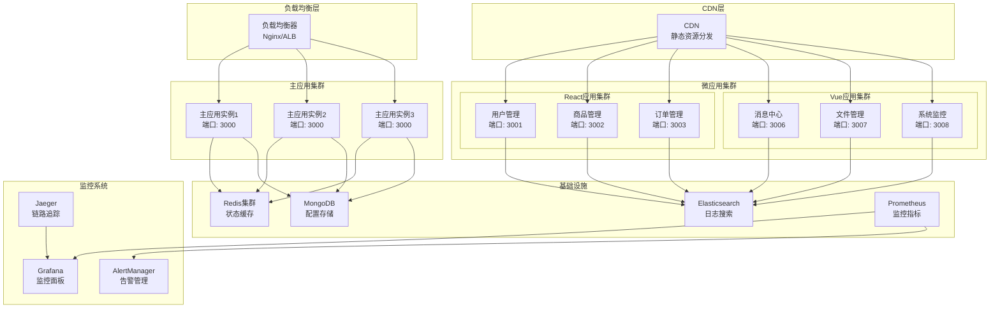

# 微前端通信系统部署指南

## 1. 部署架构概览

### 1.1 部署拓扑图



### 1.2 部署环境配置

```typescript
// 环境配置管理
interface EnvironmentConfig {
  name: string;
  mainApp: {
    url: string;
    port: number;
    replicas: number;
  };
  microApps: Array<{
    name: string;
    url: string;
    port: number;
    replicas: number;
  }>;
  infrastructure: {
    redis: {
      cluster: string[];
      password: string;
    };
    mongodb: {
      uri: string;
      database: string;
    };
    elasticsearch: {
      nodes: string[];
      index: string;
    };
  };
  monitoring: {
    prometheus: string;
    grafana: string;
    jaeger: string;
  };
}

// 开发环境配置
const developmentConfig: EnvironmentConfig = {
  name: 'development',
  mainApp: {
    url: 'http://localhost:3000',
    port: 3000,
    replicas: 1
  },
  microApps: [
    { name: 'user-management', url: 'http://localhost:3001', port: 3001, replicas: 1 },
    { name: 'product-management', url: 'http://localhost:3002', port: 3002, replicas: 1 },
    { name: 'order-management', url: 'http://localhost:3003', port: 3003, replicas: 1 },
    { name: 'message-center', url: 'http://localhost:3006', port: 3006, replicas: 1 },
    { name: 'file-management', url: 'http://localhost:3007', port: 3007, replicas: 1 },
    { name: 'system-monitor', url: 'http://localhost:3008', port: 3008, replicas: 1 }
  ],
  infrastructure: {
    redis: {
      cluster: ['localhost:6379'],
      password: ''
    },
    mongodb: {
      uri: 'mongodb://localhost:27017',
      database: 'qiankun_dev'
    },
    elasticsearch: {
      nodes: ['http://localhost:9200'],
      index: 'qiankun-logs-dev'
    }
  },
  monitoring: {
    prometheus: 'http://localhost:9090',
    grafana: 'http://localhost:3001',
    jaeger: 'http://localhost:16686'
  }
};

// 生产环境配置
const productionConfig: EnvironmentConfig = {
  name: 'production',
  mainApp: {
    url: 'https://app.example.com',
    port: 3000,
    replicas: 3
  },
  microApps: [
    { name: 'user-management', url: 'https://user.example.com', port: 3001, replicas: 2 },
    { name: 'product-management', url: 'https://product.example.com', port: 3002, replicas: 2 },
    { name: 'order-management', url: 'https://order.example.com', port: 3003, replicas: 2 },
    { name: 'message-center', url: 'https://message.example.com', port: 3006, replicas: 2 },
    { name: 'file-management', url: 'https://file.example.com', port: 3007, replicas: 2 },
    { name: 'system-monitor', url: 'https://monitor.example.com', port: 3008, replicas: 1 }
  ],
  infrastructure: {
    redis: {
      cluster: [
        'redis-cluster-1.example.com:6379',
        'redis-cluster-2.example.com:6379',
        'redis-cluster-3.example.com:6379'
      ],
      password: process.env.REDIS_PASSWORD || ''
    },
    mongodb: {
      uri: process.env.MONGODB_URI || 'mongodb://mongo-cluster.example.com:27017',
      database: 'qiankun_prod'
    },
    elasticsearch: {
      nodes: [
        'https://es-node-1.example.com:9200',
        'https://es-node-2.example.com:9200',
        'https://es-node-3.example.com:9200'
      ],
      index: 'qiankun-logs-prod'
    }
  },
  monitoring: {
    prometheus: 'https://prometheus.example.com',
    grafana: 'https://grafana.example.com',
    jaeger: 'https://jaeger.example.com'
  }
};

// 配置管理器
class ConfigManager {
  private static instance: ConfigManager;
  private currentConfig: EnvironmentConfig;
  
  private constructor() {
    this.currentConfig = this.loadConfig();
  }
  
  static getInstance(): ConfigManager {
    if (!ConfigManager.instance) {
      ConfigManager.instance = new ConfigManager();
    }
    return ConfigManager.instance;
  }
  
  private loadConfig(): EnvironmentConfig {
    const env = process.env.NODE_ENV || 'development';
    
    switch (env) {
      case 'production':
        return productionConfig;
      case 'development':
      default:
        return developmentConfig;
    }
  }
  
  getConfig(): EnvironmentConfig {
    return this.currentConfig;
  }
  
  getMicroAppConfig(appName: string): any {
    return this.currentConfig.microApps.find(app => app.name === appName);
  }
  
  getInfrastructureConfig(): any {
    return this.currentConfig.infrastructure;
  }
  
  getMonitoringConfig(): any {
    return this.currentConfig.monitoring;
  }
}
```

## 2. Docker容器化部署

### 2.1 主应用Dockerfile

```dockerfile
# 主应用Dockerfile
FROM node:18-alpine AS builder

WORKDIR /app

# 复制package文件
COPY package*.json ./
COPY pnpm-lock.yaml ./

# 安装pnpm
RUN npm install -g pnpm

# 安装依赖
RUN pnpm install --frozen-lockfile

# 复制源代码
COPY . .

# 构建应用
RUN pnpm run build

# 生产镜像
FROM nginx:alpine

# 复制构建产物
COPY --from=builder /app/dist /usr/share/nginx/html

# 复制nginx配置
COPY nginx.conf /etc/nginx/nginx.conf

# 健康检查
HEALTHCHECK --interval=30s --timeout=3s --start-period=5s --retries=3 \
  CMD curl -f http://localhost:3000/health || exit 1

EXPOSE 3000

CMD ["nginx", "-g", "daemon off;"]
```

### 2.2 微应用Dockerfile

```dockerfile
# 微应用Dockerfile模板
FROM node:18-alpine AS builder

ARG APP_NAME
WORKDIR /app

# 复制package文件
COPY package*.json ./
COPY pnpm-lock.yaml ./

# 安装pnpm
RUN npm install -g pnpm

# 安装依赖
RUN pnpm install --frozen-lockfile

# 复制源代码
COPY . .

# 构建应用
RUN pnpm run build

# 生产镜像
FROM nginx:alpine

ARG APP_NAME
ENV APP_NAME=${APP_NAME}

# 复制构建产物
COPY --from=builder /app/dist /usr/share/nginx/html

# 复制nginx配置
COPY nginx-microapp.conf /etc/nginx/nginx.conf

# 健康检查
HEALTHCHECK --interval=30s --timeout=3s --start-period=5s --retries=3 \
  CMD curl -f http://localhost:3001/health || exit 1

EXPOSE 3001

CMD ["nginx", "-g", "daemon off;"]
```

### 2.3 Docker Compose配置

```yaml
# docker-compose.yml
version: '3.8'

services:
  # 主应用
  main-app:
    build:
      context: ./main-app
      dockerfile: Dockerfile
    ports:
      - "3000:3000"
    environment:
      - NODE_ENV=production
      - REDIS_URL=redis://redis:6379
      - MONGODB_URI=mongodb://mongodb:27017/qiankun
    depends_on:
      - redis
      - mongodb
    networks:
      - qiankun-network
    restart: unless-stopped
    labels:
      - "traefik.enable=true"
      - "traefik.http.routers.main-app.rule=Host(`app.localhost`)"
      - "traefik.http.services.main-app.loadbalancer.server.port=3000"

  # 用户管理微应用
  user-management:
    build:
      context: ./sub-apps/react-app-1
      dockerfile: Dockerfile
      args:
        - APP_NAME=user-management
    ports:
      - "3001:3001"
    environment:
      - NODE_ENV=production
      - APP_NAME=user-management
    networks:
      - qiankun-network
    restart: unless-stopped
    labels:
      - "traefik.enable=true"
      - "traefik.http.routers.user-management.rule=Host(`user.localhost`)"
      - "traefik.http.services.user-management.loadbalancer.server.port=3001"

  # 商品管理微应用
  product-management:
    build:
      context: ./sub-apps/react-app-2
      dockerfile: Dockerfile
      args:
        - APP_NAME=product-management
    ports:
      - "3002:3002"
    environment:
      - NODE_ENV=production
      - APP_NAME=product-management
    networks:
      - qiankun-network
    restart: unless-stopped
    labels:
      - "traefik.enable=true"
      - "traefik.http.routers.product-management.rule=Host(`product.localhost`)"
      - "traefik.http.services.product-management.loadbalancer.server.port=3002"

  # 订单管理微应用
  order-management:
    build:
      context: ./sub-apps/react-app-3
      dockerfile: Dockerfile
      args:
        - APP_NAME=order-management
    ports:
      - "3003:3003"
    environment:
      - NODE_ENV=production
      - APP_NAME=order-management
    networks:
      - qiankun-network
    restart: unless-stopped
    labels:
      - "traefik.enable=true"
      - "traefik.http.routers.order-management.rule=Host(`order.localhost`)"
      - "traefik.http.services.order-management.loadbalancer.server.port=3003"

  # Redis缓存
  redis:
    image: redis:7-alpine
    ports:
      - "6379:6379"
    volumes:
      - redis-data:/data
    networks:
      - qiankun-network
    restart: unless-stopped
    command: redis-server --appendonly yes

  # MongoDB数据库
  mongodb:
    image: mongo:6
    ports:
      - "27017:27017"
    volumes:
      - mongodb-data:/data/db
    environment:
      - MONGO_INITDB_ROOT_USERNAME=admin
      - MONGO_INITDB_ROOT_PASSWORD=password
      - MONGO_INITDB_DATABASE=qiankun
    networks:
      - qiankun-network
    restart: unless-stopped

  # Elasticsearch日志存储
  elasticsearch:
    image: docker.elastic.co/elasticsearch/elasticsearch:8.8.0
    ports:
      - "9200:9200"
      - "9300:9300"
    environment:
      - discovery.type=single-node
      - xpack.security.enabled=false
      - "ES_JAVA_OPTS=-Xms512m -Xmx512m"
    volumes:
      - elasticsearch-data:/usr/share/elasticsearch/data
    networks:
      - qiankun-network
    restart: unless-stopped

  # Prometheus监控
  prometheus:
    image: prom/prometheus:latest
    ports:
      - "9090:9090"
    volumes:
      - ./monitoring/prometheus.yml:/etc/prometheus/prometheus.yml
      - prometheus-data:/prometheus
    command:
      - '--config.file=/etc/prometheus/prometheus.yml'
      - '--storage.tsdb.path=/prometheus'
      - '--web.console.libraries=/etc/prometheus/console_libraries'
      - '--web.console.templates=/etc/prometheus/consoles'
      - '--web.enable-lifecycle'
    networks:
      - qiankun-network
    restart: unless-stopped

  # Grafana监控面板
  grafana:
    image: grafana/grafana:latest
    ports:
      - "3001:3000"
    environment:
      - GF_SECURITY_ADMIN_PASSWORD=admin
    volumes:
      - grafana-data:/var/lib/grafana
      - ./monitoring/grafana/dashboards:/etc/grafana/provisioning/dashboards
      - ./monitoring/grafana/datasources:/etc/grafana/provisioning/datasources
    networks:
      - qiankun-network
    restart: unless-stopped

  # Jaeger链路追踪
  jaeger:
    image: jaegertracing/all-in-one:latest
    ports:
      - "16686:16686"
      - "14268:14268"
    environment:
      - COLLECTOR_OTLP_ENABLED=true
    networks:
      - qiankun-network
    restart: unless-stopped

  # Traefik负载均衡
  traefik:
    image: traefik:v2.10
    ports:
      - "80:80"
      - "8080:8080"
    command:
      - --api.insecure=true
      - --providers.docker=true
      - --providers.docker.exposedbydefault=false
      - --entrypoints.web.address=:80
    volumes:
      - /var/run/docker.sock:/var/run/docker.sock:ro
    networks:
      - qiankun-network
    restart: unless-stopped

volumes:
  redis-data:
  mongodb-data:
  elasticsearch-data:
  prometheus-data:
  grafana-data:

networks:
  qiankun-network:
    driver: bridge
```

## 3. Kubernetes部署

### 3.1 主应用Kubernetes配置

```yaml
# main-app-deployment.yaml
apiVersion: apps/v1
kind: Deployment
metadata:
  name: main-app
  labels:
    app: main-app
spec:
  replicas: 3
  selector:
    matchLabels:
      app: main-app
  template:
    metadata:
      labels:
        app: main-app
    spec:
      containers:
      - name: main-app
        image: qiankun/main-app:latest
        ports:
        - containerPort: 3000
        env:
        - name: NODE_ENV
          value: "production"
        - name: REDIS_URL
          valueFrom:
            configMapKeyRef:
              name: app-config
              key: redis-url
        - name: MONGODB_URI
          valueFrom:
            secretKeyRef:
              name: app-secrets
              key: mongodb-uri
        resources:
          requests:
            memory: "256Mi"
            cpu: "250m"
          limits:
            memory: "512Mi"
            cpu: "500m"
        livenessProbe:
          httpGet:
            path: /health
            port: 3000
          initialDelaySeconds: 30
          periodSeconds: 10
        readinessProbe:
          httpGet:
            path: /ready
            port: 3000
          initialDelaySeconds: 5
          periodSeconds: 5

---
apiVersion: v1
kind: Service
metadata:
  name: main-app-service
spec:
  selector:
    app: main-app
  ports:
  - protocol: TCP
    port: 80
    targetPort: 3000
  type: ClusterIP

---
apiVersion: networking.k8s.io/v1
kind: Ingress
metadata:
  name: main-app-ingress
  annotations:
    kubernetes.io/ingress.class: nginx
    cert-manager.io/cluster-issuer: letsencrypt-prod
spec:
  tls:
  - hosts:
    - app.example.com
    secretName: main-app-tls
  rules:
  - host: app.example.com
    http:
      paths:
      - path: /
        pathType: Prefix
        backend:
          service:
            name: main-app-service
            port:
              number: 80
```

### 3.2 微应用Kubernetes配置

```yaml
# microapp-template.yaml
apiVersion: apps/v1
kind: Deployment
metadata:
  name: ${APP_NAME}
  labels:
    app: ${APP_NAME}
    type: microapp
spec:
  replicas: 2
  selector:
    matchLabels:
      app: ${APP_NAME}
  template:
    metadata:
      labels:
        app: ${APP_NAME}
        type: microapp
    spec:
      containers:
      - name: ${APP_NAME}
        image: qiankun/${APP_NAME}:latest
        ports:
        - containerPort: 3001
        env:
        - name: NODE_ENV
          value: "production"
        - name: APP_NAME
          value: "${APP_NAME}"
        resources:
          requests:
            memory: "128Mi"
            cpu: "100m"
          limits:
            memory: "256Mi"
            cpu: "200m"
        livenessProbe:
          httpGet:
            path: /health
            port: 3001
          initialDelaySeconds: 30
          periodSeconds: 10
        readinessProbe:
          httpGet:
            path: /ready
            port: 3001
          initialDelaySeconds: 5
          periodSeconds: 5

---
apiVersion: v1
kind: Service
metadata:
  name: ${APP_NAME}-service
spec:
  selector:
    app: ${APP_NAME}
  ports:
  - protocol: TCP
    port: 80
    targetPort: 3001
  type: ClusterIP

---
apiVersion: networking.k8s.io/v1
kind: Ingress
metadata:
  name: ${APP_NAME}-ingress
  annotations:
    kubernetes.io/ingress.class: nginx
    cert-manager.io/cluster-issuer: letsencrypt-prod
spec:
  tls:
  - hosts:
    - ${APP_NAME}.example.com
    secretName: ${APP_NAME}-tls
  rules:
  - host: ${APP_NAME}.example.com
    http:
      paths:
      - path: /
        pathType: Prefix
        backend:
          service:
            name: ${APP_NAME}-service
            port:
              number: 80
```

### 3.3 配置和密钥管理

```yaml
# app-config.yaml
apiVersion: v1
kind: ConfigMap
metadata:
  name: app-config
data:
  redis-url: "redis://redis-service:6379"
  elasticsearch-url: "http://elasticsearch-service:9200"
  prometheus-url: "http://prometheus-service:9090"
  log-level: "info"
  enable-monitoring: "true"
  enable-tracing: "true"

---
apiVersion: v1
kind: Secret
metadata:
  name: app-secrets
type: Opaque
data:
  mongodb-uri: bW9uZ29kYjovL3VzZXI6cGFzc3dvcmRAbW9uZ29kYi1zZXJ2aWNlOjI3MDE3L3FpYW5rdW4=
  redis-password: cGFzc3dvcmQ=
  jwt-secret: c3VwZXItc2VjcmV0LWtleQ==
```

## 4. 监控和日志配置

### 4.1 Prometheus配置

```yaml
# prometheus.yml
global:
  scrape_interval: 15s
  evaluation_interval: 15s

rule_files:
  - "alert_rules.yml"

alerting:
  alertmanagers:
    - static_configs:
        - targets:
          - alertmanager:9093

scrape_configs:
  - job_name: 'prometheus'
    static_configs:
      - targets: ['localhost:9090']

  - job_name: 'main-app'
    static_configs:
      - targets: ['main-app:3000']
    metrics_path: '/metrics'
    scrape_interval: 30s

  - job_name: 'microapps'
    kubernetes_sd_configs:
      - role: pod
        namespaces:
          names:
            - default
    relabel_configs:
      - source_labels: [__meta_kubernetes_pod_label_type]
        action: keep
        regex: microapp
      - source_labels: [__meta_kubernetes_pod_annotation_prometheus_io_scrape]
        action: keep
        regex: true
      - source_labels: [__meta_kubernetes_pod_annotation_prometheus_io_path]
        action: replace
        target_label: __metrics_path__
        regex: (.+)

  - job_name: 'node-exporter'
    static_configs:
      - targets: ['node-exporter:9100']

  - job_name: 'redis'
    static_configs:
      - targets: ['redis-exporter:9121']

  - job_name: 'mongodb'
    static_configs:
      - targets: ['mongodb-exporter:9216']
```

### 4.2 告警规则配置

```yaml
# alert_rules.yml
groups:
  - name: qiankun-alerts
    rules:
      - alert: HighErrorRate
        expr: rate(http_requests_total{status=~"5.."}[5m]) > 0.1
        for: 5m
        labels:
          severity: critical
        annotations:
          summary: "High error rate detected"
          description: "Error rate is {{ $value }} for {{ $labels.instance }}"

      - alert: HighMemoryUsage
        expr: (node_memory_MemTotal_bytes - node_memory_MemAvailable_bytes) / node_memory_MemTotal_bytes > 0.8
        for: 5m
        labels:
          severity: warning
        annotations:
          summary: "High memory usage"
          description: "Memory usage is above 80% for {{ $labels.instance }}"

      - alert: HighCPUUsage
        expr: 100 - (avg by(instance) (irate(node_cpu_seconds_total{mode="idle"}[5m])) * 100) > 80
        for: 5m
        labels:
          severity: warning
        annotations:
          summary: "High CPU usage"
          description: "CPU usage is above 80% for {{ $labels.instance }}"

      - alert: AppDown
        expr: up == 0
        for: 1m
        labels:
          severity: critical
        annotations:
          summary: "Application is down"
          description: "{{ $labels.instance }} has been down for more than 1 minute"

      - alert: SlowResponseTime
        expr: histogram_quantile(0.95, rate(http_request_duration_seconds_bucket[5m])) > 1
        for: 5m
        labels:
          severity: warning
        annotations:
          summary: "Slow response time"
          description: "95th percentile response time is {{ $value }}s for {{ $labels.instance }}"
```

### 4.3 Grafana仪表板配置

```json
{
  "dashboard": {
    "id": null,
    "title": "Qiankun微前端监控",
    "tags": ["qiankun", "microfront"],
    "timezone": "browser",
    "panels": [
      {
        "id": 1,
        "title": "应用状态概览",
        "type": "stat",
        "targets": [
          {
            "expr": "up",
            "legendFormat": "{{instance}}"
          }
        ],
        "fieldConfig": {
          "defaults": {
            "mappings": [
              {
                "options": {
                  "0": {
                    "text": "DOWN",
                    "color": "red"
                  },
                  "1": {
                    "text": "UP",
                    "color": "green"
                  }
                },
                "type": "value"
              }
            ]
          }
        }
      },
      {
        "id": 2,
        "title": "请求速率",
        "type": "graph",
        "targets": [
          {
            "expr": "rate(http_requests_total[5m])",
            "legendFormat": "{{instance}} - {{method}}"
          }
        ]
      },
      {
        "id": 3,
        "title": "错误率",
        "type": "graph",
        "targets": [
          {
            "expr": "rate(http_requests_total{status=~\"5..\"}[5m]) / rate(http_requests_total[5m])",
            "legendFormat": "{{instance}}"
          }
        ]
      },
      {
        "id": 4,
        "title": "响应时间",
        "type": "graph",
        "targets": [
          {
            "expr": "histogram_quantile(0.95, rate(http_request_duration_seconds_bucket[5m]))",
            "legendFormat": "95th percentile"
          },
          {
            "expr": "histogram_quantile(0.50, rate(http_request_duration_seconds_bucket[5m]))",
            "legendFormat": "50th percentile"
          }
        ]
      },
      {
        "id": 5,
        "title": "内存使用率",
        "type": "graph",
        "targets": [
          {
            "expr": "(node_memory_MemTotal_bytes - node_memory_MemAvailable_bytes) / node_memory_MemTotal_bytes * 100",
            "legendFormat": "{{instance}}"
          }
        ]
      },
      {
        "id": 6,
        "title": "CPU使用率",
        "type": "graph",
        "targets": [
          {
            "expr": "100 - (avg by(instance) (irate(node_cpu_seconds_total{mode=\"idle\"}[5m])) * 100)",
            "legendFormat": "{{instance}}"
          }
        ]
      }
    ],
    "time": {
      "from": "now-1h",
      "to": "now"
    },
    "refresh": "30s"
  }
}
```

## 5. 自动化部署脚本

### 5.1 CI/CD Pipeline配置

```yaml
# .github/workflows/deploy.yml
name: Deploy Qiankun Micro-Frontend

on:
  push:
    branches: [main]
  pull_request:
    branches: [main]

env:
  REGISTRY: ghcr.io
  IMAGE_NAME: qiankun

jobs:
  test:
    runs-on: ubuntu-latest
    steps:
      - uses: actions/checkout@v3
      
      - name: Setup Node.js
        uses: actions/setup-node@v3
        with:
          node-version: '18'
          cache: 'pnpm'
      
      - name: Install pnpm
        run: npm install -g pnpm
      
      - name: Install dependencies
        run: pnpm install --frozen-lockfile
      
      - name: Run tests
        run: pnpm run test
      
      - name: Run linting
        run: pnpm run lint
      
      - name: Run type checking
        run: pnpm run type-check

  build-and-push:
    needs: test
    runs-on: ubuntu-latest
    if: github.event_name == 'push' && github.ref == 'refs/heads/main'
    
    strategy:
      matrix:
        app: [main-app, user-management, product-management, order-management]
    
    steps:
      - uses: actions/checkout@v3
      
      - name: Log in to Container Registry
        uses: docker/login-action@v2
        with:
          registry: ${{ env.REGISTRY }}
          username: ${{ github.actor }}
          password: ${{ secrets.GITHUB_TOKEN }}
      
      - name: Extract metadata
        id: meta
        uses: docker/metadata-action@v4
        with:
          images: ${{ env.REGISTRY }}/${{ github.repository }}/${{ matrix.app }}
          tags: |
            type=ref,event=branch
            type=ref,event=pr
            type=sha,prefix={{branch}}-
            type=raw,value=latest,enable={{is_default_branch}}
      
      - name: Build and push Docker image
        uses: docker/build-push-action@v4
        with:
          context: ./${{ matrix.app }}
          push: true
          tags: ${{ steps.meta.outputs.tags }}
          labels: ${{ steps.meta.outputs.labels }}

  deploy:
    needs: build-and-push
    runs-on: ubuntu-latest
    if: github.event_name == 'push' && github.ref == 'refs/heads/main'
    
    steps:
      - uses: actions/checkout@v3
      
      - name: Setup kubectl
        uses: azure/setup-kubectl@v3
        with:
          version: 'latest'
      
      - name: Configure kubectl
        run: |
          echo "${{ secrets.KUBE_CONFIG }}" | base64 -d > kubeconfig
          export KUBECONFIG=kubeconfig
      
      - name: Deploy to Kubernetes
        run: |
          export KUBECONFIG=kubeconfig
          kubectl apply -f k8s/
          kubectl rollout status deployment/main-app
          kubectl rollout status deployment/user-management
          kubectl rollout status deployment/product-management
          kubectl rollout status deployment/order-management
      
      - name: Verify deployment
        run: |
          export KUBECONFIG=kubeconfig
          kubectl get pods
          kubectl get services
          kubectl get ingress
```

### 5.2 部署脚本

```bash
#!/bin/bash
# deploy.sh - 自动化部署脚本

set -e

# 配置变量
ENVIRONMENT=${1:-development}
NAMESPACE=${2:-default}
REGISTRY="ghcr.io/your-org/qiankun"
TAG=${3:-latest}

echo "🚀 开始部署 Qiankun 微前端系统"
echo "环境: $ENVIRONMENT"
echo "命名空间: $NAMESPACE"
echo "镜像标签: $TAG"

# 检查依赖
check_dependencies() {
    echo "📋 检查部署依赖..."
    
    if ! command -v kubectl &> /dev/null; then
        echo "❌ kubectl 未安装"
        exit 1
    fi
    
    if ! command -v docker &> /dev/null; then
        echo "❌ Docker 未安装"
        exit 1
    fi
    
    echo "✅ 依赖检查通过"
}

# 构建镜像
build_images() {
    echo "🏗️ 构建 Docker 镜像..."
    
    apps=("main-app" "user-management" "product-management" "order-management")
    
    for app in "${apps[@]}"; do
        echo "构建 $app..."
        docker build -t "$REGISTRY/$app:$TAG" ./$app
        docker push "$REGISTRY/$app:$TAG"
    done
    
    echo "✅ 镜像构建完成"
}

# 部署基础设施
deploy_infrastructure() {
    echo "🏗️ 部署基础设施..."
    
    # 创建命名空间
    kubectl create namespace $NAMESPACE --dry-run=client -o yaml | kubectl apply -f -
    
    # 部署 Redis
    kubectl apply -f k8s/infrastructure/redis.yaml -n $NAMESPACE
    
    # 部署 MongoDB
    kubectl apply -f k8s/infrastructure/mongodb.yaml -n $NAMESPACE
    
    # 部署 Elasticsearch
    kubectl apply -f k8s/infrastructure/elasticsearch.yaml -n $NAMESPACE
    
    # 等待基础设施就绪
    kubectl wait --for=condition=ready pod -l app=redis -n $NAMESPACE --timeout=300s
    kubectl wait --for=condition=ready pod -l app=mongodb -n $NAMESPACE --timeout=300s
    kubectl wait --for=condition=ready pod -l app=elasticsearch -n $NAMESPACE --timeout=300s
    
    echo "✅ 基础设施部署完成"
}

# 部署应用
deploy_applications() {
    echo "🚀 部署应用..."
    
    # 替换镜像标签
    sed -i "s|{{IMAGE_TAG}}|$TAG|g" k8s/apps/*.yaml
    
    # 部署主应用
    kubectl apply -f k8s/apps/main-app.yaml -n $NAMESPACE
    
    # 部署微应用
    kubectl apply -f k8s/apps/microapps.yaml -n $NAMESPACE
    
    # 等待应用就绪
    kubectl wait --for=condition=ready pod -l app=main-app -n $NAMESPACE --timeout=300s
    kubectl wait --for=condition=ready pod -l type=microapp -n $NAMESPACE --timeout=300s
    
    echo "✅ 应用部署完成"
}

# 部署监控
deploy_monitoring() {
    echo "📊 部署监控系统..."
    
    # 部署 Prometheus
    kubectl apply -f k8s/monitoring/prometheus.yaml -n $NAMESPACE
    
    # 部署 Grafana
    kubectl apply -f k8s/monitoring/grafana.yaml -n $NAMESPACE
    
    # 部署 Jaeger
    kubectl apply -f k8s/monitoring/jaeger.yaml -n $NAMESPACE
    
    echo "✅ 监控系统部署完成"
}

# 验证部署
verify_deployment() {
    echo "🔍 验证部署状态..."
    
    # 检查 Pod 状态
    echo "Pod 状态:"
    kubectl get pods -n $NAMESPACE
    
    # 检查服务状态
    echo "服务状态:"
    kubectl get services -n $NAMESPACE
    
    # 检查 Ingress 状态
    echo "Ingress 状态:"
    kubectl get ingress -n $NAMESPACE
    
    # 健康检查
    echo "执行健康检查..."
    
    # 等待所有服务就绪
    sleep 30
    
    # 检查主应用健康状态
    MAIN_APP_URL=$(kubectl get ingress main-app-ingress -n $NAMESPACE -o jsonpath='{.spec.rules[0].host}')
    if curl -f "http://$MAIN_APP_URL/health" > /dev/null 2>&1; then
        echo "✅ 主应用健康检查通过"
    else
        echo "❌ 主应用健康检查失败"
        exit 1
    fi
    
    echo "✅ 部署验证完成"
}

# 回滚部署
rollback_deployment() {
    echo "🔄 回滚部署..."
    
    # 回滚主应用
    kubectl rollout undo deployment/main-app -n $NAMESPACE
    
    # 回滚微应用
    apps=("user-management" "product-management" "order-management")
    for app in "${apps[@]}"; do
        kubectl rollout undo deployment/$app -n $NAMESPACE
    done
    
    echo "✅ 回滚完成"
}

# 清理部署
cleanup_deployment() {
    echo "🧹 清理部署..."
    
    kubectl delete namespace $NAMESPACE
    
    echo "✅ 清理完成"
}

# 主函数
main() {
    case "${4:-deploy}" in
        "deploy")
            check_dependencies
            build_images
            deploy_infrastructure
            deploy_applications
            deploy_monitoring
            verify_deployment
            ;;
        "rollback")
            rollback_deployment
            ;;
        "cleanup")
            cleanup_deployment
            ;;
        *)
            echo "用法: $0 <environment> <namespace> <tag> [deploy|rollback|cleanup]"
            exit 1
            ;;
    esac
}

# 执行主函数
main "$@"

echo "🎉 部署完成!"
echo "访问地址:"
echo "  主应用: http://app.example.com"
echo "  监控面板: http://grafana.example.com"
echo "  链路追踪: http://jaeger.example.com"
```

### 5.3 健康检查脚本

```bash
#!/bin/bash
# health-check.sh - 健康检查脚本

NAMESPACE=${1:-default}
TIMEOUT=${2:-300}

echo "🏥 开始健康检查..."

# 检查所有 Pod 状态
check_pods() {
    echo "检查 Pod 状态..."
    
    # 等待所有 Pod 就绪
    if kubectl wait --for=condition=ready pod --all -n $NAMESPACE --timeout=${TIMEOUT}s; then
        echo "✅ 所有 Pod 就绪"
    else
        echo "❌ 部分 Pod 未就绪"
        kubectl get pods -n $NAMESPACE
        return 1
    fi
}

# 检查服务端点
check_endpoints() {
    echo "检查服务端点..."
    
    services=("main-app-service" "user-management-service" "product-management-service" "order-management-service")
    
    for service in "${services[@]}"; do
        if kubectl get endpoints $service -n $NAMESPACE -o jsonpath='{.subsets[*].addresses[*].ip}' | grep -q .; then
            echo "✅ $service 端点正常"
        else
            echo "❌ $service 端点异常"
            return 1
        fi
    done
}

# 检查应用健康状态
check_app_health() {
    echo "检查应用健康状态..."
    
    # 获取 Ingress 地址
    MAIN_APP_URL=$(kubectl get ingress main-app-ingress -n $NAMESPACE -o jsonpath='{.spec.rules[0].host}' 2>/dev/null || echo "localhost")
    
    # 检查主应用
    if curl -f -s "http://$MAIN_APP_URL/health" > /dev/null; then
        echo "✅ 主应用健康检查通过"
    else
        echo "❌ 主应用健康检查失败"
        return 1
    fi
    
    # 检查微应用
    microapps=("user-management" "product-management" "order-management")
    
    for app in "${microapps[@]}"; do
        APP_URL=$(kubectl get ingress ${app}-ingress -n $NAMESPACE -o jsonpath='{.spec.rules[0].host}' 2>/dev/null || echo "localhost")
        
        if curl -f -s "http://$APP_URL/health" > /dev/null; then
            echo "✅ $app 健康检查通过"
        else
            echo "❌ $app 健康检查失败"
            return 1
        fi
    done
}

# 检查监控系统
check_monitoring() {
    echo "检查监控系统..."
    
    # 检查 Prometheus
    if kubectl get pod -l app=prometheus -n $NAMESPACE | grep -q Running; then
        echo "✅ Prometheus 运行正常"
    else
        echo "❌ Prometheus 运行异常"
        return 1
    fi
    
    # 检查 Grafana
    if kubectl get pod -l app=grafana -n $NAMESPACE | grep -q Running; then
        echo "✅ Grafana 运行正常"
    else
        echo "❌ Grafana 运行异常"
        return 1
    fi
}

# 生成健康报告
generate_health_report() {
    echo "生成健康报告..."
    
    cat > health-report.json << EOF
{
  "timestamp": "$(date -u +%Y-%m-%dT%H:%M:%SZ)",
  "namespace": "$NAMESPACE",
  "pods": $(kubectl get pods -n $NAMESPACE -o json | jq '.items | map({name: .metadata.name, status: .status.phase, ready: (.status.conditions[] | select(.type=="Ready") | .status)})'),
  "services": $(kubectl get services -n $NAMESPACE -o json | jq '.items | map({name: .metadata.name, type: .spec.type, ports: .spec.ports})'),
  "ingresses": $(kubectl get ingress -n $NAMESPACE -o json | jq '.items | map({name: .metadata.name, hosts: .spec.rules[].host})')
}
EOF
    
    echo "✅ 健康报告已生成: health-report.json"
}

# 主函数
main() {
    if check_pods && check_endpoints && check_app_health && check_monitoring; then
        echo "🎉 所有健康检查通过!"
        generate_health_report
        exit 0
    else
        echo "💥 健康检查失败!"
        generate_health_report
        exit 1
    fi
}

# 执行主函数
main
```

## 6. 故障排查指南

### 6.1 常见问题和解决方案

```bash
#!/bin/bash
# troubleshoot.sh - 故障排查脚本

NAMESPACE=${1:-default}

echo "🔧 开始故障排查..."

# 检查 Pod 状态
check_pod_issues() {
    echo "检查 Pod 问题..."
    
    # 查找失败的 Pod
    failed_pods=$(kubectl get pods -n $NAMESPACE --field-selector=status.phase!=Running -o name)
    
    if [ -n "$failed_pods" ]; then
        echo "❌ 发现失败的 Pod:"
        echo "$failed_pods"
        
        for pod in $failed_pods; do
            echo "--- $pod 详细信息 ---"
            kubectl describe $pod -n $NAMESPACE
            echo "--- $pod 日志 ---"
            kubectl logs $pod -n $NAMESPACE --tail=50
        done
    else
        echo "✅ 所有 Pod 运行正常"
    fi
}

# 检查资源使用情况
check_resource_usage() {
    echo "检查资源使用情况..."
    
    echo "节点资源使用:"
    kubectl top nodes
    
    echo "Pod 资源使用:"
    kubectl top pods -n $NAMESPACE
}

# 检查网络连接
check_network_connectivity() {
    echo "检查网络连接..."
    
    # 检查服务发现
    echo "服务列表:"
    kubectl get services -n $NAMESPACE
    
    # 检查端点
    echo "端点列表:"
    kubectl get endpoints -n $NAMESPACE
    
    # 检查 DNS 解析
    echo "测试 DNS 解析..."
    kubectl run -it --rm debug --image=busybox --restart=Never -n $NAMESPACE -- nslookup kubernetes.default
}

# 检查存储问题
check_storage_issues() {
    echo "检查存储问题..."
    
    # 检查 PVC 状态
    echo "PVC 状态:"
    kubectl get pvc -n $NAMESPACE
    
    # 检查存储类
    echo "存储类:"
    kubectl get storageclass
}

# 检查配置问题
check_configuration_issues() {
    echo "检查配置问题..."
    
    # 检查 ConfigMap
    echo "ConfigMap 列表:"
    kubectl get configmap -n $NAMESPACE
    
    # 检查 Secret
    echo "Secret 列表:"
    kubectl get secret -n $NAMESPACE
    
    # 检查环境变量
    echo "检查主应用环境变量:"
    kubectl exec -n $NAMESPACE deployment/main-app -- env | grep -E "(NODE_ENV|REDIS|MONGO)"
}

# 生成故障报告
generate_troubleshoot_report() {
    echo "生成故障报告..."
    
    report_file="troubleshoot-report-$(date +%Y%m%d-%H%M%S).txt"
    
    {
        echo "=== Qiankun 微前端故障排查报告 ==="
        echo "时间: $(date)"
        echo "命名空间: $NAMESPACE"
        echo ""
        
        echo "=== Pod 状态 ==="
        kubectl get pods -n $NAMESPACE -o wide
        echo ""
        
        echo "=== 服务状态 ==="
        kubectl get services -n $NAMESPACE
        echo ""
        
        echo "=== Ingress 状态 ==="
        kubectl get ingress -n $NAMESPACE
        echo ""
        
        echo "=== 事件日志 ==="
        kubectl get events -n $NAMESPACE --sort-by='.lastTimestamp'
        echo ""
        
        echo "=== 资源使用情况 ==="
        kubectl top pods -n $NAMESPACE 2>/dev/null || echo "metrics-server 不可用"
        echo ""
        
    } > $report_file
    
    echo "✅ 故障报告已生成: $report_file"
}

# 主函数
main() {
    check_pod_issues
    check_resource_usage
    check_network_connectivity
    check_storage_issues
    check_configuration_issues
    generate_troubleshoot_report
    
    echo "🔧 故障排查完成!"
}

# 执行主函数
main
```

## 7. 总结

本部署指南提供了完整的qiankun微前端系统部署方案，包括：

### 7.1 部署方式
- **Docker容器化部署**: 适合开发和测试环境
- **Kubernetes集群部署**: 适合生产环境
- **自动化CI/CD**: 支持持续集成和部署

### 7.2 监控和运维
- **完整的监控体系**: Prometheus + Grafana + Jaeger
- **自动化健康检查**: 实时监控系统状态
- **告警机制**: 及时发现和处理问题

### 7.3 最佳实践
- **配置管理**: 统一的配置和密钥管理
- **资源优化**: 合理的资源分配和限制
- **故障排查**: 完整的故障排查工具和流程

通过本指南的实施，可以构建出高可用、可扩展、易维护的微前端系统部署环境。