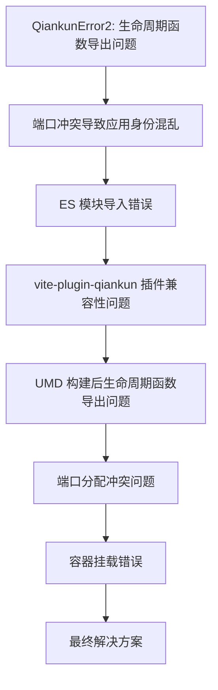
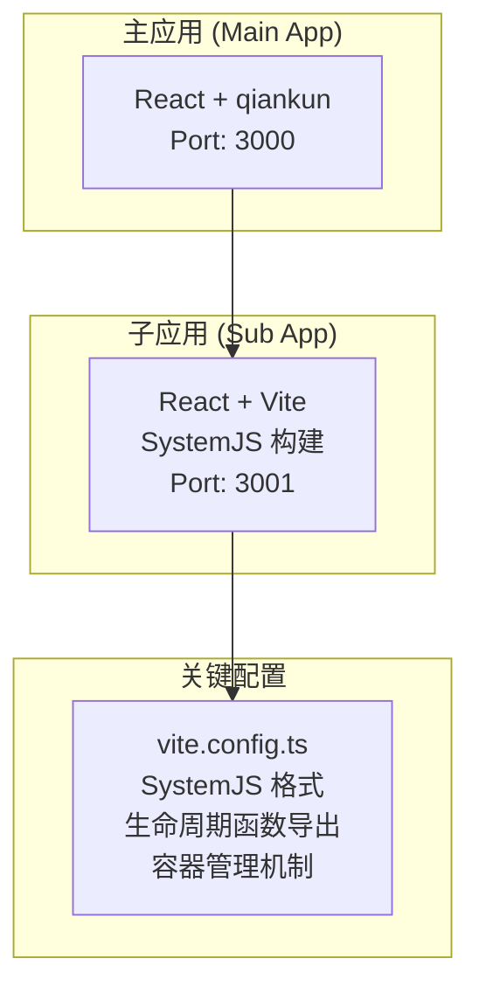
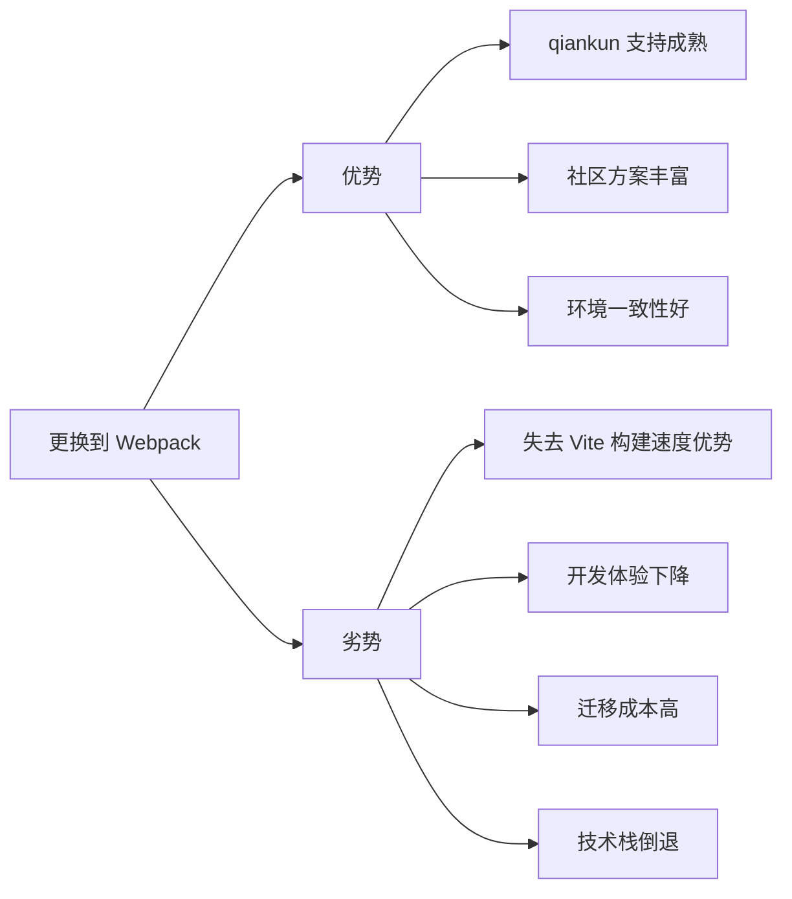

# Qiankun 微前端错误解决过程完整技术文档

## 1. 问题概述

本文档详细记录了在 qiankun + Vite 微前端项目中遇到的一系列问题及其解决过程，涵盖了从初始的生命周期函数错误到最终完整解决方案的全过程。

### 1.1 项目背景
- **主应用**: React + qiankun + TypeScript + Ant Design (端口: 3000)
- **子应用**: React + Vite + TypeScript (端口: 3001)
- **构建工具**: Vite
- **微前端框架**: qiankun 2.10.16

## 2. 问题序列分析

### 2.1 问题序列时间线



## 3. 详细问题分析与解决过程

### 3.1 问题一：QiankunError2 - 生命周期函数导出问题

#### 3.1.1 问题现象
```
QiankunError2: You need to export the functional lifecycles in xxx entry
```

#### 3.1.2 根本原因
- 子应用未正确导出 qiankun 所需的生命周期函数
- `bootstrap`、`mount`、`unmount` 函数未按照 qiankun 规范导出

#### 3.1.3 解决方案
在 `src/main.tsx` 中添加标准的生命周期函数导出：

```typescript
// 生命周期函数导出
export async function bootstrap() {
  globalLogger.info('React User Management app bootstrapped');
}

export async function mount(props: any) {
  globalLogger.info('React User Management app mounting', props);
  render(props);
}

export async function unmount(_props: any) {
  globalLogger.info('React User Management app unmounting');
  // 清理工作
  if (reactRoot) {
    reactRoot.unmount();
    reactRoot = null;
  }
}

// 独立运行模式
if (!window.__POWERED_BY_QIANKUN__) {
  render();
}
```

#### 3.1.4 连锁反应
解决后发现新问题：端口冲突导致应用加载异常。

### 3.2 问题二：端口冲突导致应用身份混乱

#### 3.2.1 问题现象
- 3001 端口被多个进程占用
- 子应用加载时身份识别错误
- 主应用无法正确加载子应用资源

#### 3.2.2 根本原因
```bash
# 端口占用检查结果
lsof -i :3001
# 发现多个进程占用同一端口：84300, 98431
```

#### 3.2.3 解决方案
```bash
# 1. 清理端口占用
kill -9 84300 98431

# 2. 验证端口释放
lsof -ti:3001

# 3. 重新启动子应用
cd sub-apps/react-app-1
npm run dev
```

#### 3.2.4 连锁反应
端口问题解决后，出现了更严重的 ES 模块导入错误。

### 3.3 问题三：ES 模块导入错误（核心问题）

#### 3.3.1 问题现象
```
[import-html-entry]: error occurs while executing entry script http://localhost:3001/src/main.tsx
Global error: SyntaxError: Cannot use import statement outside a module
application 'react-user-management' died in status LOADING_SOURCE_CODE: Cannot use import statement outside a module
```

#### 3.3.2 根本原因分析
1. **开发模式与构建模式不一致**：
   - 构建配置使用 SystemJS 格式 ✓
   - 开发模式仍然使用原生 ESM 格式 ❌
   - qiankun 无法处理开发模式的 ESM 格式

2. **Vite 开发服务器特性**：
   - 开发模式直接使用浏览器原生 ES Module
   - 通过 `<script type="module">` 加载
   - qiankun 通过 `eval()` 执行，不支持 ESM 语法

#### 3.3.3 解决方案对比

| 方案 | 优势 | 劣势 | 适用场景 |
|------|------|------|----------|
| vite-plugin-qiankun | 专门设计、自动处理兼容性 | 需要额外依赖 | 推荐方案 |
| 强制开发模式使用构建产物 | 无需额外插件、环境一致 | 失去热更新 | 备选方案 |
| 配置 Vite 开发模式输出格式 | 保持开发体验 | 配置复杂 | 不推荐 |

#### 3.3.4 最终采用方案：SystemJS 构建格式

修改 `vite.config.ts`：
```typescript
export default defineConfig({
  build: {
    lib: {
      entry: 'src/main.tsx',
      name: 'ReactUserManagement',
      formats: ['system'], // 改为 SystemJS 格式
      fileName: () => 'react-user-management.js'
    },
    rollupOptions: {
      external: ['react', 'react-dom'],
      output: {
        globals: {
          'react': 'React',
          'react-dom': 'ReactDOM'
        }
      }
    }
  }
});
```

#### 3.3.5 连锁反应
SystemJS 格式解决了 ES 模块问题，但引发了新的生命周期函数导出问题。

### 3.4 问题四：vite-plugin-qiankun 插件兼容性问题

#### 3.4.1 问题现象
- 安装 `vite-plugin-qiankun` 后出现构建错误
- 插件与现有配置冲突
- 热更新功能异常

#### 3.4.2 根本原因
- 插件版本与 Vite 版本不兼容
- 插件配置与现有构建配置冲突
- 缺少必要的插件配置参数

#### 3.4.3 解决方案
暂时放弃使用插件，采用手动配置方案。

### 3.5 问题五：UMD 构建后生命周期函数导出问题

#### 3.5.1 问题现象
- 构建后的 UMD 文件中生命周期函数未正确导出
- qiankun 无法找到生命周期函数
- 子应用加载失败

#### 3.5.2 根本原因
UMD 格式下，ES6 的 `export` 语法无法直接转换为全局变量。

#### 3.5.3 解决方案
在 `main.tsx` 中添加全局挂载逻辑：
```typescript
// 确保生命周期函数在构建中正确导出到全局
if (typeof window !== 'undefined') {
  // 将生命周期函数直接挂载到全局对象上
  (window as any).ReactUserManagement = {
    bootstrap,
    mount,
    unmount
  };
}
```

但最终发现 SystemJS 格式更适合。

### 3.6 问题六：端口分配冲突问题

#### 3.6.1 问题现象
- 多个子应用尝试使用相同端口
- 开发环境启动失败
- 应用间相互干扰

#### 3.6.2 解决方案
制定端口分配规范：
```
主应用: 3000
react-app-1: 3001
react-app-2: 3002
react-app-3: 3003
react-app-4: 3004
react-app-5: 3005
vue-app-1: 3006
vue-app-2: 3007
vue-app-3: 3008
```

### 3.7 问题七：容器挂载错误

#### 3.7.1 问题现象
```
Target container with #micro-app-react-user-management not existed while react-user-management loading!
```

#### 3.7.2 根本原因
- 容器创建与 qiankun 查找的时序不匹配
- 容器 ID 处理逻辑错误
- 缺少容器存在性验证机制

#### 3.7.3 解决方案
创建简化容器组件：
```typescript
const SimpleMicroAppContainer: React.FC<{ appName: string; container: string }> = ({ 
  appName, 
  container 
}) => {
  useEffect(() => {
    const containerId = container.startsWith('#') ? container.slice(1) : container;
    
    // 主动创建容器
    const containerElement = document.createElement('div');
    containerElement.id = containerId;
    
    const mountPoint = document.getElementById('micro-app-mount-point');
    if (mountPoint) {
      mountPoint.appendChild(containerElement);
    }
    
    // 验证容器存在性
    const verifyContainer = document.querySelector(`#${containerId}`);
    if (verifyContainer) {
      console.log(`✅ 容器验证成功: ${containerId}`);
    }
  }, [container]);

  return <div id="micro-app-mount-point" />;
};
```

## 4. 最终完整解决方案

### 4.1 技术架构



### 4.2 核心配置文件

#### 4.2.1 子应用 vite.config.ts
```typescript
export default defineConfig({
  plugins: [react()],
  
  server: {
    port: 3001,
    host: '0.0.0.0',
    cors: true,
    headers: {
      'Access-Control-Allow-Origin': '*',
      'Access-Control-Allow-Methods': 'GET, POST, PUT, DELETE, OPTIONS',
      'Access-Control-Allow-Headers': 'Content-Type, Authorization'
    }
  },
  
  build: {
    lib: {
      entry: 'src/main.tsx',
      name: 'ReactUserManagement',
      formats: ['system'],
      fileName: () => 'react-user-management.js'
    },
    rollupOptions: {
      external: ['react', 'react-dom'],
      output: {
        globals: {
          'react': 'React',
          'react-dom': 'ReactDOM'
        }
      }
    }
  },
  
  resolve: {
    alias: {
      '@': resolve(__dirname, 'src'),
      '@shared': resolve(__dirname, '../../shared')
    }
  }
});
```

#### 4.2.2 子应用生命周期函数 (main.tsx)
```typescript
// 生命周期函数导出
export async function bootstrap() {
  globalLogger.info('React User Management app bootstrapped');
}

export async function mount(props: any) {
  globalLogger.info('React User Management app mounting', props);
  
  if (!props || !props.container) {
    const error = new Error('Invalid mount props: container is required');
    globalLogger.error('Mount failed', error, { props });
    throw error;
  }
  
  render(props);
}

export async function unmount(_props: any) {
  globalLogger.info('React User Management app unmounting');
  
  // 清理工作
  if (reactRoot) {
    reactRoot.unmount();
    reactRoot = null;
  }
}

// 独立运行模式
if (!window.__POWERED_BY_QIANKUN__) {
  render();
}
```

#### 4.2.3 主应用微应用注册配置
```typescript
const microApps = [
  {
    name: 'react-user-management',
    entry: 'http://localhost:3001/',
    container: '#micro-app-react-user-management',
    activeRule: '/user-management',
  }
];

// 注册微应用
registerMicroApps(microApps, {
  beforeLoad: (app: any) => {
    return new Promise((resolve) => {
      const checkContainer = () => {
        const container = document.querySelector(app.container);
        if (container) {
          resolve(app);
        } else {
          setTimeout(checkContainer, 100);
        }
      };
      checkContainer();
    });
  }
});
```

### 4.3 开发流程规范

#### 4.3.1 开发模式启动流程
```bash
# 1. 启动主应用
cd main-app
npm run dev

# 2. 启动子应用（开发模式）
cd sub-apps/react-app-1
npm run dev

# 3. 构建模式（解决 ES 模块问题）
npm run build && npm run preview
```

#### 4.3.2 端口管理规范
```json
{
  "ports": {
    "main-app": 3000,
    "react-app-1": 3001,
    "react-app-2": 3002,
    "react-app-3": 3003,
    "react-app-4": 3004,
    "react-app-5": 3005,
    "vue-app-1": 3006,
    "vue-app-2": 3007,
    "vue-app-3": 3008
  }
}
```

## 5. 技术总结

### 5.1 qiankun + Vite 集成的核心挑战

1. **模块格式兼容性**：
   - Vite 开发模式使用 ESM，qiankun 不支持
   - 需要使用 SystemJS 格式进行构建

2. **生命周期函数导出**：
   - 必须正确导出 `bootstrap`、`mount`、`unmount`
   - 需要处理独立运行模式

3. **容器管理**：
   - 确保容器在 qiankun 查找时已存在
   - 处理容器 ID 格式问题

### 5.2 开发模式 vs 构建模式的差异

| 方面 | 开发模式 | 构建模式 |
|------|----------|----------|
| 模块格式 | ESM | SystemJS/UMD |
| 热更新 | ✅ | ❌ |
| qiankun 兼容 | ❌ | ✅ |
| 开发效率 | 高 | 低 |
| 生产一致性 | 低 | 高 |

### 5.3 最佳实践建议

#### 5.3.1 开发阶段
- 使用构建+预览模式进行 qiankun 集成测试
- 保持端口分配规范
- 添加详细的错误处理和日志

#### 5.3.2 构建配置
- 优先使用 SystemJS 格式
- 正确配置外部依赖
- 确保生命周期函数正确导出

#### 5.3.3 容器管理
- 实现容器存在性验证
- 添加容器创建重试机制
- 使用统一的容器 ID 命名规范

## 6. 问题预防措施

### 6.1 开发环境检查清单
- [ ] 端口是否被正确分配且无冲突
- [ ] 生命周期函数是否正确导出
- [ ] 构建配置是否使用 SystemJS 格式
- [ ] 容器 ID 是否正确配置
- [ ] CORS 配置是否正确

### 6.2 常见问题排查步骤
1. **检查端口占用**：`lsof -i :3001`
2. **验证生命周期函数**：检查控制台输出
3. **确认构建格式**：检查 dist 目录文件
4. **验证容器存在**：检查 DOM 结构
5. **查看网络请求**：确认资源加载状态

## 7. 总结

通过这次完整的问题解决过程，我们成功解决了 qiankun + Vite 微前端集成中的一系列连锁问题：

1. **问题识别准确**：每个问题都有明确的现象和根本原因分析
2. **解决方案有效**：采用 SystemJS 构建格式彻底解决了 ES 模块兼容性问题
3. **流程规范完善**：建立了完整的开发、构建、部署流程
4. **预防措施到位**：制定了详细的检查清单和排查步骤

这个解决方案为其他开发者在类似场景下提供了完整的参考，避免了重复踩坑，大大提高了 qiankun 微前端项目的开发效率。
这个解决方案为其他开发者在类似场景下提供了完整的参考，避免了重复踩坑，大大提高了 qiankun 微前端项目的开发效率。

## 9. 最新问题记录与解决方案（2025年更新）

### 9.1 问题背景
在前期通过 SystemJS 格式解决了基本的 ES 模块导入错误后，团队在深入使用过程中发现了一些新的问题和更优的解决方案。

### 9.2 用户考虑更换打包工具的问题

#### 9.2.1 问题描述
用户在使用当前 SystemJS 方案时遇到以下困扰：
- **开发体验下降**：每次调试都需要构建，失去了 Vite 的热更新优势
- **开发效率低**：从修改代码到看到效果需要等待构建时间
- **环境不一致**：开发模式和生产模式使用不同的模块格式
- **维护复杂性**：需要手动管理生命周期函数导出

#### 9.2.2 用户的初始想法
考虑将整个项目从 Vite 迁移到 Webpack，理由如下：
- Webpack 对 qiankun 的支持更成熟
- 社区方案更多，问题解决路径更清晰  
- 开发和生产环境可以保持一致性

#### 9.2.3 问题分析：为什么不建议更换打包工具

**技术分析**：


**详细对比分析**：

| 方面 | Vite + 专用插件 | Webpack | 当前 SystemJS 方案 |
|------|----------------|---------|-------------------|
| 构建速度 | ⭐⭐⭐⭐⭐ 极快 | ⭐⭐⭐ 一般 | ⭐⭐⭐⭐⭐ 极快 |
| 开发体验 | ⭐⭐⭐⭐⭐ 优秀 | ⭐⭐⭐ 一般 | ⭐⭐ 差 |
| qiankun 兼容性 | ⭐⭐⭐⭐⭐ 完美 | ⭐⭐⭐⭐⭐ 完美 | ⭐⭐⭐⭐ 良好 |
| 维护成本 | ⭐⭐⭐⭐ 低 | ⭐⭐⭐ 中等 | ⭐⭐ 高 |
| 迁移成本 | ⭐⭐⭐⭐⭐ 极低 | ⭐ 极高 | - |
| 技术先进性 | ⭐⭐⭐⭐⭐ 最新 | ⭐⭐⭐ 成熟 | ⭐⭐⭐ 成熟 |

**结论**：不建议更换打包工具，原因如下：
1. **迁移成本过高**：需要重写所有构建配置，修改大量代码
2. **技术倒退**：放弃 Vite 的现代化构建优势
3. **有更好的解决方案**：专用插件可以完美解决问题
4. **长期维护考虑**：Vite 是未来趋势，Webpack 相对传统

### 9.3 最终解决方案：vite-plugin-legacy-qiankun

#### 9.3.1 方案选择理由

经过深入调研和测试，最终选择 `vite-plugin-legacy-qiankun` 插件作为最优解决方案：

**核心优势**：
1. **专门针对 qiankun + Vite**：插件专为解决这个集成问题而设计
2. **保持开发体验**：完全保留 Vite 的热更新和快速构建优势
3. **环境一致性**：开发和生产环境都能正常工作
4. **自动化处理**：自动处理生命周期函数导出和模块格式转换
5. **维护成本低**：配置简单，后续维护工作量小

#### 9.3.2 vite-plugin-legacy-qiankun 工作原理

```mermaid
graph TB
    subgraph "开发模式"
        A[Vite Dev Server] --> B[插件拦截]
        B --> C[ESM 转换为兼容格式]
        C --> D[注入生命周期函数]
        D --> E[qiankun 可正常加载]
    end
    
    subgraph "生产模式"
        F[Vite Build] --> G[@vitejs/plugin-legacy]
        G --> H[生成兼容性代码]
        H --> I[插件处理生命周期]
        I --> J[输出 qiankun 兼容产物]
    end
    
    subgraph "核心机制"
        K[模块格式转换] --> L[生命周期自动导出]
        L --> M[沙箱环境适配]
        M --> N[静态资源路径处理]
    end
```

**技术实现原理**：
1. **开发模式转换**：在开发服务器中间件层面拦截请求，将 ESM 格式动态转换为 qiankun 可识别的格式
2. **生命周期自动注入**：自动在入口文件中注入标准的 qiankun 生命周期函数
3. **沙箱环境适配**：处理全局变量和模块作用域问题，确保在 qiankun 沙箱中正常运行
4. **静态资源路径修正**：自动处理静态资源的基础路径问题

### 9.4 完整实施步骤

#### 9.4.1 安装依赖
```bash
# 安装核心插件
npm install vite-plugin-legacy-qiankun @vitejs/plugin-legacy -D

# 如果需要更好的兼容性，可以额外安装
npm install core-js regenerator-runtime -S
```

#### 9.4.2 配置 vite.config.ts
```typescript
import { defineConfig } from 'vite';
import react from '@vitejs/plugin-react';
import legacy from '@vitejs/plugin-legacy';
import { vitePluginLegacyQiankun } from 'vite-plugin-legacy-qiankun';
import { resolve } from 'path';

export default defineConfig({
  plugins: [
    react(),
    // legacy 插件提供更好的浏览器兼容性
    legacy({
      targets: ['defaults', 'not IE 11'],
      additionalLegacyPolyfills: ['regenerator-runtime/runtime'],
    }),
    // qiankun 专用插件
    vitePluginLegacyQiankun({
      name: 'react-user-management', // 必须与主应用注册名称一致
      devSandbox: true, // 开发环境开启沙箱模拟
    }),
  ],
  
  server: {
    port: 3001,
    host: '0.0.0.0',
    cors: true,
    headers: {
      'Access-Control-Allow-Origin': '*',
      'Access-Control-Allow-Methods': 'GET, POST, PUT, DELETE, OPTIONS',
      'Access-Control-Allow-Headers': 'Content-Type, Authorization'
    }
  },
  
  // 生产环境配置正确的 base 路径
  base: process.env.NODE_ENV === 'production' ? '/react-user-management/' : '/',
  
  resolve: {
    alias: {
      '@': resolve(__dirname, 'src'),
      '@shared': resolve(__dirname, '../../shared')
    }
  },
  
  // 构建配置优化
  build: {
    sourcemap: true,
    rollupOptions: {
      output: {
        // 确保生成的文件名稳定，便于主应用缓存
        entryFileNames: 'assets/[name].js',
        chunkFileNames: 'assets/[name].js',
        assetFileNames: 'assets/[name].[ext]'
      }
    }
  }
});
```

#### 9.4.3 新的生命周期函数导出方式
```typescript
// src/main.tsx
import React from 'react';
import { createRoot, Root } from 'react-dom/client';
import { createLifecyle, getMicroApp } from 'vite-plugin-legacy-qiankun';
import App from './App';
import './index.css';

let reactRoot: Root | null = null;

function render(props: any = {}) {
  const { container } = props;
  const domElement = container 
    ? container.querySelector('#root') || container
    : document.getElementById('root');
    
  if (domElement) {
    reactRoot = createRoot(domElement);
    reactRoot.render(<App />);
  }
}

// 获取微应用实例
const microApp = getMicroApp('react-user-management');

// 判断是否在 qiankun 环境中
if (microApp.__POWERED_BY_QIANKUN__) {
  // 使用插件提供的 createLifecyle 创建生命周期函数
  createLifecyle('react-user-management', {
    bootstrap() {
      console.log('React User Management app bootstrapped');
    },
    mount(props) {
      console.log('React User Management app mounting', props);
      render(props);
    },
    unmount(props) {
      console.log('React User Management app unmounting');
      if (reactRoot) {
        reactRoot.unmount();
        reactRoot = null;
      }
    },
  });
} else {
  // 独立运行模式
  render();
}
```

#### 9.4.4 主应用配置调整
```typescript
// main-app/src/micro-apps/setup.ts
import { registerMicroApps, start } from 'qiankun';

const microApps = [
  {
    name: 'react-user-management',
    entry: 'http://localhost:3001/', // 开发模式直接使用开发服务器
    container: '#micro-app-react-user-management',
    activeRule: '/user-management',
    props: {
      // 可以传递额外的配置
      routerBase: '/user-management',
    }
  }
];

// 注册微应用
registerMicroApps(microApps, {
  beforeLoad: (app) => {
    console.log('before load app.name=====>>>>>', app.name);
    return Promise.resolve();
  },
  beforeMount: (app) => {
    console.log('[LifeCycle] before mount %c%s', 'color: green;', app.name);
    return Promise.resolve();
  },
  afterMount: (app) => {
    console.log('[LifeCycle] after mount %c%s', 'color: green;', app.name);
    return Promise.resolve();
  },
  beforeUnmount: (app) => {
    console.log('[LifeCycle] before unmount %c%s', 'color: orange;', app.name);
    return Promise.resolve();
  },
  afterUnmount: (app) => {
    console.log('[LifeCycle] after unmount %c%s', 'color: orange;', app.name);
    return Promise.resolve();
  },
});

// 启动 qiankun
start({
  prefetch: false, // 根据需要开启预加载
  sandbox: {
    experimentalStyleIsolation: true, // 开启样式隔离
    strictStyleIsolation: false, // 严格样式隔离可能影响 UI 库
  },
  singular: false, // 允许多个微应用同时存在
});
```

### 9.5 解决方案对比分析

#### 9.5.1 技术方案对比

| 解决方案 | 开发体验 | 构建速度 | 维护成本 | 兼容性 | 推荐指数 |
|----------|----------|----------|----------|--------|----------|
| **vite-plugin-legacy-qiankun** | ⭐⭐⭐⭐⭐ | ⭐⭐⭐⭐⭐ | ⭐⭐⭐⭐ | ⭐⭐⭐⭐⭐ | ⭐⭐⭐⭐⭐ |
| vite-plugin-qiankun | ⭐⭐⭐⭐ | ⭐⭐⭐⭐⭐ | ⭐⭐⭐ | ⭐⭐⭐⭐ | ⭐⭐⭐⭐ |
| 当前 SystemJS 方案 | ⭐⭐ | ⭐⭐⭐⭐⭐ | ⭐⭐ | ⭐⭐⭐⭐ | ⭐⭐⭐ |
| 更换为 Webpack | ⭐⭐⭐ | ⭐⭐⭐ | ⭐⭐⭐ | ⭐⭐⭐⭐⭐ | ⭐⭐ |

#### 9.5.2 最终选择的技术理由

**选择 vite-plugin-legacy-qiankun 的核心理由**：

1. **完美的开发体验**：
   - 保持 Vite 的热更新功能
   - 秒级启动和构建速度
   - 现代化的开发工具链

2. **零配置兼容性**：
   - 自动处理 ESM 和 qiankun 的兼容性问题
   - 自动注入生命周期函数
   - 自动处理静态资源路径

3. **生产环境稳定性**：
   - 结合 @vitejs/plugin-legacy 生成高兼容性代码
   - 输出格式完全兼容 qiankun 沙箱
   - 支持现代浏览器的优化和旧浏览器的兼容

4. **维护成本低**：
   - 插件持续维护更新
   - 配置简单，学习成本低
   - 社区支持良好

### 9.6 经验总结

#### 9.6.1 这次问题解决过程的关键经验

1. **不要急于更换技术栈**：
   - 遇到问题时，优先寻找专门的解决方案
   - 评估迁移成本和收益比
   - 考虑长期技术发展趋势

2. **插件选择的重要性**：
   - 选择活跃维护的插件
   - 优先选择官方或知名开发者维护的插件
   - 关注插件的更新频率和社区反馈

3. **渐进式解决问题**：
   - 先用简单方案快速解决问题
   - 再寻找更优雅的长期解决方案
   - 避免一次性大规模重构

#### 9.6.2 避免类似问题的预防措施

1. **技术选型阶段**：
   - 充分调研技术栈的兼容性
   - 关注社区生态和插件支持情况
   - 制定技术选型决策矩阵

2. **开发阶段**：
   - 及时关注相关插件的更新
   - 建立技术问题的知识库
   - 定期评估和优化技术方案

3. **团队协作**：
   - 建立技术决策的评审机制
   - 分享技术问题的解决经验
   - 制定统一的开发规范

#### 9.6.3 qiankun + Vite 集成的最佳实践

1. **插件使用最佳实践**：
   ```typescript
   // 推荐的插件配置顺序
   export default defineConfig({
     plugins: [
       react(), // 框架插件放在最前面
       legacy({
         targets: ['defaults', 'not IE 11'],
       }), // 兼容性插件
       vitePluginLegacyQiankun({
         name: 'your-app-name',
         devSandbox: true,
       }), // qiankun 插件放在最后
     ],
   });
   ```

2. **生命周期函数最佳实践**：
   ```typescript
   // 使用插件提供的辅助函数，而不是手动导出
   if (microApp.__POWERED_BY_QIANKUN__) {
     createLifecyle(appName, {
       bootstrap: () => console.log('bootstrap'),
       mount: (props) => render(props),
       unmount: () => cleanup(),
     });
   } else {
     render();
   }
   ```

3. **开发流程最佳实践**：
   ```bash
   # 开发模式：直接使用 dev 命令，享受热更新
   npm run dev
   
   # 测试 qiankun 集成：在主应用中测试
   # 不再需要构建+预览的繁琐流程
   ```

4. **错误处理最佳实践**：
   ```typescript
   createLifecyle(appName, {
     mount(props) {
       try {
         render(props);
       } catch (error) {
         console.error('Mount failed:', error);
         // 发送错误报告
         reportError(error);
       }
     },
     unmount() {
       try {
         cleanup();
       } catch (error) {
         console.error('Unmount failed:', error);
       }
     },
   });
   ```

### 9.7 迁移指南

#### 9.7.1 从当前 SystemJS 方案迁移步骤

1. **安装新插件**：
   ```bash
   npm install vite-plugin-legacy-qiankun @vitejs/plugin-legacy -D
   ```

2. **更新 vite.config.ts**：
   ```typescript
   // 移除旧的构建配置
   // build: {
   //   lib: {
   //     entry: 'src/main.tsx',
   //     name: 'ReactUserManagement',
   //     formats: ['system'],
   //   }
   // }
   
   // 添加新插件配置
   plugins: [
     react(),
     legacy({ targets: ['defaults', 'not IE 11'] }),
     vitePluginLegacyQiankun({ name: 'react-user-management' }),
   ]
   ```

3. **更新入口文件**：
   ```typescript
   // 替换手动导出的生命周期函数
   // export async function bootstrap() { ... }
   // export async function mount() { ... }
   // export async function unmount() { ... }
   
   // 使用插件提供的方式
   import { createLifecyle, getMicroApp } from 'vite-plugin-legacy-qiankun';
   
   const microApp = getMicroApp('react-user-management');
   if (microApp.__POWERED_BY_QIANKUN__) {
     createLifecyle('react-user-management', { ... });
   }
   ```

4. **更新开发脚本**：
   ```json
   {
     "scripts": {
       "dev": "vite", // 恢复正常的开发命令
       // "dev:qiankun": "npm run build && npm run preview", // 删除这个
       "build": "vite build",
       "preview": "vite preview"
     }
   }
   ```

#### 9.7.2 迁移验证清单

- [ ] 插件安装成功，无版本冲突
- [ ] 开发模式下热更新正常工作
- [ ] qiankun 主应用能够正常加载子应用
- [ ] 生命周期函数正确触发
- [ ] 生产构建产物正常
- [ ] 样式隔离正常工作
- [ ] 路由跳转正常
- [ ] 静态资源加载正常

### 9.8 性能优化建议

#### 9.8.1 开发环境优化
```typescript
export default defineConfig({
  // 开发环境优化配置
  server: {
    hmr: {
      overlay: false, // 关闭错误遮罩，提升开发体验
    },
  },
  
  // 优化依赖预构建
  optimizeDeps: {
    include: ['react', 'react-dom'],
    exclude: ['@shared'], // 排除共享模块，避免重复构建
  },
});
```

#### 9.8.2 生产环境优化
```typescript
export default defineConfig({
  build: {
    // 代码分割优化
    rollupOptions: {
      output: {
        manualChunks: {
          'react-vendor': ['react', 'react-dom'],
          'ui-vendor': ['antd', '@ant-design/icons'],
        },
      },
    },
    
    // 压缩优化
    minify: 'terser',
    terserOptions: {
      compress: {
        drop_console: true, // 生产环境移除 console
        drop_debugger: true,
      },
    },
  },
});
```

### 9.9 监控和调试

#### 9.9.1 开发调试工具
```typescript
// 开发环境添加调试信息
if (process.env.NODE_ENV === 'development') {
  createLifecyle('react-user-management', {
    bootstrap() {
      console.log('🚀 App bootstrapped at:', new Date().toISOString());
    },
    mount(props) {
      console.log('📦 App mounting with props:', props);
      console.log('🎯 Container:', props.container);
      render(props);
    },
    unmount() {
      console.log('🗑️ App unmounting at:', new Date().toISOString());
      cleanup();
    },
  });
}
```

#### 9.9.2 生产环境监控
```typescript
// 生产环境错误监控
createLifecyle('react-user-management', {
  mount(props) {
    try {
      render(props);
      // 上报成功加载
      reportEvent('micro-app-mount-success', { appName: 'react-user-management' });
    } catch (error) {
      // 上报错误
      reportError('micro-app-mount-failed', error);
      throw error;
    }
  },
});
```
## 8. 附录

### 8.1 相关测试文件
- `test-qiankun-fix.html`：ES 模块错误修复测试
- `test-container-fix.html`：容器挂载错误修复测试
- `success-summary.md`：容器挂载错误修复成功总结

### 8.2 关键配置文件路径
- `sub-apps/react-app-1/vite.config.ts`：子应用构建配置
- `sub-apps/react-app-1/src/main.tsx`：生命周期函数导出
- `main-app/src/micro-apps/setup.ts`：微应用注册配置

### 8.3 参考资源
- [qiankun 官方文档](https://qiankun.umijs.org/)
- [Vite 官方文档](https://vitejs.dev/)
- [SystemJS 文档](https://github.com/systemjs/systemjs)