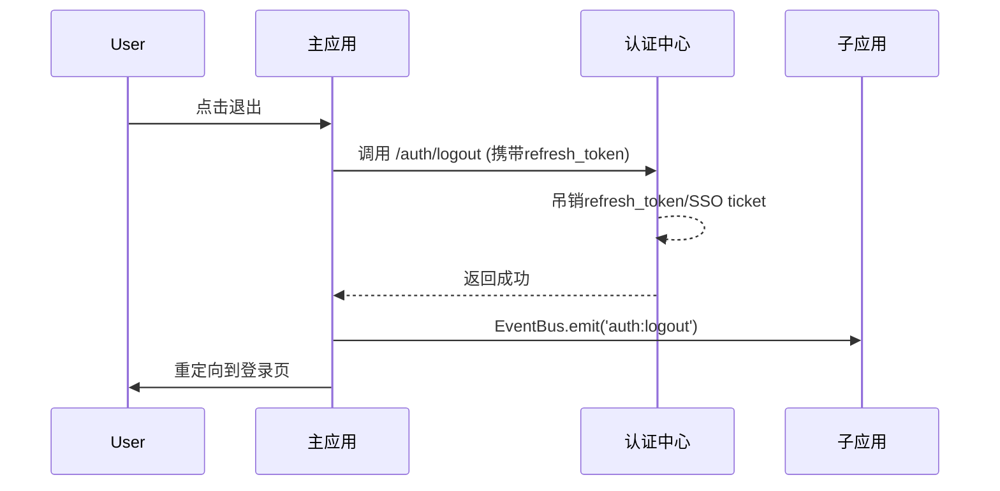

# 微前端登录态共享技术方案

## 1. 背景与挑战

在微前端架构中，主应用和多个子应用需要共享用户的登录状态。由于各个应用运行在不同的域名或端口下，传统的Cookie机制面临跨域限制，需要设计一套完整的登录态共享方案。

### 主要挑战：
- 跨域Cookie限制
- 不同技术栈的兼容性（React、Vue）
- 登录态同步的实时性
- 安全性保障
- 用户体验一致性

## 2. 技术方案概览

### 2.1 核心架构设计

```
┌─────────────────────────────────────────────────────────────┐
│                    统一认证中心                              │
│  ┌─────────────┐  ┌─────────────┐  ┌─────────────┐       │
│  │   用户认证   │  │   Token管理  │  │   权限验证   │       │
│  └─────────────┘  └─────────────┘  └─────────────┘       │
└─────────────────────────┬─────────────────────────────────┘
                          │
                          │ JWT Token / Cookie
                          │
┌─────────────────────────┴─────────────────────────────────┐
│                    主应用 (Main App)                     │
│  ┌─────────────┐  ┌─────────────┐  ┌─────────────┐     │
│  │  登录态管理  │  │  权限控制    │  │  应用注册    │     │
│  └─────────────┘  └─────────────┘  └─────────────┘     │
└─────────────────────────┬─────────────────────────────────┘
                          │
         ┌────────────────┼────────────────┐
         │                │                │
┌────────┴───────┐ ┌──────┴──────┐ ┌──────┴──────┐
│   子应用A      │ │   子应用B    │ │   子应用C    │
│  (React)       │ │  (Vue)       │ │  (React)     │
│                │ │              │ │              │
│ ┌────────────┐ │ │ ┌───────────┐│ │ ┌───────────┐│
│ │ 登录态监听  │ │ │ │ 登录态监听 ││ │ │ 登录态监听 ││
│ │ 权限验证    │ │ │ │ 权限验证   ││ │ │ 权限验证   ││
│ └────────────┘ │ │ └───────────┘│ │ └───────────┘│
└────────────────┘ └──────────────┘ └──────────────┘
```

## 3. 具体实现方案

### 3.1 Cookie共享方案（同域）

当主应用和子应用部署在同一顶级域名下时，采用Cookie共享方案：

> **后端Set-Cookie策略建议**：统一认证中心在响应中设置`HttpOnly`、`Secure`、`SameSite=None`（跨站点）或`SameSite=Lax`（同站点）等属性，示例：

```typescript
// 示例：NestJS认证服务中设置登录Cookie
@Post('login')
async login(@Res({ passthrough: true }) res: Response, @Body() body: LoginDto) {
  const { token, refreshToken, expires } = await this.authService.login(body);

  res.cookie('auth_token', token, {
    domain: '.example.com',
    httpOnly: true,
    sameSite: 'none',
    secure: true,
    expires
  });

  res.cookie('refresh_token', refreshToken, {
    domain: '.example.com',
    httpOnly: true,
    sameSite: 'none',
    secure: true,
    expires
  });

  return { success: true };
}
```

```typescript
// shared/utils/auth.ts
export class AuthManager {
  private static readonly TOKEN_KEY = 'auth_token';
  private static readonly REFRESH_KEY = 'refresh_token';
  private static readonly DOMAIN = '.example.com'; // 顶级域名

  // 设置Cookie
  static setCookie(name: string, value: string, expires?: Date): void {
    let cookieString = `${name}=${value}; domain=${this.DOMAIN}; path=/; SameSite=Lax`;
    
    if (expires) {
      cookieString += `; expires=${expires.toUTCString()}`;
    }
    
    // 生产环境启用Secure
    if (process.env.NODE_ENV === 'production') {
      cookieString += '; Secure';
    }
    
    document.cookie = cookieString;
  }

  // 获取Cookie
  static getCookie(name: string): string | null {
    const cookies = document.cookie.split(';');
    for (let cookie of cookies) {
      const [cookieName, cookieValue] = cookie.trim().split('=');
      if (cookieName === name) {
        return decodeURIComponent(cookieValue);
      }
    }
    return null;
  }

  // 删除Cookie
  static deleteCookie(name: string): void {
    this.setCookie(name, '', new Date(0));
  }

  // 设置登录态
  static setAuth(token: string, refreshToken: string, expiresIn: number): void {
    const expires = new Date(Date.now() + expiresIn * 1000);
    this.setCookie(this.TOKEN_KEY, token, expires);
    this.setCookie(this.REFRESH_KEY, refreshToken, expires);
    
    // 触发登录事件
    window.dispatchEvent(new CustomEvent('auth:login', { detail: { token } }));
  }

  // 清除登录态
  static clearAuth(): void {
    this.deleteCookie(this.TOKEN_KEY);
    this.deleteCookie(this.REFRESH_KEY);
    
    // 触发登出事件
    window.dispatchEvent(new CustomEvent('auth:logout'));
  }

  // 获取Token
  static getToken(): string | null {
    return this.getCookie(this.TOKEN_KEY);
  }
}
```

### 3.2 Token共享方案（跨域）

当应用部署在不同域名下时，采用Token共享方案：

> **跨标签/跨窗口同步建议**：优先使用`BroadcastChannel`或`Service Worker`完成多实例同步，降级到`storage`事件监听。

```typescript
// shared/communication/auth-bridge.ts
export class AuthBridge {
  private static instance: AuthBridge;
  private token: string | null = null;
  private subscribers: Map<string, (token: string | null) => void> = new Map();
  private broadcast?: (type: 'auth:login' | 'auth:logout', payload?: any) => void;

  static getInstance(): AuthBridge {
    if (!this.instance) {
      this.instance = new AuthBridge();
    }
    return this.instance;
  }

  // 初始化认证桥接
  initialize(): void {
    // 监听主应用的认证事件
    window.addEventListener('auth:login', this.handleLogin.bind(this));
    window.addEventListener('auth:logout', this.handleLogout.bind(this));
    
    // BroadcastChannel同步
    try {
      const channel = new BroadcastChannel('auth_channel');
      channel.addEventListener('message', (event) => {
        if (event.data?.type === 'auth:login') {
          this.handleLogin(new CustomEvent('auth:login', { detail: event.data.payload }));
        }
        if (event.data?.type === 'auth:logout') {
          this.handleLogout();
        }
      });

      this.broadcast = (type: 'auth:login' | 'auth:logout', payload?: any) => {
        channel.postMessage({ type, payload });
      };
    } catch (error) {
      console.warn('BroadcastChannel unavailable, fallback to storage events.', error);
    }

    // 监听存储变化（用于跨Tab同步）
    window.addEventListener('storage', this.handleStorageChange.bind(this));
    
    // 初始化时尝试获取Token
    this.syncToken();
  }

  // 处理登录
  private handleLogin(event: Event): void {
    const customEvent = event as CustomEvent;
    this.token = customEvent.detail.token;
    this.notifySubscribers();
    
    // 存储到localStorage用于跨Tab同步
    localStorage.setItem('auth_token', this.token || '');
    localStorage.setItem('auth_timestamp', Date.now().toString());

    // 广播给其他上下文
    this.broadcast?.('auth:login', customEvent.detail);
  }

  // 处理登出
  private handleLogout(): void {
    this.token = null;
    this.notifySubscribers();
    localStorage.removeItem('auth_token');
    localStorage.removeItem('auth_timestamp');

    // 广播给其他上下文
    this.broadcast?.('auth:logout');
  }

  // 同步Token
  private syncToken(): void {
    const token = localStorage.getItem('auth_token');
    const timestamp = localStorage.getItem('auth_timestamp');
    
    if (token && timestamp) {
      const age = Date.now() - parseInt(timestamp);
      // Token有效期检查（默认2小时）
      if (age < 2 * 60 * 60 * 1000) {
        this.token = token;
        this.notifySubscribers();
      } else {
        this.clearToken();
      }
    }
  }

  // 存储变化处理
  private handleStorageChange(event: StorageEvent): void {
    if (event.key === 'auth_token') {
      this.token = event.newValue;
      this.notifySubscribers();
    }
  }

  // 订阅Token变化
  subscribe(id: string, callback: (token: string | null) => void): void {
    this.subscribers.set(id, callback);
    // 立即通知当前状态
    callback(this.token);
  }

  // 取消订阅
  unsubscribe(id: string): void {
    this.subscribers.delete(id);
  }

  // 通知订阅者
  private notifySubscribers(): void {
    this.subscribers.forEach(callback => {
      callback(this.token);
    });
  }

  // 获取当前Token
  getToken(): string | null {
    return this.token;
  }

  // 清除Token
  private clearToken(): void {
    this.token = null;
    localStorage.removeItem('auth_token');
    localStorage.removeItem('auth_timestamp');
  }
}
```

### 3.3 权限验证中间件

```typescript
// shared/middleware/auth-middleware.ts
import { AuthBridge } from '../communication/auth-bridge';
import { EventBus } from '../communication/event-bus';

export class AuthMiddleware {
  private authBridge: AuthBridge;

  constructor() {
    this.authBridge = AuthBridge.getInstance();
  }

  // 验证权限
  async validatePermission(permission: string): Promise<boolean> {
    const token = this.authBridge.getToken();
    
    if (!token) {
      this.redirectToLogin();
      return false;
    }

    try {
      // 调用权限验证API
      const response = await fetch('/api/auth/validate', {
        headers: {
          'Authorization': `Bearer ${token}`
        }
      });

      if (!response.ok) {
        throw new Error('Permission validation failed');
      }

      const result = await response.json();
      return result.permissions.includes(permission);
    } catch (error) {
      console.error('Permission validation error:', error);
      this.redirectToLogin();
      return false;
    }
  }

  // 重定向到登录页
  private redirectToLogin(): void {
    EventBus.emit('auth:require-login', {
      redirectUrl: window.location.href
    });
  }

  // 获取用户信息
  async getUserInfo(): Promise<UserInfo | null> {
    const token = this.authBridge.getToken();
    
    if (!token) {
      return null;
    }

    try {
      const response = await fetch('/api/auth/userinfo', {
        headers: {
          'Authorization': `Bearer ${token}`
        }
      });

      if (!response.ok) {
        throw new Error('Failed to get user info');
      }

      return await response.json();
    } catch (error) {
      console.error('Get user info error:', error);
      return null;
    }
  }
}

interface UserInfo {
  id: string;
  username: string;
  email: string;
  permissions: string[];
  roles: string[];
}
```

### 3.4 子应用集成方案

#### React子应用集成

```typescript
// sub-apps/react-app-1/src/hooks/useAuth.ts
import { useEffect, useState } from 'react';
import { AuthBridge } from '@shared/communication';

export function useAuth() {
  const [token, setToken] = useState<string | null>(null);
  const [loading, setLoading] = useState(true);
  const authBridge = AuthBridge.getInstance();

  useEffect(() => {
    // 订阅Token变化
    const unsubscribe = authBridge.subscribe('react-app-1', (newToken) => {
      setToken(newToken);
      setLoading(false);
    });

    // 初始化认证桥接
    authBridge.initialize();

    return () => {
      unsubscribe();
    };
  }, []);

  const login = (token: string, refreshToken: string) => {
    // 触发登录事件，由主应用处理
    window.dispatchEvent(new CustomEvent('auth:login', {
      detail: { token, refreshToken }
    }));
  };

  const logout = () => {
    // 触发登出事件
    window.dispatchEvent(new CustomEvent('auth:logout'));
  };

  return {
    token,
    loading,
    isAuthenticated: !!token,
    login,
    logout
  };
}
```

#### Vue子应用集成

```typescript
// sub-apps/vue-app-1/src/composables/useAuth.ts
import { ref, onMounted, onUnmounted } from 'vue';
import { AuthBridge } from '@shared/communication';

export function useAuth() {
  const token = ref<string | null>(null);
  const loading = ref(true);
  const authBridge = AuthBridge.getInstance();

  onMounted(() => {
    authBridge.initialize();
    
    // 订阅Token变化
    authBridge.subscribe('vue-app-1', (newToken) => {
      token.value = newToken;
      loading.value = false;
    });
  });

  onUnmounted(() => {
    authBridge.unsubscribe('vue-app-1');
  });

  const login = (token: string, refreshToken: string) => {
    window.dispatchEvent(new CustomEvent('auth:login', {
      detail: { token, refreshToken }
    }));
  };

  const logout = () => {
    window.dispatchEvent(new CustomEvent('auth:logout'));
  };

  return {
    token,
    loading,
    isAuthenticated: computed(() => !!token.value),
    login,
    logout
  };
}
```

### 3.5 多端环境适配

```
┌───────────┬──────────────────────────────┬────────────────────────────┐
│ 场景      │ Token存储策略               │ 额外考虑                    │
├───────────┼──────────────────────────────┼────────────────────────────┤
│ Web       │ Cookie + localStorage        │ HTTPS、Secure、HttpOnly     │
│ 移动H5    │ sessionStorage               │ App内WebView清理策略         │
│ ReactNative│ Secure Storage/Keychain     │ Token刷新、前后台切换        │
│ 桌面/跨域 │ IndexedDB + Service Worker   │ 离线缓存、广播同步           │
└───────────┴──────────────────────────────┴────────────────────────────┘
```

- 移动端WebView需规避`SameSite=None`在低版本系统的兼容问题。
- 原生容器（如Electron、RN）需通过桥接层调用统一认证中心API，避免Token泄露在可被调试的全局变量中。
- 建议为每个平台定义`TokenStorageStrategy`接口，主应用根据运行环境注入具体实现。

```typescript
// shared/storage/token-storage.ts
export interface TokenStorageStrategy {
  getToken(): Promise<string | null>;
  setToken(token: string | null, refreshToken?: string | null): Promise<void>;
  clear(): Promise<void>;
}

export class WebTokenStorage implements TokenStorageStrategy {
  async getToken() {
    return localStorage.getItem('auth_token');
  }

  async setToken(token: string | null, refreshToken?: string | null) {
    if (token) {
      localStorage.setItem('auth_token', token);
    }
    if (refreshToken) {
      localStorage.setItem('refresh_token', refreshToken);
    }
  }

  async clear() {
    localStorage.removeItem('auth_token');
    localStorage.removeItem('refresh_token');
  }
}

export class NativeSecureStorage implements TokenStorageStrategy {
  constructor(private bridge: NativeBridge) {}

  async getToken() {
    return this.bridge.invoke<string>('secureStorage.get', { key: 'auth_token' });
  }

  async setToken(token: string | null, refreshToken?: string | null) {
    await this.bridge.invoke('secureStorage.set', { key: 'auth_token', value: token });
    if (refreshToken) {
      await this.bridge.invoke('secureStorage.set', { key: 'refresh_token', value: refreshToken });
    }
  }

  async clear() {
    await this.bridge.invoke('secureStorage.remove', { key: 'auth_token' });
    await this.bridge.invoke('secureStorage.remove', { key: 'refresh_token' });
  }
}
```

## 4. 安全性考虑

### 4.1 Token安全

```typescript
// shared/utils/token-security.ts
export class TokenSecurity {
  // Token加密存储
  static encryptToken(token: string): string {
    // 使用简单的异或加密（实际项目中应使用更强的加密算法）
    const key = window.btoa(window.location.hostname);
    let encrypted = '';
    for (let i = 0; i < token.length; i++) {
      encrypted += String.fromCharCode(
        token.charCodeAt(i) ^ key.charCodeAt(i % key.length)
      );
    }
    return window.btoa(encrypted);
  }

  // Token解密
  static decryptToken(encryptedToken: string): string {
    try {
      const decoded = window.atob(encryptedToken);
      const key = window.btoa(window.location.hostname);
      let decrypted = '';
      for (let i = 0; i < decoded.length; i++) {
        decrypted += String.fromCharCode(
          decoded.charCodeAt(i) ^ key.charCodeAt(i % key.length)
        );
      }
      return decrypted;
    } catch {
      return '';
    }
  }

  // 验证Token格式
  static validateToken(token: string): boolean {
    // JWT Token格式验证
    const parts = token.split('.');
    return parts.length === 3;
  }

  // 检查Token是否过期
  static isTokenExpired(token: string): boolean {
    try {
      const payload = JSON.parse(window.atob(token.split('.')[1]));
      const currentTime = Math.floor(Date.now() / 1000);
      return payload.exp < currentTime;
    } catch {
      return true;
    }
  }
}
```

### 4.2 CSRF防护

```typescript
// shared/middleware/csrf-protection.ts
export class CSRFProtection {
  private static readonly CSRF_TOKEN_KEY = 'csrf_token';

  // 生成CSRF Token
  static generateCSRFToken(): string {
    const token = Array.from(crypto.getRandomValues(new Uint8Array(32)))
      .map(b => b.toString(16).padStart(2, '0'))
      .join('');
    
    sessionStorage.setItem(this.CSRF_TOKEN_KEY, token);
    return token;
  }

  // 获取CSRF Token
  static getCSRFToken(): string | null {
    return sessionStorage.getItem(this.CSRF_TOKEN_KEY);
  }

  // 验证CSRF Token
  static validateCSRFToken(token: string): boolean {
    const storedToken = this.getCSRFToken();
    return storedToken === token;
  }

  // 为请求添加CSRF保护
  static addCSRFProtection(request: Request): Request {
    const token = this.getCSRFToken();
    if (token) {
      request.headers.set('X-CSRF-Token', token);
    }
    return request;
  }
}
```

### 4.3 统一登出与票据吊销



- 认证中心记录每个`refresh_token`已绑定的客户端列表，吊销时批量通知（Webhook/BroadcastChannel）。
- 支持后端主动登出（例如安全团队强制下线），主应用通过轮询或长连接接收吊销事件。
- 在`AuthBridge`中监听`auth:logout`事件时，清理本地缓存、刷新UI并触发`TokenRefresher.stopTokenRefresh()`。

```typescript
// backend/src/auth/session.service.ts
export class SessionService {
  private sessionIndex = new Map<string, Set<string>>(); // userId -> sessionIds

  async revokeUserSessions(userId: string) {
    const sessionIds = this.sessionIndex.get(userId);
    if (!sessionIds) return;

    for (const sessionId of sessionIds) {
      await this.tokenService.revoke(sessionId);
      await this.eventBus.publish('auth.session.revoked', { sessionId, userId });
    }

    this.sessionIndex.delete(userId);
  }
}

// main-app/src/services/logout-handler.ts
import { AuthBridge } from '@shared/communication';
import { TokenRefresher } from '@shared/utils/token-refresh';

export class LogoutHandler {
  private authBridge = AuthBridge.getInstance();
  private refresher = TokenRefresher.getInstance();

  constructor() {
    window.addEventListener('auth:logout', () => {
      this.refresher.stopTokenRefresh();
    });

    EventBus.on('auth:session-revoked', () => this.forceLogout());
  }

  async logout() {
    await fetch('/api/auth/logout', { method: 'POST', credentials: 'include' });
    window.dispatchEvent(new CustomEvent('auth:logout'));
  }

  private forceLogout() {
    window.dispatchEvent(new CustomEvent('auth:logout'));
  }
}
```

## 5. 性能优化

### 5.1 Token缓存策略

```typescript
// shared/utils/token-cache.ts
export class TokenCache {
  private cache = new Map<string, CacheEntry>();
  private readonly maxAge = 5 * 60 * 1000; // 5分钟

  set(key: string, token: string): void {
    this.cache.set(key, {
      token,
      timestamp: Date.now()
    });
  }

  get(key: string): string | null {
    const entry = this.cache.get(key);
    
    if (!entry) {
      return null;
    }

    // 检查是否过期
    if (Date.now() - entry.timestamp > this.maxAge) {
      this.cache.delete(key);
      return null;
    }

    return entry.token;
  }

  clear(): void {
    this.cache.clear();
  }

  // 定期清理过期缓存
  startCleanup(): void {
    setInterval(() => {
      const now = Date.now();
      for (const [key, entry] of this.cache.entries()) {
        if (now - entry.timestamp > this.maxAge) {
          this.cache.delete(key);
        }
      }
    }, 60 * 1000); // 每分钟清理一次
  }
}

interface CacheEntry {
  token: string;
  timestamp: number;
}
```

### 5.2 请求去重

```typescript
// shared/utils/request-deduplication.ts
export class RequestDeduplication {
  private pendingRequests = new Map<string, Promise<any>>();

  async deduplicate<T>(
    key: string,
    requestFn: () => Promise<T>
  ): Promise<T> {
    // 如果已有相同请求在进行中，直接返回
    if (this.pendingRequests.has(key)) {
      return this.pendingRequests.get(key);
    }

    // 创建新的请求
    const promise = requestFn().finally(() => {
      this.pendingRequests.delete(key);
    });

    this.pendingRequests.set(key, promise);
    return promise;
  }
}
```

## 6. 监控与告警

### 6.1 认证监控

```typescript
// shared/monitoring/auth-monitor.ts
import { EventBus } from '../communication/event-bus';

export class AuthMonitor {
  private static instance: AuthMonitor;
  private metrics = {
    loginAttempts: 0,
    loginFailures: 0,
    tokenRefreshes: 0,
    authErrors: 0
  };

  static getInstance(): AuthMonitor {
    if (!this.instance) {
      this.instance = new AuthMonitor();
    }
    return this.instance;
  }

  initialize(): void {
    // 监听认证相关事件
    EventBus.on('auth:login', this.trackLogin.bind(this));
    EventBus.on('auth:login-failed', this.trackLoginFailure.bind(this));
    EventBus.on('auth:token-refreshed', this.trackTokenRefresh.bind(this));
    EventBus.on('auth:error', this.trackAuthError.bind(this));
  }

  private trackLogin(): void {
    this.metrics.loginAttempts++;
    this.sendMetrics();
  }

  private trackLoginFailure(): void {
    this.metrics.loginFailures++;
    this.sendMetrics();
  }

  private trackTokenRefresh(): void {
    this.metrics.tokenRefreshes++;
    this.sendMetrics();
  }

  private trackAuthError(): void {
    this.metrics.authErrors++;
    this.sendMetrics();
  }

  private sendMetrics(): void {
    // 发送监控数据到监控服务
    if (window.navigator.sendBeacon) {
      const data = JSON.stringify({
        type: 'auth_metrics',
        metrics: this.metrics,
        timestamp: Date.now()
      });
      
      window.navigator.sendBeacon('/api/monitoring/auth', data);
    }
  }

  getMetrics() {
    return { ...this.metrics };
  }
}
```

## 7. 错误处理与恢复

### 7.1 认证错误处理

```typescript
// shared/error/auth-error-handler.ts
import { EventBus } from '../communication/event-bus';
import { AuthBridge } from '../communication/auth-bridge';

export class AuthErrorHandler {
  private authBridge: AuthBridge;

  constructor() {
    this.authBridge = AuthBridge.getInstance();
    this.setupErrorHandling();
  }

  private setupErrorHandling(): void {
    // 全局错误处理
    window.addEventListener('unhandledrejection', this.handlePromiseRejection.bind(this));
    
    // 认证相关错误处理
    EventBus.on('auth:error', this.handleAuthError.bind(this));
    EventBus.on('auth:token-expired', this.handleTokenExpired.bind(this));
  }

  private handlePromiseRejection(event: PromiseRejectionEvent): void {
    if (event.reason?.message?.includes('401')) {
      this.handleUnauthorized();
    }
  }

  private handleAuthError(error: any): void {
    console.error('Authentication error:', error);
    
    if (error.code === 'TOKEN_EXPIRED') {
      this.handleTokenExpired();
    } else if (error.code === 'INVALID_TOKEN') {
      this.handleInvalidToken();
    }
  }

  private handleTokenExpired(): void {
    // 尝试刷新Token
    this.refreshToken().catch(() => {
      // 刷新失败，跳转到登录页
      this.redirectToLogin();
    });
  }

  private handleInvalidToken(): void {
    // 清除无效Token
    this.authBridge.clearToken();
    this.redirectToLogin();
  }

  private handleUnauthorized(): void {
    const token = this.authBridge.getToken();
    
    if (!token) {
      this.redirectToLogin();
      return;
    }

    // 检查Token是否过期
    if (this.isTokenExpired(token)) {
      this.handleTokenExpired();
    } else {
      // Token有效但权限不足
      EventBus.emit('auth:insufficient-permission');
    }
  }

  private async refreshToken(): Promise<void> {
    const refreshToken = this.getRefreshToken();
    
    if (!refreshToken) {
      throw new Error('No refresh token available');
    }

    const response = await fetch('/api/auth/refresh', {
      method: 'POST',
      headers: {
        'Content-Type': 'application/json'
      },
      body: JSON.stringify({ refreshToken })
    });

    if (!response.ok) {
      throw new Error('Token refresh failed');
    }

    const { token, refreshToken: newRefreshToken } = await response.json();
    
    // 更新Token
    window.dispatchEvent(new CustomEvent('auth:login', {
      detail: { token, refreshToken: newRefreshToken }
    }));
  }

  private redirectToLogin(): void {
    EventBus.emit('auth:require-login', {
      redirectUrl: window.location.href
    });
  }

  private getRefreshToken(): string | null {
    return localStorage.getItem('refresh_token');
  }

  private isTokenExpired(token: string): boolean {
    try {
      const payload = JSON.parse(window.atob(token.split('.')[1]));
      const currentTime = Math.floor(Date.now() / 1000);
      return payload.exp < currentTime;
    } catch {
      return true;
    }
  }
}
```

## 8. 用户体验优化

### 8.1 无感刷新

```typescript
// shared/utils/token-refresh.ts
export class TokenRefresher {
  private static instance: TokenRefresher;
  private refreshTimeout: NodeJS.Timeout | null = null;
  private readonly refreshThreshold = 5 * 60 * 1000; // 提前5分钟刷新

  static getInstance(): TokenRefresher {
    if (!this.instance) {
      this.instance = new TokenRefresher();
    }
    return this.instance;
  }

  // 启动Token刷新定时器
  startTokenRefresh(token: string): void {
    const expiresIn = this.getTokenExpiresIn(token);
    
    if (expiresIn <= 0) {
      // Token已过期
      this.handleTokenExpired();
      return;
    }

    // 计算刷新时间
    const refreshTime = Math.max(0, expiresIn - this.refreshThreshold);
    
    this.refreshTimeout = setTimeout(() => {
      this.refreshToken();
    }, refreshTime);
  }

  // 停止Token刷新
  stopTokenRefresh(): void {
    if (this.refreshTimeout) {
      clearTimeout(this.refreshTimeout);
      this.refreshTimeout = null;
    }
  }

  private getTokenExpiresIn(token: string): number {
    try {
      const payload = JSON.parse(window.atob(token.split('.')[1]));
      const currentTime = Math.floor(Date.now() / 1000);
      return Math.max(0, (payload.exp - currentTime) * 1000);
    } catch {
      return 0;
    }
  }

  private async refreshToken(): Promise<void> {
    try {
      const refreshToken = localStorage.getItem('refresh_token');
      
      if (!refreshToken) {
        throw new Error('No refresh token available');
      }

      const response = await fetch('/api/auth/refresh', {
        method: 'POST',
        headers: {
          'Content-Type': 'application/json'
        },
        body: JSON.stringify({ refreshToken })
      });

      if (!response.ok) {
        throw new Error('Token refresh failed');
      }

      const { token, refreshToken: newRefreshToken } = await response.json();
      
      // 更新Token
      window.dispatchEvent(new CustomEvent('auth:login', {
        detail: { token, refreshToken: newRefreshToken }
      }));
      
      // 重新启动刷新定时器
      this.startTokenRefresh(token);
      
    } catch (error) {
      console.error('Token refresh error:', error);
      // 刷新失败，跳转到登录页
      window.dispatchEvent(new CustomEvent('auth:require-login'));
    }
  }

  private handleTokenExpired(): void {
    window.dispatchEvent(new CustomEvent('auth:token-expired'));
  }
}
```

## 9. 部署配置

### 9.1 Nginx配置

```nginx
# 主应用配置
server {
    listen 80;
    server_name main.example.com;
    
    location / {
        root /var/www/main-app;
        try_files $uri $uri/ /index.html;
    }
    
    location /api/ {
        proxy_pass http://backend:8080;
        proxy_set_header Host $host;
        proxy_set_header X-Real-IP $remote_addr;
        proxy_set_header X-Forwarded-For $proxy_add_x_forwarded_for;
        
        # CORS配置
        add_header Access-Control-Allow-Origin *.example.com;
        add_header Access-Control-Allow-Credentials true;
        add_header Access-Control-Allow-Methods "GET, POST, PUT, DELETE, OPTIONS";
        add_header Access-Control-Allow-Headers "Authorization, Content-Type";
    }
}

# 子应用配置
server {
    listen 80;
    server_name app1.example.com;
    
    location / {
        root /var/www/app1;
        try_files $uri $uri/ /index.html;
    }
}
```

### 9.2 Docker配置

```dockerfile
# Dockerfile.main
FROM node:16-alpine
WORKDIR /app
COPY package*.json ./
RUN npm install
COPY . .
RUN npm run build
EXPOSE 3000
CMD ["npm", "start"]

# docker-compose.yml
version: '3.8'
services:
  main-app:
    build:
      context: ./main-app
      dockerfile: Dockerfile.main
    ports:
      - "3000:3000"
    environment:
      - NODE_ENV=production
      - AUTH_DOMAIN=.example.com
    
  app1:
    build:
      context: ./sub-apps/react-app-1
      dockerfile: Dockerfile.app
    ports:
      - "3001:3000"
    environment:
      - NODE_ENV=production
      - AUTH_DOMAIN=.example.com
```

## 10. 测试方案

### 10.1 单元测试

```typescript
// tests/auth-manager.test.ts
import { AuthManager } from '../shared/utils/auth';

describe('AuthManager', () => {
  beforeEach(() => {
    // 清理cookies
    document.cookie.split(';').forEach(cookie => {
      const [name] = cookie.trim().split('=');
      AuthManager.deleteCookie(name);
    });
  });

  test('should set and get cookie', () => {
    AuthManager.setCookie('test', 'value');
    expect(AuthManager.getCookie('test')).toBe('value');
  });

  test('should handle auth token', () => {
    const token = 'test-token';
    const refreshToken = 'refresh-token';
    
    AuthManager.setAuth(token, refreshToken, 3600);
    
    expect(AuthManager.getToken()).toBe(token);
    expect(AuthManager.getCookie('refresh_token')).toBe(refreshToken);
  });

  test('should clear auth', () => {
    AuthManager.setAuth('token', 'refresh', 3600);
    AuthManager.clearAuth();
    
    expect(AuthManager.getToken()).toBeNull();
  });
});
```

### 10.2 集成测试

```typescript
// tests/auth-integration.test.ts
import { AuthBridge } from '../shared/communication/auth-bridge';

describe('Auth Integration', () => {
  let authBridge: AuthBridge;

  beforeEach(() => {
    authBridge = AuthBridge.getInstance();
    authBridge.initialize();
  });

  afterEach(() => {
    localStorage.clear();
  });

  test('should sync token across applications', (done) => {
    const testToken = 'test-jwt-token';
    
    // 订阅Token变化
    authBridge.subscribe('test-app', (token) => {
      expect(token).toBe(testToken);
      done();
    });

    // 模拟登录事件
    window.dispatchEvent(new CustomEvent('auth:login', {
      detail: { token: testToken }
    }));
  });

  test('should handle token expiration', () => {
    const expiredToken = 'eyJhbGciOiJIUzI1NiIsInR5cCI6IkpXVCJ9.eyJleHAiOjE2MDAwMDB9.test';
    
    localStorage.setItem('auth_token', expiredToken);
    localStorage.setItem('auth_timestamp', Date.now().toString());
    
    // 重新初始化应该清除过期Token
    authBridge.syncToken();
    
    expect(authBridge.getToken()).toBeNull();
    expect(localStorage.getItem('auth_token')).toBeNull();
  });
});
```

## 11. 总结

本方案提供了完整的微前端登录态共享解决方案，包括：

1. **同域Cookie共享**：适用于同一顶级域名下的应用
2. **跨域Token共享**：适用于不同域名下的应用
3. **权限验证机制**：统一的权限验证中间件
4. **安全性保障**：Token加密、CSRF防护、XSS防护
5. **性能优化**：Token缓存、请求去重、无感刷新
6. **监控告警**：认证状态监控、错误追踪
7. **用户体验**：无感刷新、自动登录、错误恢复

通过这套方案，可以实现微前端架构下用户登录态的统一管理和安全共享，提供良好的用户体验和系统安全性。