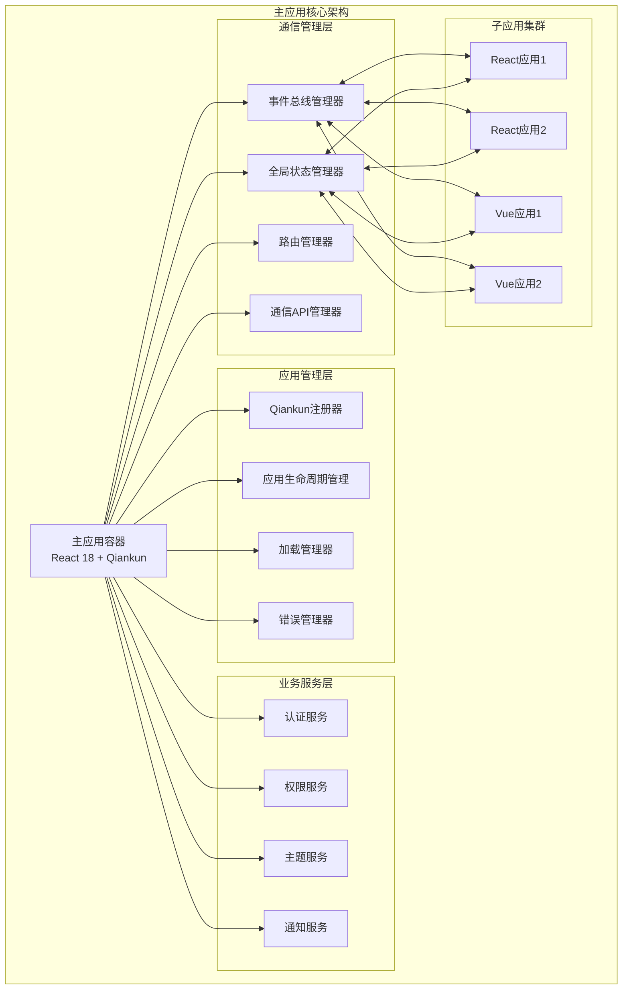

# 主应用通信指南

## 1. 概述

本文档详细介绍qiankun微前端架构中主应用的通信职责、API设计、事件管理等核心功能。主应用作为微前端系统的协调中心，负责管理所有子应用的生命周期、路由导航、状态同步和事件通信。

### 1.1 主应用架构图



### 1.2 主应用通信职责

| 职责 | 描述 | 实现方式 |
|------|------|----------|
| **事件协调** | 管理应用间事件的发布、订阅和路由 | 全局事件总线 |
| **状态同步** | 维护全局状态并同步到各子应用 | 全局状态管理器 |
| **路由管理** | 控制应用间的路由跳转和导航 | 路由管理器 |
| **生命周期管理** | 管理子应用的加载、挂载、卸载 | Qiankun生命周期钩子 |
| **权限控制** | 统一的认证和授权管理 | 权限服务 |
| **错误处理** | 全局错误捕获和处理 | 错误边界 + 错误管理器 |

## 2. 通信API设计

### 2.1 事件通信API

主应用提供统一的事件通信接口，支持应用间的消息传递和事件订阅。

```typescript
// 事件通信API接口
interface MainAppEventAPI {
  // 发送事件到指定应用
  sendToApp(appName: string, event: AppEvent): void;
  
  // 广播事件到所有应用
  broadcast(event: AppEvent): void;
  
  // 订阅来自子应用的事件
  subscribeFromApp(appName: string, eventType: string, handler: EventHandler): EventSubscription;
  
  // 订阅全局事件
  subscribeGlobal(eventType: string, handler: EventHandler): EventSubscription;
  
  // 请求-响应模式通信
  requestFromApp<T>(appName: string, request: AppRequest): Promise<T>;
}

// 主应用事件API实现
class MainAppEventAPIImpl implements MainAppEventAPI {
  private eventBus: EventBus;
  private appRegistry: Map<string, MicroApp>;
  
  constructor() {
    this.eventBus = globalEventBus;
    this.appRegistry = new Map();
    this.setupEventRouting();
  }
  
  // 发送事件到指定应用
  sendToApp(appName: string, event: AppEvent): void {
    const targetApp = this.appRegistry.get(appName);
    if (!targetApp || targetApp.status !== 'MOUNTED') {
      console.warn(`Target app ${appName} is not available`);
      return;
    }
    
    const routedEvent: BaseEvent = {
      type: event.type,
      source: 'main-app',
      target: appName,
      timestamp: new Date().toISOString(),
      id: `main-to-${appName}-${Date.now()}`,
      data: event.data,
      metadata: {
        routingType: 'direct',
        priority: event.priority || 'normal'
      }
    };
    
    this.eventBus.emit(routedEvent);
  }
  
  // 广播事件到所有应用
  broadcast(event: AppEvent): void {
    const broadcastEvent: BaseEvent = {
      type: event.type,
      source: 'main-app',
      target: '*',
      timestamp: new Date().toISOString(),
      id: `broadcast-${Date.now()}`,
      data: event.data,
      metadata: {
        routingType: 'broadcast',
        priority: event.priority || 'normal'
      }
    };
    
    this.eventBus.emit(broadcastEvent);
  }
  
  // 订阅来自子应用的事件
  subscribeFromApp(appName: string, eventType: string, handler: EventHandler): EventSubscription {
    return this.eventBus.on(eventType, (event) => {
      if (event.source === appName) {
        handler(event);
      }
    });
  }
  
  // 订阅全局事件
  subscribeGlobal(eventType: string, handler: EventHandler): EventSubscription {
    return this.eventBus.on(eventType, handler);
  }
  
  // 请求-响应模式通信
  async requestFromApp<T>(appName: string, request: AppRequest): Promise<T> {
    const requestId = `req-${Date.now()}-${Math.random()}`;
    const responseEventType = `${request.type}_RESPONSE`;
    
    return new Promise((resolve, reject) => {
      const timeout = setTimeout(() => {
        reject(new Error(`Request timeout: ${request.type} to ${appName}`));
      }, request.timeout || 5000);
      
      const subscription = this.subscribeFromApp(appName, responseEventType, (event) => {
        if (event.data.requestId === requestId) {
          clearTimeout(timeout);
          subscription.unsubscribe();
          
          if (event.data.error) {
            reject(new Error(event.data.error));
          } else {
            resolve(event.data.response);
          }
        }
      });
      
      this.sendToApp(appName, {
        type: request.type,
        data: { ...request.data, requestId },
        priority: 'high'
      });
    });
  }
  
  // 设置事件路由
  private setupEventRouting(): void {
    // 监听子应用注册
    this.eventBus.on('MICRO_APP_MOUNTED', (event) => {
      const appName = event.data.name;
      this.appRegistry.set(appName, event.data);
      console.log(`App ${appName} registered for communication`);
    });
    
    // 监听子应用卸载
    this.eventBus.on('MICRO_APP_UNMOUNTED', (event) => {
      const appName = event.data.name;
      this.appRegistry.delete(appName);
      console.log(`App ${appName} unregistered from communication`);
    });
  }
}

// 应用事件接口
interface AppEvent {
  type: string;
  data: any;
  priority?: 'low' | 'normal' | 'high' | 'urgent';
}

// 应用请求接口
interface AppRequest {
  type: string;
  data: any;
  timeout?: number;
}

// 微应用信息接口
interface MicroApp {
  name: string;
  status: 'LOADING' | 'LOADED' | 'MOUNTING' | 'MOUNTED' | 'UNMOUNTING' | 'UNMOUNTED';
  entry: string;
  container: string;
  props?: any;
}
```

### 2.2 状态管理API

主应用提供全局状态管理服务，支持状态的读取、更新和订阅。

```typescript
// 状态管理API接口
interface MainAppStateAPI {
  // 获取全局状态
  getGlobalState(): GlobalState;
  
  // 更新全局状态
  updateGlobalState(updates: Partial<GlobalState>): void;
  
  // 订阅状态变更
  subscribeState<T>(path: string, listener: StateListener<T>): StateSubscription;
  
  // 获取应用特定状态
  getAppState(appName: string): any;
  
  // 更新应用状态
  updateAppState(appName: string, state: any): void;
  
  // 状态同步到子应用
  syncStateToApp(appName: string, statePath: string): void;
}

// 主应用状态API实现
class MainAppStateAPIImpl implements MainAppStateAPI {
  private stateManager: GlobalStateManager;
  private appStates: Map<string, any>;
  
  constructor() {
    this.stateManager = globalStateManager;
    this.appStates = new Map();
    this.setupStateSync();
  }
  
  // 获取全局状态
  getGlobalState(): GlobalState {
    return this.stateManager.getState();
  }
  
  // 更新全局状态
  updateGlobalState(updates: Partial<GlobalState>): void {
    this.stateManager.setState(updates);
    
    // 发送状态更新事件
    globalEventBus.emit({
      type: 'GLOBAL_STATE_UPDATED',
      source: 'main-app',
      timestamp: new Date().toISOString(),
      id: `state-update-${Date.now()}`,
      data: {
        updates,
        newState: this.stateManager.getState()
      }
    });
  }
  
  // 订阅状态变更
  subscribeState<T>(path: string, listener: StateListener<T>): StateSubscription {
    return this.stateManager.subscribePath(path, listener);
  }
  
  // 获取应用特定状态
  getAppState(appName: string): any {
    return this.appStates.get(appName) || {};
  }
  
  // 更新应用状态
  updateAppState(appName: string, state: any): void {
    this.appStates.set(appName, { ...this.getAppState(appName), ...state });
    
    // 通知应用状态更新
    globalEventBus.emit({
      type: 'APP_STATE_UPDATED',
      source: 'main-app',
      target: appName,
      timestamp: new Date().toISOString(),
      id: `app-state-update-${Date.now()}`,
      data: {
        appName,
        state: this.getAppState(appName)
      }
    });
  }
  
  // 状态同步到子应用
  syncStateToApp(appName: string, statePath: string): void {
    const globalState = this.getGlobalState();
    const stateValue = this.getNestedValue(globalState, statePath);
    
    globalEventBus.emit({
      type: 'STATE_SYNC',
      source: 'main-app',
      target: appName,
      timestamp: new Date().toISOString(),
      id: `state-sync-${Date.now()}`,
      data: {
        path: statePath,
        value: stateValue
      }
    });
  }
  
  // 设置状态同步
  private setupStateSync(): void {
    // 监听全局状态变更
    this.stateManager.subscribe((newState, prevState) => {
      const changes = this.getStateChanges(newState, prevState);
      
      // 广播状态变更到所有子应用
      if (Object.keys(changes).length > 0) {
        globalEventBus.emit({
          type: 'GLOBAL_STATE_CHANGED',
          source: 'main-app',
          target: '*',
          timestamp: new Date().toISOString(),
          id: `global-state-change-${Date.now()}`,
          data: {
            changes,
            newState
          }
        });
      }
    });
  }
  
  // 获取嵌套值
  private getNestedValue(obj: any, path: string): any {
    return path.split('.').reduce((current, key) => current?.[key], obj);
  }
  
  // 获取状态变更
  private getStateChanges(newState: GlobalState, prevState: GlobalState): Record<string, any> {
    const changes: Record<string, any> = {};
    
    Object.keys(newState).forEach(key => {
      if (JSON.stringify(newState[key as keyof GlobalState]) !== JSON.stringify(prevState[key as keyof GlobalState])) {
        changes[key] = {
          from: prevState[key as keyof GlobalState],
          to: newState[key as keyof GlobalState]
        };
      }
    });
    
    return changes;
  }
}

// 状态监听器接口
interface StateListener<T> {
  (newValue: T, prevValue: T): void;
}

// 状态订阅接口
interface StateSubscription {
  unsubscribe(): void;
}
```

### 2.3 路由管理API

主应用提供统一的路由管理服务，控制应用间的导航和路由同步。

```typescript
// 路由管理API接口
interface MainAppRouteAPI {
  // 导航到指定应用路由
  navigateToApp(appName: string, route: string, params?: any): Promise<boolean>;
  
  // 获取当前路由信息
  getCurrentRoute(): RouteInfo;
  
  // 订阅路由变更
  subscribeRouteChange(listener: RouteChangeListener): RouteSubscription;
  
  // 注册应用路由
  registerAppRoutes(appName: string, routes: AppRoute[]): void;
  
  // 获取应用路由配置
  getAppRoutes(appName: string): AppRoute[];
  
  // 路由权限检查
  checkRoutePermission(route: string): boolean;
}

// 主应用路由API实现
class MainAppRouteAPIImpl implements MainAppRouteAPI {
  private routeManager: RouteManager;
  private appRoutes: Map<string, AppRoute[]>;
  private currentRoute: RouteInfo;
  
  constructor() {
    this.routeManager = new RouteManager();
    this.appRoutes = new Map();
    this.currentRoute = this.parseCurrentRoute();
    this.setupRouteSync();
  }
  
  // 导航到指定应用路由
  async navigateToApp(appName: string, route: string, params?: any): Promise<boolean> {
    // 检查应用是否存在
    if (!this.appRoutes.has(appName)) {
      console.error(`App ${appName} routes not registered`);
      return false;
    }
    
    // 检查路由权限
    const fullRoute = `/${appName}${route}`;
    if (!this.checkRoutePermission(fullRoute)) {
      console.error(`Permission denied for route: ${fullRoute}`);
      return false;
    }
    
    try {
      // 执行路由导航
      const success = await this.routeManager.navigate({
        to: fullRoute,
        from: this.currentRoute.path,
        params,
        state: { appName, route }
      });
      
      if (success) {
        // 更新当前路由信息
        this.currentRoute = {
          path: fullRoute,
          appName,
          route,
          params: params || {},
          timestamp: new Date().toISOString()
        };
        
        // 发送路由变更事件
        this.emitRouteChangeEvent(fullRoute, appName, route, params);
      }
      
      return success;
    } catch (error) {
      console.error('Navigation failed:', error);
      return false;
    }
  }
  
  // 获取当前路由信息
  getCurrentRoute(): RouteInfo {
    return { ...this.currentRoute };
  }
  
  // 订阅路由变更
  subscribeRouteChange(listener: RouteChangeListener): RouteSubscription {
    return globalEventBus.on('ROUTE_CHANGED', (event) => {
      listener(event.data);
    });
  }
  
  // 注册应用路由
  registerAppRoutes(appName: string, routes: AppRoute[]): void {
    this.appRoutes.set(appName, routes);
    
    // 注册到路由管理器
    routes.forEach(route => {
      this.routeManager.addRoute({
        path: `/${appName}${route.path}`,
        component: route.component,
        meta: {
          appName,
          ...route.meta
        }
      });
    });
    
    console.log(`Registered ${routes.length} routes for app: ${appName}`);
  }
  
  // 获取应用路由配置
  getAppRoutes(appName: string): AppRoute[] {
    return this.appRoutes.get(appName) || [];
  }
  
  // 路由权限检查
  checkRoutePermission(route: string): boolean {
    const currentUser = globalStateManager.getState().user.currentUser;
    if (!currentUser) {
      return false;
    }
    
    const userPermissions = globalStateManager.getState().user.permissions;
    const routePermissions = this.getRoutePermissions(route);
    
    if (routePermissions.length === 0) {
      return true; // 无权限要求的路由
    }
    
    return routePermissions.some(permission => userPermissions.includes(permission));
  }
  
  // 设置路由同步
  private setupRouteSync(): void {
    // 监听浏览器路由变更
    window.addEventListener('popstate', (event) => {
      this.handleRouteChange(window.location.pathname);
    });
    
    // 监听路由管理器事件
    globalEventBus.on('ROUTE_CHANGE', (event) => {
      this.handleRouteChange(event.data.to);
    });
  }
  
  // 处理路由变更
  private handleRouteChange(newPath: string): void {
    const routeInfo = this.parseRoute(newPath);
    this.currentRoute = routeInfo;
    
    // 通知相关应用
    if (routeInfo.appName) {
      globalEventBus.emit({
        type: 'APP_ROUTE_CHANGED',
        source: 'main-app',
        target: routeInfo.appName,
        timestamp: new Date().toISOString(),
        id: `route-change-${Date.now()}`,
        data: routeInfo
      });
    }
  }
  
  // 解析当前路由
  private parseCurrentRoute(): RouteInfo {
    return this.parseRoute(window.location.pathname);
  }
  
  // 解析路由
  private parseRoute(path: string): RouteInfo {
    const segments = path.split('/').filter(Boolean);
    const appName = segments[0] || '';
    const route = segments.length > 1 ? '/' + segments.slice(1).join('/') : '/';
    
    return {
      path,
      appName,
      route,
      params: this.parseQueryParams(),
      timestamp: new Date().toISOString()
    };
  }
  
  // 解析查询参数
  private parseQueryParams(): Record<string, string> {
    const params: Record<string, string> = {};
    const searchParams = new URLSearchParams(window.location.search);
    
    searchParams.forEach((value, key) => {
      params[key] = value;
    });
    
    return params;
  }
  
  // 获取路由权限
  private getRoutePermissions(route: string): string[] {
    // 这里应该从配置或数据库中获取路由权限
    const routePermissionMap: Record<string, string[]> = {
      '/user-management': ['user:read'],
      '/user-management/create': ['user:create'],
      '/user-management/edit': ['user:update'],
      '/product-management': ['product:read'],
      '/order-management': ['order:read'],
      '/system-monitor': ['system:read']
    };
    
    return routePermissionMap[route] || [];
  }
  
  // 发送路由变更事件
  private emitRouteChangeEvent(path: string, appName: string, route: string, params?: any): void {
    globalEventBus.emit({
      type: 'ROUTE_CHANGED',
      source: 'main-app',
      timestamp: new Date().toISOString(),
      id: `route-changed-${Date.now()}`,
      data: {
        path,
        appName,
        route,
        params: params || {}
      }
    });
  }
}

// 路由信息接口
interface RouteInfo {
  path: string;
  appName: string;
  route: string;
  params: Record<string, any>;
  timestamp: string;
}

// 应用路由接口
interface AppRoute {
  path: string;
  component: string;
  meta?: {
    title?: string;
    permissions?: string[];
    cache?: boolean;
  };
}

// 路由变更监听器接口
interface RouteChangeListener {
  (routeInfo: RouteInfo): void;
}

// 路由订阅接口
interface RouteSubscription {
  unsubscribe(): void;
}
```

## 3. 应用生命周期管理

### 3.1 生命周期钩子

主应用通过qiankun的生命周期钩子管理子应用的加载、挂载和卸载过程。

```typescript
// 应用生命周期管理器
class AppLifecycleManager {
  private apps: Map<string, MicroAppInfo> = new Map();
  private lifecycleHooks: LifecycleHooks = {};
  
  // 注册应用
  registerApp(appConfig: MicroAppConfig): void {
    const appInfo: MicroAppInfo = {
      ...appConfig,
      status: 'REGISTERED',
      registeredAt: new Date().toISOString(),
      mountCount: 0,
      lastMountTime: null,
      lastUnmountTime: null
    };
    
    this.apps.set(appConfig.name, appInfo);
    
    // 使用qiankun注册应用
    registerMicroApps([{
      name: appConfig.name,
      entry: appConfig.entry,
      container: appConfig.container,
      activeRule: appConfig.activeRule,
      props: {
        ...appConfig.props,
        // 注入通信API
        eventAPI: mainAppEventAPI,
        stateAPI: mainAppStateAPI,
        routeAPI: mainAppRouteAPI
      }
    }], {
      beforeLoad: this.createBeforeLoadHook(appConfig.name),
      beforeMount: this.createBeforeMountHook(appConfig.name),
      afterMount: this.createAfterMountHook(appConfig.name),
      beforeUnmount: this.createBeforeUnmountHook(appConfig.name),
      afterUnmount: this.createAfterUnmountHook(appConfig.name)
    });
    
    console.log(`App ${appConfig.name} registered successfully`);
  }
  
  // 创建加载前钩子
  private createBeforeLoadHook(appName: string) {
    return async (app: any) => {
      console.log(`[${appName}] Before load`);
      
      const appInfo = this.apps.get(appName)!;
      appInfo.status = 'LOADING';
      
      // 发送生命周期事件
      this.emitLifecycleEvent(appName, 'beforeLoad', { app });
      
      // 执行自定义钩子
      if (this.lifecycleHooks.beforeLoad) {
        await this.lifecycleHooks.beforeLoad(appName, app);
      }
      
      return app;
    };
  }
  
  // 创建挂载前钩子
  private createBeforeMountHook(appName: string) {
    return async (app: any) => {
      console.log(`[${appName}] Before mount`);
      
      const appInfo = this.apps.get(appName)!;
      appInfo.status = 'MOUNTING';
      
      // 发送生命周期事件
      this.emitLifecycleEvent(appName, 'beforeMount', { app });
      
      // 执行自定义钩子
      if (this.lifecycleHooks.beforeMount) {
        await this.lifecycleHooks.beforeMount(appName, app);
      }
      
      return app;
    };
  }
  
  // 创建挂载后钩子
  private createAfterMountHook(appName: string) {
    return async (app: any) => {
      console.log(`[${appName}] After mount`);
      
      const appInfo = this.apps.get(appName)!;
      appInfo.status = 'MOUNTED';
      appInfo.mountCount++;
      appInfo.lastMountTime = new Date().toISOString();
      
      // 发送生命周期事件
      this.emitLifecycleEvent(appName, 'afterMount', { app });
      
      // 同步全局状态到新挂载的应用
      this.syncGlobalStateToApp(appName);
      
      // 执行自定义钩子
      if (this.lifecycleHooks.afterMount) {
        await this.lifecycleHooks.afterMount(appName, app);
      }
      
      return app;
    };
  }
  
  // 创建卸载前钩子
  private createBeforeUnmountHook(appName: string) {
    return async (app: any) => {
      console.log(`[${appName}] Before unmount`);
      
      const appInfo = this.apps.get(appName)!;
      appInfo.status = 'UNMOUNTING';
      
      // 发送生命周期事件
      this.emitLifecycleEvent(appName, 'beforeUnmount', { app });
      
      // 执行自定义钩子
      if (this.lifecycleHooks.beforeUnmount) {
        await this.lifecycleHooks.beforeUnmount(appName, app);
      }
      
      return app;
    };
  }
  
  // 创建卸载后钩子
  private createAfterUnmountHook(appName: string) {
    return async (app: any) => {
      console.log(`[${appName}] After unmount`);
      
      const appInfo = this.apps.get(appName)!;
      appInfo.status = 'UNMOUNTED';
      appInfo.lastUnmountTime = new Date().toISOString();
      
      // 发送生命周期事件
      this.emitLifecycleEvent(appName, 'afterUnmount', { app });
      
      // 清理应用相关资源
      this.cleanupAppResources(appName);
      
      // 执行自定义钩子
      if (this.lifecycleHooks.afterUnmount) {
        await this.lifecycleHooks.afterUnmount(appName, app);
      }
      
      return app;
    };
  }
  
  // 同步全局状态到应用
  private syncGlobalStateToApp(appName: string): void {
    const globalState = globalStateManager.getState();
    
    globalEventBus.emit({
      type: 'GLOBAL_STATE_SYNC',
      source: 'main-app',
      target: appName,
      timestamp: new Date().toISOString(),
      id: `state-sync-${Date.now()}`,
      data: globalState
    });
  }
  
  // 清理应用资源
  private cleanupAppResources(appName: string): void {
    // 清理应用特定的事件监听器
    globalEventBus.removeAppListeners(appName);
    
    // 清理应用状态
    mainAppStateAPI.updateAppState(appName, {});
    
    // 清理缓存
    this.clearAppCache(appName);
  }
  
  // 清理应用缓存
  private clearAppCache(appName: string): void {
    // 清理路由缓存
    const cacheKeys = Object.keys(sessionStorage).filter(key => key.startsWith(`${appName}-`));
    cacheKeys.forEach(key => sessionStorage.removeItem(key));
  }
  
  // 发送生命周期事件
  private emitLifecycleEvent(appName: string, phase: string, data: any): void {
    globalEventBus.emit({
      type: `MICRO_APP_${phase.toUpperCase()}`,
      source: 'main-app',
      timestamp: new Date().toISOString(),
      id: `lifecycle-${appName}-${phase}-${Date.now()}`,
      data: {
        appName,
        phase,
        ...data
      }
    });
  }
  
  // 设置生命周期钩子
  setLifecycleHooks(hooks: Partial<LifecycleHooks>): void {
    this.lifecycleHooks = { ...this.lifecycleHooks, ...hooks };
  }
  
  // 获取应用信息
  getAppInfo(appName: string): MicroAppInfo | undefined {
    return this.apps.get(appName);
  }
  
  // 获取所有应用信息
  getAllAppsInfo(): MicroAppInfo[] {
    return Array.from(this.apps.values());
  }
}

// 微应用配置接口
interface MicroAppConfig {
  name: string;
  entry: string;
  container: string;
  activeRule: string | ((location: Location) => boolean);
  props?: any;
}

// 微应用信息接口
interface MicroAppInfo extends MicroAppConfig {
  status: 'REGISTERED' | 'LOADING' | 'LOADED' | 'MOUNTING' | 'MOUNTED' | 'UNMOUNTING' | 'UNMOUNTED';
  registeredAt: string;
  mountCount: number;
  lastMountTime: string | null;
  lastUnmountTime: string | null;
}

// 生命周期钩子接口
interface LifecycleHooks {
  beforeLoad?: (appName: string, app: any) => Promise<void>;
  beforeMount?: (appName: string, app: any) => Promise<void>;
  afterMount?: (appName: string, app: any) => Promise<void>;
  beforeUnmount?: (appName: string, app: any) => Promise<void>;
  afterUnmount?: (appName: string, app: any) => Promise<void>;
}
```

## 4. 错误处理和监控

### 4.1 错误边界

主应用实现全局错误边界，捕获和处理子应用的错误。

```typescript
// 全局错误边界组件
class GlobalErrorBoundary extends React.Component<
  { children: React.ReactNode },
  { hasError: boolean; error: Error | null; errorInfo: React.ErrorInfo | null }
> {
  constructor(props: { children: React.ReactNode }) {
    super(props);
    this.state = {
      hasError: false,
      error: null,
      errorInfo: null
    };
  }
  
  static getDerivedStateFromError(error: Error) {
    return {
      hasError: true,
      error
    };
  }
  
  componentDidCatch(error: Error, errorInfo: React.ErrorInfo) {
    this.setState({
      error,
      errorInfo
    });
    
    // 发送错误事件
    globalEventBus.emit({
      type: 'GLOBAL_ERROR',
      source: 'main-app',
      timestamp: new Date().toISOString(),
      id: `error-${Date.now()}`,
      data: {
        error: {
          message: error.message,
          stack: error.stack,
          name: error.name
        },
        errorInfo: {
          componentStack: errorInfo.componentStack
        },
        url: window.location.href,
        userAgent: navigator.userAgent,
        timestamp: new Date().toISOString()
      }
    });
    
    // 上报错误到监控系统
    this.reportError(error, errorInfo);
  }
  
  // 上报错误
  private async reportError(error: Error, errorInfo: React.ErrorInfo): Promise<void> {
    try {
      await fetch('/api/monitoring/errors', {
        method: 'POST',
        headers: {
          'Content-Type': 'application/json',
          'Authorization': `Bearer ${globalStateManager.getState().auth.accessToken}`
        },
        body: JSON.stringify({
          error: {
            message: error.message,
            stack: error.stack,
            name: error.name
          },
          errorInfo,
          context: {
            url: window.location.href,
            userAgent: navigator.userAgent,
            userId: globalStateManager.getState().user.currentUser?.id,
            timestamp: new Date().toISOString()
          }
        })
      });
    } catch (reportError) {
      console.error('Failed to report error:', reportError);
    }
  }
  
  // 重置错误状态
  resetError = (): void => {
    this.setState({
      hasError: false,
      error: null,
      errorInfo: null
    });
  };
  
  render() {
    if (this.state.hasError) {
      return (
        <div className="error-boundary">
          <h2>应用出现错误</h2>
          <details style={{ whiteSpace: 'pre-wrap' }}>
            <summary>错误详情</summary>
            <p>{this.state.error?.message}</p>
            <p>{this.state.error?.stack}</p>
            <p>{this.state.errorInfo?.componentStack}</p>
          </details>
          <button onClick={this.resetError}>重试</button>
          <button onClick={() => window.location.reload()}>刷新页面</button>
        </div>
      );
    }
    
    return this.props.children;
  }
}

// 错误处理管理器
class ErrorHandlingManager {
  private errorHandlers: Map<string, ErrorHandler> = new Map();
  private errorQueue: ErrorRecord[] = [];
  private maxErrorQueueSize = 1000;
  
  constructor() {
    this.setupGlobalErrorHandling();
  }
  
  // 设置全局错误处理
  private setupGlobalErrorHandling(): void {
    // 捕获未处理的Promise拒绝
    window.addEventListener('unhandledrejection', (event) => {
      this.handleError(new Error(event.reason), 'unhandledrejection', {
        promise: event.promise,
        reason: event.reason
      });
    });
    
    // 捕获全局JavaScript错误
    window.addEventListener('error', (event) => {
      this.handleError(event.error || new Error(event.message), 'javascript', {
        filename: event.filename,
        lineno: event.lineno,
        colno: event.colno
      });
    });
    
    // 捕获资源加载错误
    window.addEventListener('error', (event) => {
      if (event.target !== window) {
        this.handleError(new Error(`Resource load failed: ${(event.target as any)?.src || (event.target as any)?.href}`), 'resource', {
          target: event.target,
          type: (event.target as any)?.tagName
        });
      }
    }, true);
  }
  
  // 处理错误
  handleError(error: Error, type: string, context?: any): void {
    const errorRecord: ErrorRecord = {
      id: `error-${Date.now()}-${Math.random()}`,
      error: {
        message: error.message,
        stack: error.stack,
        name: error.name
      },
      type,
      context: context || {},
      timestamp: new Date().toISOString(),
      url: window.location.href,
      userAgent: navigator.userAgent,
      userId: globalStateManager.getState().user.currentUser?.id
    };
    
    // 添加到错误队列
    this.errorQueue.push(errorRecord);
    if (this.errorQueue.length > this.maxErrorQueueSize) {
      this.errorQueue.shift();
    }
    
    // 执行错误处理器
    const handler = this.errorHandlers.get(type) || this.errorHandlers.get('default');
    if (handler) {
      try {
        handler.handle(errorRecord);
      } catch (handlerError) {
        console.error('Error handler failed:', handlerError);
      }
    }
    
    // 发送错误事件
    globalEventBus.emit({
      type: 'ERROR_OCCURRED',
      source: 'main-app',
      timestamp: new Date().toISOString(),
      id: errorRecord.id,
      data: errorRecord
    });
    
    // 上报错误
    this.reportError(errorRecord);
  }
  
  // 注册错误处理器
  registerErrorHandler(type: string, handler: ErrorHandler): void {
    this.errorHandlers.set(type, handler);
  }
  
  // 上报错误
  private async reportError(errorRecord: ErrorRecord): Promise<void> {
    try {
      await fetch('/api/monitoring/errors', {
        method: 'POST',
        headers: {
          'Content-Type': 'application/json'
        },
        body: JSON.stringify(errorRecord)
      });
    } catch (error) {
      console.error('Failed to report error:', error);
    }
  }
  
  // 获取错误统计
  getErrorStats(): ErrorStats {
    const stats: ErrorStats = {
      total: this.errorQueue.length,
      byType: {},
      recent: this.errorQueue.slice(-10)
    };
    
    this.errorQueue.forEach(error => {
      stats.byType[error.type] = (stats.byType[error.type] || 0) + 1;
    });
    
    return stats;
  }
  
  // 清空错误队列
  clearErrorQueue(): void {
    this.errorQueue = [];
  }
}

// 错误记录接口
interface ErrorRecord {
  id: string;
  error: {
    message: string;
    stack?: string;
    name: string;
  };
  type: string;
  context: any;
  timestamp: string;
  url: string;
  userAgent: string;
  userId?: string;
}

// 错误处理器接口
interface ErrorHandler {
  handle(errorRecord: ErrorRecord): void;
}

// 错误统计接口
interface ErrorStats {
  total: number;
  byType: Record<string, number>;
  recent: ErrorRecord[];
}
```

## 5. 性能优化

### 5.1 懒加载和预加载

主应用实现智能的应用加载策略，提升性能和用户体验。

```typescript
// 应用加载管理器
class AppLoadingManager {
  private loadingStrategies: Map<string, LoadingStrategy> = new Map();
  private preloadQueue: string[] = [];
  private loadingPromises: Map<string, Promise<void>> = new Map();
  private loadedApps: Set<string> = new Set();
  
  constructor() {
    this.setupLoadingStrategies();
    this.setupPreloadTriggers();
  }
  
  // 设置加载策略
  private setupLoadingStrategies(): void {
    // 立即加载策略
    this.loadingStrategies.set('immediate', {
      shouldLoad: () => true,
      priority: 1
    });
    
    // 懒加载策略
    this.loadingStrategies.set('lazy', {
      shouldLoad: (appName) => this.isAppVisible(appName),
      priority: 2
    });
    
    // 预加载策略
    this.loadingStrategies.set('preload', {
      shouldLoad: (appName) => this.shouldPreload(appName),
      priority: 3
    });
    
    // 智能加载策略
    this.loadingStrategies.set('smart', {
      shouldLoad: (appName) => this.shouldSmartLoad(appName),
      priority: 4
    });
  }
  
  // 设置预加载触发器
  private setupPreloadTriggers(): void {
    // 空闲时预加载
    if ('requestIdleCallback' in window) {
      requestIdleCallback(() => {
        this.preloadApps();
      });
    } else {
      setTimeout(() => {
        this.preloadApps();
      }, 2000);
    }
    
    // 鼠标悬停预加载
    document.addEventListener('mouseover', (event) => {
      const target = event.target as HTMLElement;
      const appName = target.getAttribute('data-preload-app');
      if (appName && !this.loadedApps.has(appName)) {
        this.preloadApp(appName);
      }
    });
    
    // 路由变更预加载
    globalEventBus.on('ROUTE_CHANGE', (event) => {
      const nextApp = this.predictNextApp(event.data.to);
      if (nextApp) {
        this.preloadApp(nextApp);
      }
    });
  }
  
  // 加载应用
  async loadApp(appName: string, strategy: string = 'lazy'): Promise<void> {
    // 检查是否已经在加载
    if (this.loadingPromises.has(appName)) {
      return this.loadingPromises.get(appName)!;
    }
    
    // 检查是否已经加载
    if (this.loadedApps.has(appName)) {
      return Promise.resolve();
    }
    
    const loadingStrategy = this.loadingStrategies.get(strategy);
    if (!loadingStrategy || !loadingStrategy.shouldLoad(appName)) {
      return Promise.resolve();
    }
    
    // 创建加载Promise
    const loadingPromise = this.performAppLoad(appName);
    this.loadingPromises.set(appName, loadingPromise);
    
    try {
      await loadingPromise;
      this.loadedApps.add(appName);
      this.loadingPromises.delete(appName);
      
      // 发送加载完成事件
      globalEventBus.emit({
        type: 'APP_LOADED',
        source: 'main-app',
        timestamp: new Date().toISOString(),
        id: `app-loaded-${Date.now()}`,
        data: { appName, strategy }
      });
    } catch (error) {
      this.loadingPromises.delete(appName);
      throw error;
    }
  }
  
  // 执行应用加载
  private async performAppLoad(appName: string): Promise<void> {
    const startTime = performance.now();
    
    try {
      // 获取应用配置
      const appConfig = this.getAppConfig(appName);
      if (!appConfig) {
        throw new Error(`App config not found: ${appName}`);
      }
      
      // 预加载应用资源
      await this.preloadAppResources(appConfig);
      
      // 初始化应用
      await this.initializeApp(appName, appConfig);
      
      const loadTime = performance.now() - startTime;
      
      // 记录性能指标
      this.recordLoadingMetrics(appName, loadTime);
      
      console.log(`App ${appName} loaded in ${loadTime.toFixed(2)}ms`);
    } catch (error) {
      console.error(`Failed to load app ${appName}:`, error);
      throw error;
    }
  }
  
  // 预加载应用资源
  private async preloadAppResources(appConfig: MicroAppConfig): Promise<void> {
    const resources = await this.getAppResources(appConfig.entry);
    
    // 预加载JavaScript文件
    const jsPromises = resources.js.map(url => this.preloadScript(url));
    
    // 预加载CSS文件
    const cssPromises = resources.css.map(url => this.preloadStylesheet(url));
    
    // 等待所有资源加载完成
    await Promise.all([...jsPromises, ...cssPromises]);
  }
  
  // 预加载脚本
  private preloadScript(url: string): Promise<void> {
    return new Promise((resolve, reject) => {
      const link = document.createElement('link');
      link.rel = 'preload';
      link.as = 'script';
      link.href = url;
      link.onload = () => resolve();
      link.onerror = () => reject(new Error(`Failed to preload script: ${url}`));
      document.head.appendChild(link);
    });
  }
  
  // 预加载样式表
  private preloadStylesheet(url: string): Promise<void> {
    return new Promise((resolve, reject) => {
      const link = document.createElement('link');
      link.rel = 'preload';
      link.as = 'style';
      link.href = url;
      link.onload = () => resolve();
      link.onerror = () => reject(new Error(`Failed to preload stylesheet: ${url}`));
      document.head.appendChild(link);
    });
  }
  
  // 获取应用资源
  private async getAppResources(entry: string): Promise<{ js: string[]; css: string[] }> {
    try {
      const response = await fetch(entry);
      const html = await response.text();
      
      const jsUrls = this.extractResourceUrls(html, 'script', 'src');
      const cssUrls = this.extractResourceUrls(html, 'link[rel="stylesheet"]', 'href');
      
      return { js: jsUrls, css: cssUrls };
    } catch (error) {
      console.error(`Failed to fetch app resources from ${entry}:`, error);
      return { js: [], css: [] };
    }
  }
  
  // 提取资源URL
  private extractResourceUrls(html: string, selector: string, attribute: string): string[] {
    const parser = new DOMParser();
    const doc = parser.parseFromString(html, 'text/html');
    const elements = doc.querySelectorAll(selector);
    
    return Array.from(elements)
      .map(el => el.getAttribute(attribute))
      .filter(url => url && !url.startsWith('data:'))
      .map(url => this.resolveUrl(url!));
  }
  
  // 解析相对URL
  private resolveUrl(url: string): string {
    if (url.startsWith('http')) {
      return url;
    }
    
    const base = window.location.origin;
    return new URL(url, base).href;
  }
  
  // 预加载应用
  private async preloadApps(): Promise<void> {
    const appsToPreload = this.getAppsToPreload();
    
    for (const appName of appsToPreload) {
      try {
        await this.loadApp(appName, 'preload');
      } catch (error) {
        console.error(`Failed to preload app ${appName}:`, error);
      }
    }
  }
  
  // 获取需要预加载的应用
  private getAppsToPreload(): string[] {
    const currentUser = globalStateManager.getState().user.currentUser;
    if (!currentUser) {
      return [];
    }
    
    // 基于用户权限和使用习惯确定预加载应用
    const userPermissions = globalStateManager.getState().user.permissions;
    const availableApps = ['user-management', 'product-management', 'order-management'];
    
    return availableApps.filter(app => {
      const requiredPermissions = this.getAppPermissions(app);
      return requiredPermissions.some(permission => userPermissions.includes(permission));
    });
  }
  
  // 获取应用权限
  private getAppPermissions(appName: string): string[] {
    const permissionMap: Record<string, string[]> = {
      'user-management': ['user:read'],
      'product-management': ['product:read'],
      'order-management': ['order:read']
    };
    
    return permissionMap[appName] || [];
  }
  
  // 检查应用是否可见
  private isAppVisible(appName: string): boolean {
    const container = document.querySelector(`#${appName}-container`);
    return container !== null;
  }
  
  // 检查是否应该预加载
  private shouldPreload(appName: string): boolean {
    return this.preloadQueue.includes(appName);
  }
  
  // 智能加载判断
  private shouldSmartLoad(appName: string): boolean {
    const userBehavior = this.getUserBehaviorData();
    const appUsageFrequency = userBehavior.appUsage[appName] || 0;
    const currentTime = new Date().getHours();
    const peakHours = userBehavior.peakHours[appName] || [];
    
    // 基于使用频率和时间模式决定是否加载
    return appUsageFrequency > 0.1 || peakHours.includes(currentTime);
  }
  
  // 获取用户行为数据
  private getUserBehaviorData(): any {
    const stored = localStorage.getItem('user-behavior-data');
    return stored ? JSON.parse(stored) : {
      appUsage: {},
      peakHours: {}
    };
  }
  
  // 预测下一个应用
  private predictNextApp(currentRoute: string): string | null {
    const routePatterns: Record<string, string[]> = {
      '/user-management': ['product-management', 'order-management'],
      '/product-management': ['order-management', 'user-management'],
      '/order-management': ['user-management', 'product-management']
    };
    
    const nextApps = routePatterns[currentRoute];
    return nextApps ? nextApps[0] : null;
  }
  
  // 记录加载指标
  private recordLoadingMetrics(appName: string, loadTime: number): void {
    const metrics = {
      appName,
      loadTime,
      timestamp: new Date().toISOString(),
      memoryUsage: this.getMemoryUsage(),
      networkType: this.getNetworkType()
    };
    
    // 发送性能指标事件
    globalEventBus.emit({
      type: 'APP_LOADING_METRICS',
      source: 'main-app',
      timestamp: new Date().toISOString(),
      id: `loading-metrics-${Date.now()}`,
      data: metrics
    });
  }
  
  // 获取内存使用情况
  private getMemoryUsage(): any {
    if ('memory' in performance) {
      const memory = (performance as any).memory;
      return {
        used: memory.usedJSHeapSize,
        total: memory.totalJSHeapSize,
        limit: memory.jsHeapSizeLimit
      };
    }
    return null;
  }
  
  // 获取网络类型
  private getNetworkType(): string {
    if ('connection' in navigator) {
      return (navigator as any).connection.effectiveType || 'unknown';
    }
    return 'unknown';
  }
  
  // 获取应用配置
  private getAppConfig(appName: string): MicroAppConfig | null {
    // 这里应该从配置中心或本地配置获取应用配置
    const configs: Record<string, MicroAppConfig> = {
      'user-management': {
        name: 'user-management',
        entry: '//localhost:3001',
        container: '#user-management-container',
        activeRule: '/user-management'
      },
      'product-management': {
        name: 'product-management',
        entry: '//localhost:3002',
        container: '#product-management-container',
        activeRule: '/product-management'
      }
    };
    
    return configs[appName] || null;
  }
  
  // 初始化应用
  private async initializeApp(appName: string, config: MicroAppConfig): Promise<void> {
    // 这里可以执行应用特定的初始化逻辑
    console.log(`Initializing app: ${appName}`);
  }
}

// 加载策略接口
interface LoadingStrategy {
  shouldLoad: (appName: string) => boolean;
  priority: number;
}
```

## 6. 最佳实践

### 6.1 通信最佳实践

1. **事件命名规范**
   - 使用大写字母和下划线：`USER_UPDATED`、`ORDER_CREATED`
   - 包含动作和对象：`动作_对象`
   - 避免过于通用的名称

2. **状态管理原则**
   - 保持状态的不可变性
   - 使用明确的状态更新路径
   - 避免深层嵌套的状态结构

3. **错误处理策略**
   - 实现全局错误边界
   - 提供用户友好的错误信息
   - 记录详细的错误日志

4. **性能优化建议**
   - 使用懒加载减少初始加载时间
   - 实现智能预加载提升用户体验
   - 监控应用性能指标

### 6.2 开发调试工具

主应用提供开发调试工具，帮助开发者调试通信问题。

```typescript
// 开发调试工具
class DevTools {
  private isEnabled: boolean;
  private eventLog: BaseEvent[] = [];
  private stateLog: any[] = [];
  private performanceLog: any[] = [];
  
  constructor() {
    this.isEnabled = process.env.NODE_ENV === 'development';
    if (this.isEnabled) {
      this.setupDevTools();
    }
  }
  
  // 设置开发工具
  private setupDevTools(): void {
    // 添加到全局对象
    (window as any).__QIANKUN_DEV_TOOLS__ = this;
    
    // 监听事件
    globalEventBus.on('*', (event) => {
      this.logEvent(event);
    });
    
    // 监听状态变更
    globalStateManager.subscribe((newState, prevState) => {
      this.logStateChange(newState, prevState);
    });
    
    // 添加控制台命令
    this.addConsoleCommands();
  }
  
  // 记录事件
  private logEvent(event: BaseEvent): void {
    this.eventLog.push(event);
    if (this.eventLog.length > 1000) {
      this.eventLog.shift();
    }
  }
  
  // 记录状态变更
  private logStateChange(newState: any, prevState: any): void {
    this.stateLog.push({
      timestamp: new Date().toISOString(),
      newState,
      prevState,
      changes: this.getStateChanges(newState, prevState)
    });
    
    if (this.stateLog.length > 100) {
      this.stateLog.shift();
    }
  }
  
  // 获取状态变更
  private getStateChanges(newState: any, prevState: any): any {
    const changes: any = {};
    
    Object.keys(newState).forEach(key => {
      if (JSON.stringify(newState[key]) !== JSON.stringify(prevState[key])) {
        changes[key] = {
          from: prevState[key],
          to: newState[key]
        };
      }
    });
    
    return changes;
  }
  
  // 添加控制台命令
  private addConsoleCommands(): void {
    (window as any).qiankunDebug = {
      // 获取事件日志
      getEventLog: () => this.eventLog,
      
      // 获取状态日志
      getStateLog: () => this.stateLog,
      
      // 获取当前状态
      getCurrentState: () => globalStateManager.getState(),
      
      // 发送测试事件
      sendTestEvent: (type: string, data: any) => {
        globalEventBus.emit({
          type,
          source: 'dev-tools',
          timestamp: new Date().toISOString(),
          id: `test-${Date.now()}`,
          data
        });
      },
      
      // 清空日志
      clearLogs: () => {
        this.eventLog = [];
        this.stateLog = [];
        this.performanceLog = [];
      },
      
      // 导出日志
      exportLogs: () => {
        const logs = {
          events: this.eventLog,
          states: this.stateLog,
          performance: this.performanceLog,
          timestamp: new Date().toISOString()
        };
        
        const blob = new Blob([JSON.stringify(logs, null, 2)], { type: 'application/json' });
        const url = URL.createObjectURL(blob);
        const a = document.createElement('a');
        a.href = url;
        a.download = `qiankun-debug-${Date.now()}.json`;
        a.click();
        URL.revokeObjectURL(url);
      }
    };
    
    console.log('Qiankun Debug Tools Available:');
    console.log('- qiankunDebug.getEventLog() - 获取事件日志');
    console.log('- qiankunDebug.getStateLog() - 获取状态日志');
    console.log('- qiankunDebug.getCurrentState() - 获取当前状态');
    console.log('- qiankunDebug.sendTestEvent(type, data) - 发送测试事件');
    console.log('- qiankunDebug.clearLogs() - 清空日志');
    console.log('- qiankunDebug.exportLogs() - 导出日志');
  }
}
```

## 7. 总结

本主应用通信指南详细介绍了qiankun微前端架构中主应用的通信职责和实现方案。主要特性包括：

### 7.1 核心功能
- **统一的通信API**：提供标准化的事件、状态和路由通信接口
- **生命周期管理**：完整的子应用生命周期管理和钩子系统
- **错误处理机制**：全局错误边界和错误处理管理器
- **性能优化**：智能加载策略和资源预加载

### 7.2 技术亮点
- **类型安全**：完整的TypeScript类型定义
- **可扩展性**：插件化的架构设计
- **监控能力**：完善的性能监控和错误追踪
- **开发友好**：丰富的调试工具和开发辅助功能

### 7.3 使用建议
- 遵循事件命名规范和状态管理原则
- 实现适当的错误处理和用户反馈
- 合理使用预加载和懒加载策略
- 利用开发工具进行调试和优化

通过本指南的实践，可以构建出高性能、可维护的微前端主应用，为整个系统提供稳定可靠的通信基础设施。